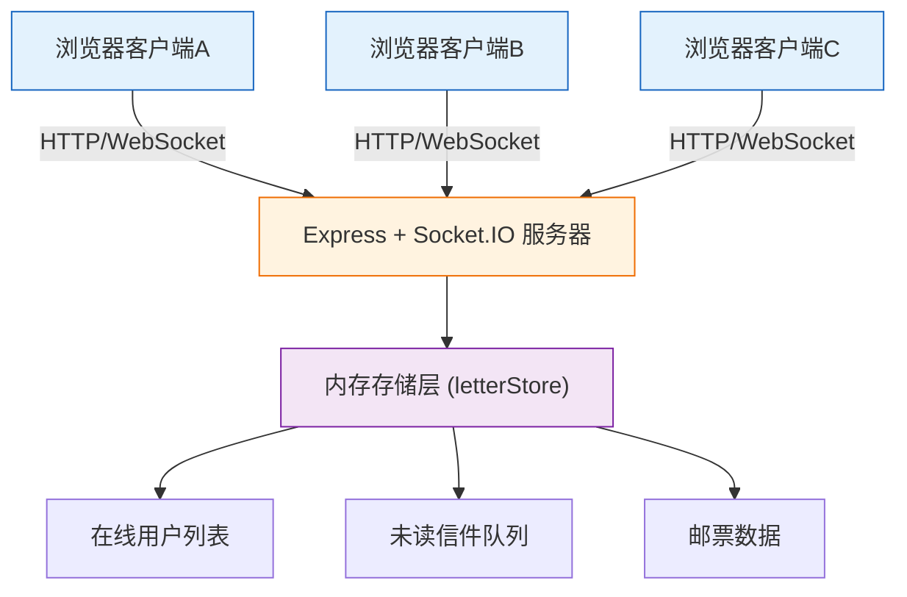
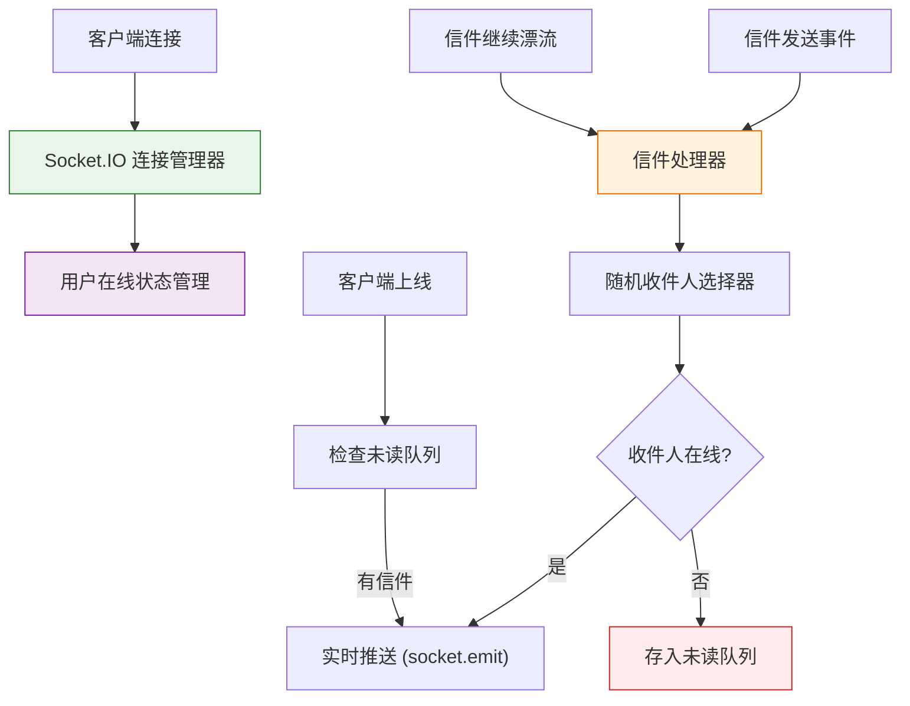

## 1. 架构设计



## 2. 技术描述

- **前端**：React 18 + TypeScript + Vite 5
  - UI组件：React Function Components + Hooks
  - 状态管理：React useState/useReducer（轻量级场景）
  - 实时通信：socket.io-client 4.x
  - HTTP请求：axios 1.x
  - 图形绘制：HTML5 Canvas API
  - 音频：Web Audio API
  - 唯一标识：uuid 9.x
  
- **后端**：Node.js + Express 4 + TypeScript
  - 实时通信：socket.io 4.x
  - 跨域：cors 2.x
  - 唯一标识：uuid 9.x
  - 构建：ts-node + tsx 用于开发运行

- **构建工具**：Vite 5
  - React插件：@vitejs/plugin-react 4.x
  - TypeScript支持：内置

## 3. 项目结构

```
auto98/
├── index.html                      # 入口HTML
├── package.json                    # 项目依赖和脚本
├── vite.config.js                  # Vite配置
├── tsconfig.json                   # TypeScript配置
├── src/
│   ├── client/                     # 前端代码
│   │   ├── App.tsx                 # 主应用组件
│   │   ├── LetterCanvas.tsx        # Canvas手写组件
│   │   ├── components/             # UI组件目录
│   │   │   ├── Envelope.tsx        # 信封组件
│   │   │   ├── LetterReader.tsx    # 信件阅读组件
│   │   │   ├── StampAlbum.tsx      # 邮票册组件
│   │   │   └── Stamp.tsx           # 邮票组件
│   │   ├── types/                  # 类型定义
│   │   │   └── index.ts
│   │   └── utils/                  # 工具函数
│   │       ├── audio.ts            # 音频工具
│   │       └── canvas.ts           # Canvas工具
│   └── server/                     # 后端代码
│       ├── server.ts               # 服务器入口
│       └── letterStore.ts          # 内存存储
```

## 4. API 与 Socket 事件定义

### 4.1 Socket 事件

```typescript
// 客户端 -> 服务器
interface ClientToServerEvents {
  'user:connect': (userId: string) => void;
  'letter:send': (letter: LetterData) => void;
  'letter:forward': (letterId: string) => void;
  'letter:read': (letterId: string) => void;
  'stamp:collect': (stampId: string) => void;
}

// 服务器 -> 客户端
interface ServerToClientEvents {
  'letter:receive': (letter: LetterData) => void;
  'letter:delivered': (letterId: string) => void;
  'user:count': (count: number) => void;
  'stamp:awarded': (stamp: StampData) => void;
}
```

### 4.2 数据类型定义

```typescript
interface LetterData {
  id: string;
  fromUserId: string;
  toUserId: string;
  paperColor: string;
  inkColor: string;
  strokes: StrokeData[];
  stamp?: StampPosition;
  seal?: SealData;
  createdAt: number;
  read: boolean;
  forwardCount: number;
}

interface StrokeData {
  points: { x: number; y: number; pressure: number }[];
  color: string;
  width: number;
}

interface SealData {
  type: 'flower' | 'tree' | 'star' | 'wind';
  x: number;
  y: number;
}

interface StampData {
  id: string;
  type: string;
  country: string;
  year: number;
  color: string;
}

interface StampPosition {
  stampId: string;
  x: number;
  y: number;
}

interface UserData {
  id: string;
  socketId: string;
  online: boolean;
  stamps: string[];
  lettersSent: number;
  lastLogin: number;
}
```

## 5. 服务器架构



## 6. 核心模块说明

### 6.1 LetterCanvas 模块
- 负责Canvas手写输入
- 实现毛笔笔触效果（宽度随速度变化3-8px）
- 管理信纸背景和暗纹
- 渲染印章和邮票

### 6.2 LetterStore 模块
- 内存存储在线用户列表
- 管理未读信件队列
- 实现随机收件人分配算法
- 统计用户写信数量和邮票奖励

### 6.3 Socket 服务模块
- 处理用户连接/断开
- 转发信件实时推送
- 广播在线用户数量
- 处理信件已读状态同步

## 7. 性能优化策略

1. **Canvas 性能**
   - 使用 requestAnimationFrame 进行绘制
   - 离屏Canvas缓存静态元素（信纸背景、暗纹）
   - 笔触点增量绘制，避免全量重绘

2. **动画性能**
   - CSS transform 和 opacity 动画（GPU加速）
   - 避免 layout thrashing，批量读取/写入样式
   - 使用 will-change 提示浏览器优化

3. **网络性能**
   - Socket.IO 二进制传输压缩
   - 信件数据增量同步
   - 合理的心跳包间隔（30s）

4. **内存管理**
   - 限制未读信件队列长度（最多1000封）
   - 用户离线24小时后清理数据
   - Canvas 及时释放资源
