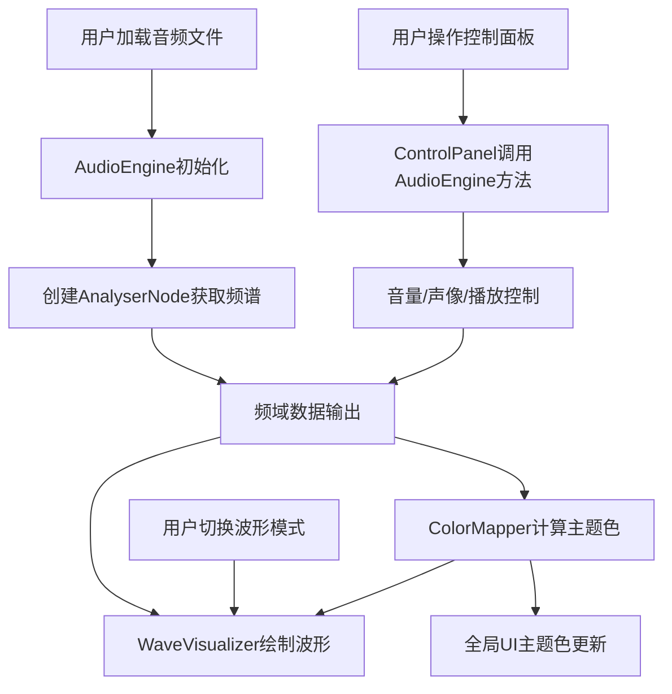
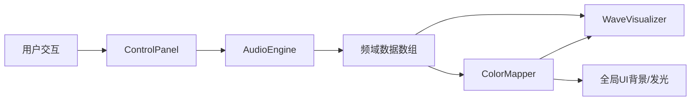

## 1. 产品概述

多轨音频波形可视化与混合控制台是一款面向音乐爱好者的浏览器端DJ式音频混合工具，支持同时加载最多4个音频轨道，实时频谱可视化与颜色映射，让用户通过直觉化的推子、旋钮和模式切换创造独特的视觉音乐体验。

- 解决问题：为音乐爱好者提供无需安装软件的浏览器端音频混合与可视化创作工具
- 目标用户：音乐爱好者、DJ初学者、音频可视化创作者

## 2. 核心功能

### 2.1 用户角色

| 角色 | 注册方式 | 核心权限 |
|------|----------|----------|
| 普通用户 | 无需注册 | 加载音频、混合控制、可视化操作 |

### 2.2 功能模块

1. **主可视化页面**：多轨频谱波形画布（上区70%）、控制台区域（下区30%）

### 2.3 页面详情

| 页面名称 | 模块名称 | 功能描述 |
|----------|----------|----------|
| 主可视化页面 | 波形可视化画布 | Canvas渲染128根柱状图的实时频谱，支持柱状/线条/粒子三种模式切换，背景星点粒子动效 |
| 主可视化页面 | 颜色映射模块 | 根据低/中/高频能量比实时计算全局渐变主题色，影响柱状图填充色、控制台发光边缘、页面径向渐变 |
| 主可视化页面 | 轨道控制卡片 | 每轨道独立音量推子（-50dB~+6dB）、声像旋钮（-90°~90°）、波形模式切换、音频标识波浪曲线 |
| 主可视化页面 | 全局控制区 | 全局播放/暂停按钮、音频文件拖拽上传区域（支持最多4轨道） |

## 3. 核心流程

用户打开应用 → 拖拽/选择音频文件加载至轨道 → 音频引擎初始化并分析频谱 → 频谱数据实时驱动波形可视化 → 颜色映射模块计算主题色影响全局UI → 用户通过推子/旋钮调节音量/声像 → 切换波形显示模式 → 创造独特的视觉音乐体验

## 4. 用户界面设计

### 4.1 设计风格

- **主色调**：深空色 #0a0a1a（背景）、深灰蓝 #1a1a2e（控制台）、深色 #16213e（卡片）
- **强调色**：霓虹红 #ff3366（低频）、霓虹绿 #33ff99（中频）、霓虹蓝 #66b3ff（高频）
- **按钮风格**：圆形按钮（波形模式切换），激活状态填充主题色
- **字体**：Orbitron（科幻风格标题），Rajdhani（技术感正文）
- **布局风格**：上下分区Flex布局，上区70%可视化画布，下区30%控制台
- **动效**：推子缓动0.1秒过渡，颜色插值0.5秒，模式切换0.3秒平滑过渡，星点闪烁，悬停模糊提示框

### 4.2 页面设计概览

| 页面名称 | 模块名称 | UI元素 |
|----------|----------|--------|
| 主可视化页面 | 波形画布区域 | Canvas全宽，深空色背景，星点粒子(1-3px)，128根柱状图渐变填充 |
| 主可视化页面 | 控制台区域 | Flex四栏等宽布局，每栏轨道卡片含推子/旋钮/模式切换/音频标识 |
| 主可视化页面 | 全局控制区 | 底部居中播放/暂停按钮，拖拽上传区域（虚线边框闪烁） |

### 4.3 响应式设计

- 桌面优先设计（1920×1080基准）
- 最小支持1366×768分辨率
- 控制台卡片宽度均分自适应

### 4.4 数据流向

