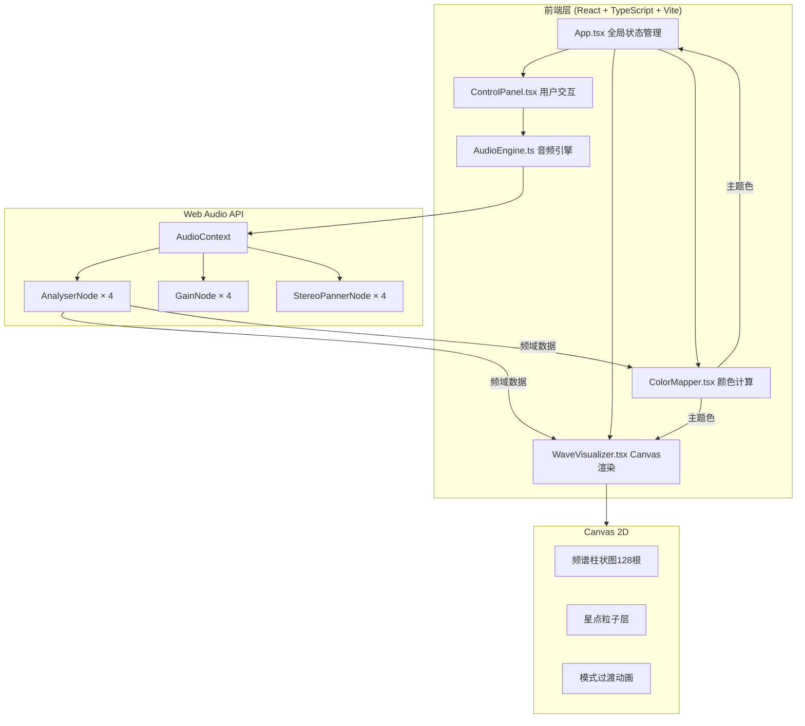

## 1. 架构设计



## 2. 技术说明

- **前端框架**：React@18 + TypeScript + Vite
- **初始化工具**：vite-init（react-ts模板）
- **状态管理**：Zustand（全局音频状态、可视化参数、主题色）
- **样式方案**：Tailwind CSS + CSS Modules（复杂动画和Canvas相关样式）
- **音频处理**：Web Audio API（浏览器原生，无需后端）
- **后端**：无（纯前端应用）
- **数据库**：无

## 3. 路由定义

| 路由 | 用途 |
|------|------|
| / | 主页面：波形可视化与混合控制台 |

## 4. 核心模块设计

### 4.1 AudioEngine.ts

```typescript
interface AudioEngineAPI {
  start(trackIndex: number): void;
  stop(trackIndex: number): void;
  setGain(trackIndex: number, dB: number): void;
  setPan(trackIndex: number, angle: number): void;
  loadAudio(trackIndex: number, file: File): Promise<void>;
  getFrequencyData(trackIndex: number): Uint8Array;
}
```

- 每个轨道独立的AudioContext处理链：AudioSource → GainNode → StereoPannerNode → AnalyserNode → destination
- AnalyserNode.fftSize = 256，输出128个频域数据点
- getFrequencyData通过requestAnimationFrame循环获取实时频谱

### 4.2 WaveVisualizer.tsx

- Canvas绘制层：背景星点层 + 频谱层 + 过渡动画层
- 三种渲染模式：bars（柱状图）、lines（贝塞尔曲线）、particles（粒子+光线）
- 使用requestAnimationFrame驱动60fps刷新
- 模式切换时使用缓动函数在0.3秒内平滑过渡

### 4.3 ColorMapper.tsx

- 计算三个频段能量：低频(0-250Hz)、中频(250-4000Hz)、高频(4000-20000Hz)
- 输出全局主题色渐变，使用HSL颜色空间插值
- 颜色过渡使用requestAnimationFrame，插值时间0.5秒
- 影响范围：柱状图填充色、控制台发光边缘、页面径向渐变中心色

### 4.4 ControlPanel.tsx

- 轨道卡片组件：音量推子（纵向，-50dB~+6dB）、声像旋钮（-90°~90°）、模式切换按钮组
- 音频标识生成：取前3秒平均频谱数据绘制静态波浪曲线
- 拖拽上传区域：拖拽时虚线边框闪烁

## 5. 全局状态设计（Zustand Store）

```typescript
interface AudioStore {
  tracks: TrackState[];
  globalThemeColor: string;
  waveMode: 'bars' | 'lines' | 'particles';
  isPlaying: boolean;

  setTrackGain: (index: number, dB: number) => void;
  setTrackPan: (index: number, angle: number) => void;
  setWaveMode: (mode: 'bars' | 'lines' | 'particles') => void;
  setGlobalPlaying: (playing: boolean) => void;
  loadTrackAudio: (index: number, file: File) => void;
}

interface TrackState {
  loaded: boolean;
  playing: boolean;
  gain: number;
  pan: number;
  fileName: string;
  fingerprint: number[];
}
```

## 6. 文件结构与调用关系

```
src/
├── main.tsx                    # React入口，挂载App
├── App.tsx                     # 主组件，布局上下分区
├── store/
│   └── audioStore.ts           # Zustand全局状态
├── components/
│   ├── AudioEngine.ts          # 音频引擎（被ControlPanel和App调用）
│   ├── WaveVisualizer.tsx      # 波形可视化（接收频域数据+主题色）
│   ├── ColorMapper.tsx         # 颜色映射（接收频域数据，输出主题色）
│   ├── ControlPanel.tsx        # 控制台（调用AudioEngine方法）
│   ├── TrackCard.tsx           # 单轨道卡片组件
│   ├── VolumeFader.tsx         # 音量推子组件
│   ├── PanKnob.tsx             # 声像旋钮组件
│   ├── WaveModeSwitch.tsx      # 波形模式切换组件
│   ├── AudioFingerprint.tsx    # 音频标识波浪曲线
│   ├── DropZone.tsx            # 拖拽上传区域
│   └── StarField.tsx           # 星点粒子背景
├── utils/
│   ├── colorUtils.ts           # 颜色插值计算
│   └── audioUtils.ts           # 音频频段能量计算
└── styles/
    └── global.css              # 全局样式（深空背景、动画）
```

### 数据流向

1. **用户操作流**：用户 → ControlPanel → AudioEngine → Web Audio API
2. **频谱数据流**：AudioEngine → 频域数据 → WaveVisualizer（绘制）+ ColorMapper（计算颜色）
3. **主题色流**：ColorMapper → 主题色 → WaveVisualizer（填充色）+ 控制台发光边缘 + 页面背景
4. **状态流**：Zustand Store → 所有组件（响应式更新）
