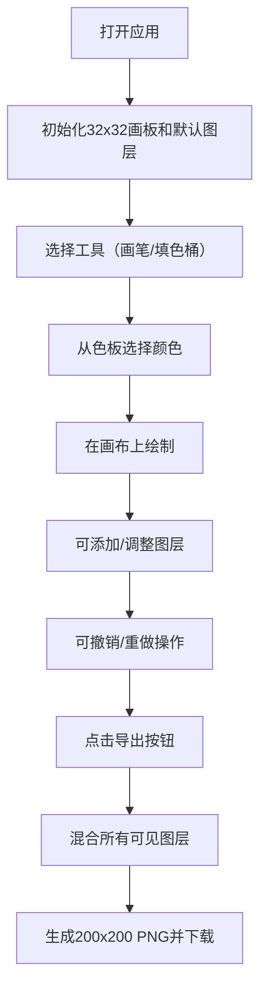

## 1. 产品概述
在线复古像素风格绘图板应用，让用户使用像素笔和填色桶在32x32网格上创作8-bit风格像素画，并支持图层的叠加与混合，最终可导出为PNG图片。
- 面向像素艺术爱好者、游戏开发者和复古设计爱好者
- 提供轻量级、浏览器端的像素画创作工具，无需安装即可使用

## 2. 核心功能

### 2.2 功能模块
1. **像素画板**：32x32网格画布，支持像素绘制和显示
2. **工具栏**：画笔工具、填色桶工具、10色色板
3. **图层系统**：多图层管理，支持添加/删除/排序/调整不透明度
4. **导出功能**：将画布导出为200x200像素PNG图片
5. **撤销/重做**：支持20步操作历史记录
6. **设置面板**：网格线显示开关

### 2.3 页面详情
| 页面名称 | 模块名称 | 功能描述 |
|-----------|-------------|---------------------|
| 主页面 | 像素画板 | 32x32网格画布，响应式尺寸，支持鼠标点击和拖拽绘制 |
| 主页面 | 工具栏 | 垂直排列的画笔/填色桶工具选择，10色色板选择 |
| 主页面 | 图层面板 | 显示图层缩略图，支持添加/删除/上下移动/调整不透明度/可见性 |
| 主页面 | 顶部菜单栏 | 导出按钮和网格线显示开关 |
| 主页面 | 快捷键系统 | Ctrl+Z撤销，Ctrl+Shift+Z重做 |

## 3. 核心流程
用户打开应用后，默认显示一个32x32的空白像素网格，自动创建一个底层。用户选择画笔或填色桶工具，从色板选择颜色，在画布上点击或拖拽进行绘制。可通过图层面板添加新图层，调整图层顺序和不透明度。完成创作后，点击导出按钮生成并下载PNG图片。



## 4. 用户界面设计

### 4.1 设计风格
- **主题颜色**：深灰色背景#2C2C2C，深色边框#1A1A1A，浅灰色网格线#CCCCCC，蓝色高亮#4488FF，绿色导出按钮#44CC44，红色删除按钮#FF4444
- **设计风格**：复古像素风格，简洁实用为主，配合像素化图标和元素
- **按钮样式**：圆角6px，带有0.2s背景色过渡动画
- **字体**：使用等宽像素风格字体，增强复古感
- **布局风格**：左侧画板，右侧工具栏和图层面板，顶部菜单栏

### 4.2 页面设计概述
| 页面名称 | 模块名称 | UI Elements |
|-----------|-------------|-------------|
| 主页面 | 像素画板 | 640x640像素（每格20x20），带1px深色边框，网格线可选显示 |
| 主页面 | 工具栏 | 垂直排列，画笔（圆形图标，半径18px）、填色桶（矩形18x18px）、色板（10个20x20色块，两行排列） |
| 主页面 | 图层面板 | 标题"图层"，每个图层条目200x60px，左侧50x50缩略图，右侧依次为眼睛图标、名称、不透明度滑块、删除按钮 |
| 主页面 | 顶部菜单栏 | 绿色导出按钮、网格线开关（滑块样式） |
| 主页面 | 响应式布局 | 屏幕<800px时，工具栏移至画板下方水平排列，画板缩小为384x384（每格12x12） |

### 4.3 响应性
- 采用桌面优先设计，针对小屏幕进行自适应调整
- 媒体查询断点：800px，低于此宽度时布局从左右结构改为上下结构
- 触摸设备优化：确保点击区域足够大（至少40x40px）

### 4.4 动画与交互
- 所有按钮和可点击元素添加0.2s背景色过渡动画
- 工具选择时蓝色边框高亮动画
- 色块选中时2px白色边框动画
- 图层拖拽排序时的视觉反馈
```
