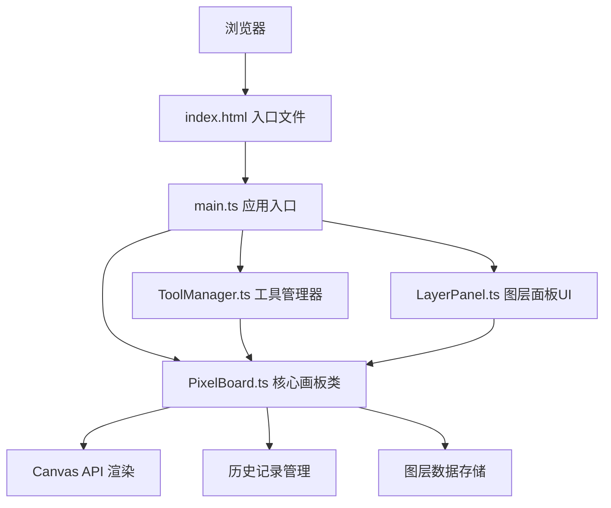

## 1. 架构设计


## 2. 技术描述
- **前端框架**：原生 TypeScript + HTML5 Canvas API
- **构建工具**：Vite@5
- **开发语言**：TypeScript@5
- **无需后端**：纯前端应用，所有功能在浏览器端完成
- **数据存储**：内存中维护32x32像素数组，每个像素存储为RGBA颜色值

## 3. 核心类与接口定义

### 3.1 PixelBoard 类
```typescript
// 像素数据类型
type Pixel = { r: number; g: number; b: number; a: number } | null;

// 图层接口
interface Layer {
  id: string;
  name: string;
  pixels: Pixel[][]; // 32x32
  opacity: number; // 0-100
  visible: boolean;
}

// 操作历史记录
interface HistoryState {
  layers: Layer[];
  activeLayerId: string;
}

class PixelBoard {
  constructor(container: HTMLElement, gridSize: number = 32);
  render(): void;
  setPixel(x: number, y: number, color: string): void;
  getPixel(x: number, y: number, layerId?: string): Pixel;
  floodFill(x: number, y: number, color: string): void;
  addLayer(): void;
  removeLayer(id: string): void;
  moveLayer(id: string, direction: 'up' | 'down'): void;
  setLayerOpacity(id: string, opacity: number): void;
  toggleLayerVisibility(id: string): void;
  setActiveLayer(id: string): void;
  exportPNG(size: number): string;
  undo(): void;
  redo(): void;
  saveHistory(): void;
  setShowGrid(show: boolean): void;
  setPixelSize(size: number): void;
}
```

### 3.2 ToolManager 类
```typescript
type ToolType = 'brush' | 'fill';

class ToolManager {
  private currentTool: ToolType;
  private currentColor: string;
  private board: PixelBoard;

  setTool(tool: ToolType): void;
  setColor(color: string): void;
  handleMouseDown(x: number, y: number): void;
  handleMouseMove(x: number, y: number): void;
  handleMouseUp(): void;
}
```

### 3.3 LayerPanel 类
```typescript
class LayerPanel {
  private container: HTMLElement;
  private board: PixelBoard;
  private onLayerSelect: (layerId: string) => void;

  constructor(container: HTMLElement, board: PixelBoard);
  render(): void;
  private createLayerElement(layer: Layer, index: number): HTMLElement;
  private updateThumbnail(canvas: HTMLCanvasElement, layer: Layer): void;
}
```

## 4. 性能优化策略
- **Canvas 双缓冲渲染：使用离屏Canvas进行图层混合，减少重绘次数
- **拖拽绘制优化：记录鼠标移动路径，只重绘受影响的像素区域
- **洪水填充算法**：使用BFS算法实现四方向连通区域填充，时间复杂度O(n)
- **历史记录优化**：只存储图层数据的深拷贝快照，限制最大20步
- **缩略图缓存**：图层缩略图只在图层数据变化时更新

## 5. 文件结构
```
project/
├── package.json
├── index.html
├── src/
│   ├── main.ts
│   ├── PixelBoard.ts
│   ├── ToolManager.ts
│   └── LayerPanel.ts
└── tsconfig.json
└── vite.config.ts
```

## 6. 核心算法实现

### 6.1 洪水填充算法（四方向连通）
```
函数 floodFill(startX, startY, targetColor):
    targetPixel = getPixel(startX, startY)
    如果 targetPixel == currentColor: 返回
    使用队列存储待填充像素
    将 (startX, startY) 入队
    标记已访问
    当队列不为空:
        (x, y) = 出队
        设置像素 (x, y) 为 currentColor
        检查上下左右四个方向
        如果相邻像素 == targetPixel 且未访问:
            入队并标记
```

### 6.2 图层混合算法
```
函数 blendLayers(layers, exportSize):
    创建 exportSize x exportSize 的离屏Canvas
    按图层从上到下顺序遍历:
        如果图层可见:
            遍历32x32像素:
                计算目标位置
                应用图层不透明度
                使用 alpha 混合绘制像素
    返回 Canvas data URL
```

### 6.3 撤销/重做机制
```
维护 history 数组（最大长度 20
维护 historyIndex 指针
saveHistory():
    深拷贝当前状态到 history[historyIndex+1]
    截断 history 到 historyIndex+1
undo():
    如果 historyIndex > 0:
        historyIndex--
        恢复 history[historyIndex] 状态
redo():
    如果 historyIndex < history.length-1:
        historyIndex++
        恢复 history[historyIndex] 状态
```
