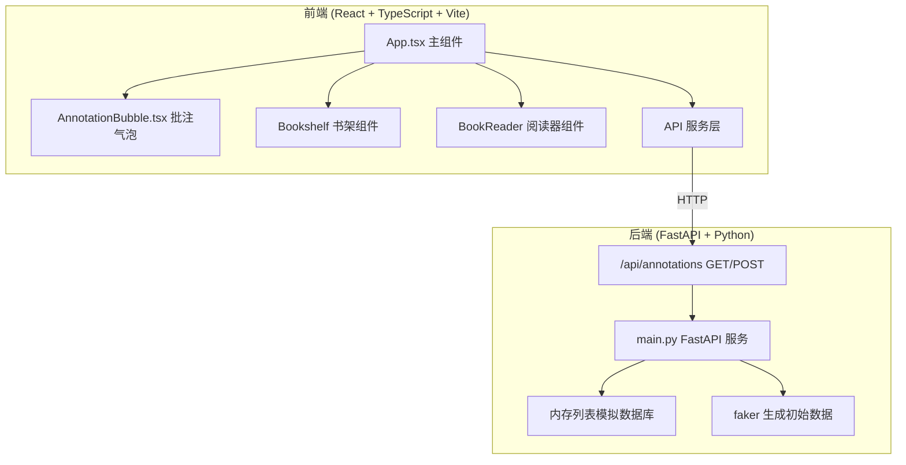
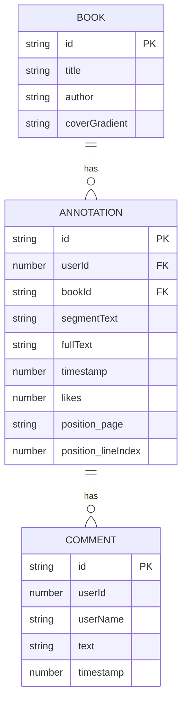

## 1. 架构设计



## 2. 技术描述

- **前端**：React 18 + TypeScript + Vite 5
- **构建工具**：Vite
- **样式方案**：原生 CSS + CSS Modules / 全局样式
- **状态管理**：React useState / useEffect 本地状态管理
- **后端**：FastAPI + Python
- **ASGI 服务器**：Uvicorn
- **数据模拟**：Faker 生成 10 条初始批注数据
- **数据存储**：内存列表模拟数据库（单机运行）
- **开发代理**：Vite 代理 /api 到 8000 端口
- **前端模拟延迟**：300ms 异步延迟

## 3. 文件结构与调用关系

```
project-root/
├── index.html                    # 入口 HTML，#root 挂载点
├── package.json                  # 依赖与脚本配置
├── vite.config.js                # Vite 配置，/api 代理
├── tsconfig.json                 # TypeScript 严格模式配置
├── src/
│   ├── App.tsx                   # 主组件，状态管理，路由切换
│   ├── AnnotationBubble.tsx      # 批注气泡组件（props传入，点赞回调）
│   ├── Bookshelf.tsx             # 书架网格组件
│   ├── BookReader.tsx            # 双页阅读器组件
│   ├── CommentInput.tsx          # 评论输入组件
│   ├── types/
│   │   └── index.ts              # TypeScript 类型定义
│   ├── services/
│   │   └── api.ts                # API 请求封装
│   ├── utils/
│   │   └── colors.ts             # 头像颜色分配工具
│   └── styles/
│       ├── App.css               # 主样式
│       └── AnnotationBubble.css  # 气泡样式
└── backend/
    └── main.py                   # FastAPI 服务，CRUD 端点
```

**数据流向**：
1. App.tsx → api.ts → GET /api/annotations → 后端返回批注列表 → App.tsx 状态更新 → 传递给 BookReader 和 AnnotationBubble
2. 用户选中段落 → BookReader 触发回调 → App.tsx 显示输入框 → 用户提交 → api.ts → POST /api/annotations → 后端存储 → 返回新批注 → App.tsx 更新列表
3. 点击气泡 → AnnotationBubble 展开 → 显示评论 → 发表评论 → api.ts → 后端更新

## 4. 数据模型

### 4.1 TypeScript 类型定义

```typescript
interface Annotation {
  id: string;
  userId: number;
  bookId: string;
  segmentText: string;
  fullText: string;
  timestamp: number;
  likes: number;
  position: {
    page: 'left' | 'right';
    lineIndex: number;
  };
  comments: Comment[];
}

interface Comment {
  id: string;
  userId: number;
  userName: string;
  text: string;
  timestamp: number;
}

interface Book {
  id: string;
  title: string;
  author: string;
  coverGradient: string;
  pages: string[][]; // 每页的行
}
```

### 4.2 数据模型 ER 图



## 5. API 定义

### 5.1 获取批注列表

**GET /api/annotations?bookId={bookId}**

响应：
```json
{
  "data": [
    {
      "id": "uuid",
      "userId": 1,
      "bookId": "book1",
      "segmentText": "段落片段",
      "fullText": "完整批注内容...",
      "timestamp": 1620000000000,
      "likes": 5,
      "position": {
        "page": "left",
        "lineIndex": 3
      },
      "comments": []
    }
  ]
}
```

### 5.2 创建批注

**POST /api/annotations**

请求体：
```json
{
  "userId": 1,
  "bookId": "book1",
  "segmentText": "选中的段落",
  "fullText": "批注内容",
  "position": {
    "page": "left",
    "lineIndex": 3
  }
}
```

响应：返回创建的批注对象

### 5.3 点赞批注

**POST /api/annotations/{id}/like**

响应：返回更新后的批注对象（含新的 likes 数）

### 5.4 添加评论

**POST /api/annotations/{id}/comments**

请求体：
```json
{
  "userId": 2,
  "userName": "用户名",
  "text": "评论内容"
}
```

响应：返回更新后的批注对象

## 6. 性能优化策略

- **虚拟列表**：批注超过 50 条时自动折叠最早批注
- **防抖节流**：输入框输入事件防抖
- **CSS 动画优化**：使用 transform 和 opacity 属性提升渲染性能
- **组件 memo**：使用 React.memo 避免不必要的重渲染
- **懒加载**：评论区按需加载
