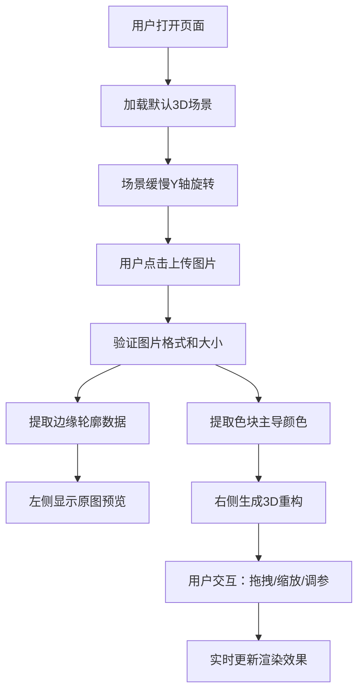

## 1. 产品概述

基于Blender风格化渲染原理的3D线描油画模拟工具，用户上传照片后自动提取边缘轮廓和色彩层次，在三维空间中用旋转的线框和色块重构动态立体油画效果。

- 核心目标：将平面照片转化为具有艺术感的3D动态油画效果，线条和色块随时间缓慢旋转变换，形成笔触在立体空间游走的视觉体验
- 目标用户：艺术爱好者、设计师、创意工作者
- 产品价值：提供一种新颖的图片风格化工具，将普通照片转化为独特的立体艺术作品

## 2. 核心功能

### 2.1 用户角色

| 角色 | 注册方式 | 核心权限 |
|------|----------|----------|
| 普通用户 | 无需注册 | 上传图片、调节参数、体验3D效果 |

### 2.2 功能模块

1. **3D场景展示**：深灰蓝背景的3D空间，默认展示500-800条线段组成的半透明轮廓线框
2. **图片上传处理**：支持jpg/png格式，最大5MB，提取边缘和色彩数据
3. **艺术重构渲染**：根据图片数据生成线框和色块Mesh，实现3D立体油画效果
4. **交互控制**：鼠标拖拽旋转视角、滚轮缩放、重置视角、调节色块深度
5. **性能监控**：左上角FPS计数器，保持30fps以上渲染帧率

### 2.3 页面详情

| 页面名称 | 模块名称 | 功能描述 |
|---------|---------|----------|
| 主页面 | 3D场景容器 | 全屏Three.js渲染，深灰蓝径向渐变背景 |
| 主页面 | 控制栏 | 底部半透明控制栏，包含上传按钮、重置视角、深度滑块 |
| 主页面 | FPS计数器 | 左上角绿色小字显示实时帧率 |
| 主页面 | 上传图片预览 | 场景左侧半透明平面展示原图 |
| 主页面 | 艺术重构区 | 场景右侧实时生成线框和色块重构 |

## 3. 核心流程

用户打开页面 → 看到默认3D线框场景（缓慢旋转） → 点击上传按钮选择图片 → 系统处理图片提取边缘和色彩 → 左侧显示原图预览 → 右侧生成3D线框和色块重构 → 用户可拖拽旋转视角/滚轮缩放 → 调节深度滑块改变立体层次 → 点击重置视角恢复默认视角

## 4. 用户界面设计

### 4.1 设计风格

- 主色调：深灰蓝 #1A2333（背景），暖白 #F5E6D3（线框），紫色 #6C63FF（按钮）
- 辅助色：绿色 #00FF00（FPS文字）
- 按钮风格：圆角8px，悬停变亮 #7B73FF，过渡动画0.2s
- 字体：现代无衬线字体，界面文字清晰可读
- 布局：全屏3D场景，底部悬浮控制栏，左上角FPS计数器
- 视觉效果：半透明元素、径向渐变背景、柔和的空间深度感

### 4.2 页面设计概述

| 页面名称 | 模块名称 | UI元素 |
|---------|---------|--------|
| 主页面 | 3D场景 | 深灰蓝径向渐变背景，居中3D线框/色块，Y轴缓慢旋转 |
| 主页面 | 底部控制栏 | 高度60px，背景rgba(0,0,0,0.5)，包含上传按钮、重置按钮、深度滑块 |
| 主页面 | FPS计数器 | 左上角，绿色14px小字，显示当前帧率 |
| 主页面 | 上传按钮 | 圆角8px，紫色背景，悬停动效 |
| 主页面 | 深度滑块 | 范围0.5-3.0，调节色块深度偏移 |

### 4.3 响应性

- 桌面端优先设计，全屏3D场景自适应窗口大小
- 控制栏元素在窗口缩小时保持间距和可用性
- 鼠标/触摸交互优化，支持拖拽和手势缩放

### 4.4 3D场景指导

- **环境与氛围**：深灰蓝 #1A2333 背景，径向渐变由中心向外变暗，营造沉浸式艺术空间
- **光照设置**：环境光 + 方向光，柔和照亮线框和色块，突出立体感
- **相机设置**：PerspectiveCamera，视场角60度，OrbitControls控制，阻尼0.1，缩放范围0.5-5倍
- **构图与焦点**：场景中心为重构艺术品，左侧原图预览，视觉重心在右侧3D重构区
- **交互与动画**：整体Y轴匀速旋转（30秒一圈），所有位置变化使用lerp插值（0.5s过渡），线框和色块随时间缓慢旋转变换角度
- **后处理效果**：无特殊后处理，保持清晰的线条和色块边缘
- **资源与性能预算**：线段500-800条，色块四边形若干，总面数不超过2000，帧率保持30fps以上

## 5. 性能与技术约束

- 总面数控制在2000以内
- 渲染帧率保持30fps以上
- 图片最大5MB，支持jpg/png格式
- 所有位置变化使用lerp插值，过渡时间0.5s
- 场景元素深度偏移0.5-1.5单位（可调至3.0）
