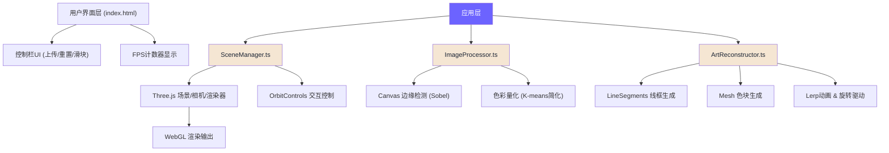

## 1. 架构设计



## 2. 技术描述

- **前端框架**：无额外UI框架，原生HTML + TypeScript
- **3D引擎**：Three.js @0.160.0
- **构建工具**：Vite @5.0.0
- **开发语言**：TypeScript @5.3.0（严格模式，ESModule）
- **类型定义**：@types/three @0.160.0

**项目结构**：
```
├── package.json          # 依赖配置
├── index.html            # 入口HTML
├── tsconfig.json         # TS配置
├── vite.config.js        # Vite配置
└── src/
    ├── SceneManager.ts      # 场景管理：相机、渲染器、控制器
    ├── ImageProcessor.ts    # 图像处理：边缘检测、色彩提取
    └── ArtReconstructor.ts  # 艺术重构：线框/色块生成、动画驱动
```

## 3. 核心模块职责

### 3.1 SceneManager.ts

**职责**：Three.js基础环境搭建与生命周期管理

| 方法 | 功能描述 |
|------|----------|
| `constructor(container: HTMLElement)` | 初始化场景、相机、渲染器、控制器 |
| `init()` | 创建光照、背景、默认占位线框 |
| `addObject(obj: Object3D)` | 添加3D对象到场景 |
| `removeObject(obj: Object3D)` | 从场景移除3D对象 |
| `resetCamera()` | 重置相机到默认视角 |
| `onWindowResize()` | 处理窗口大小变化 |
| `getScene()` | 获取场景实例 |
| `getCamera()` | 获取相机实例 |
| `render()` | 执行单帧渲染 |

**关键配置**：
- `PerspectiveCamera`: fov=60, near=0.1, far=1000, position=(0, 0, 12)
- `OrbitControls`: enableDamping=true, dampingFactor=0.1, minDistance=6, maxDistance=60
- `WebGLRenderer`: antialias=true, alpha=true, setPixelRatio(Math.min(window.devicePixelRatio, 2))
- 背景：Canvas绘制径向渐变 #1A2333 → #0D1118

### 3.2 ImageProcessor.ts

**职责**：图片上传验证与特征提取

| 方法 | 功能描述 |
|------|----------|
| `validateFile(file: File): boolean` | 验证格式(jpg/png)和大小(≤5MB) |
| `loadImage(file: File): Promise<HTMLImageElement>` | 加载图片为Image元素 |
| `extractEdges(img: HTMLImageElement, threshold?: number): LineData[]` | Sobel边缘检测，返回线段数组 |
| `extractColorPatches(img: HTMLImageElement, gridSize?: number): ColorPatch[]` | 网格采样取主导颜色 |
| `processImage(file: File): Promise<ProcessedImageData>` | 综合处理入口 |

**数据结构**：
```typescript
interface LineData {
  x1: number; y1: number;  // 起点 (归一化 -1~1)
  x2: number; y2: number;  // 终点 (归一化 -1~1)
  strength: number;        // 边缘强度 0~1
}

interface ColorPatch {
  x: number; y: number;    // 位置 (归一化 -1~1)
  color: THREE.Color;      // 主导颜色
  size: number;            // 尺寸系数 0.2~0.8
}

interface ProcessedImageData {
  lines: LineData[];
  patches: ColorPatch[];
  image: HTMLImageElement;
  texture: THREE.Texture;
}
```

**边缘检测算法**：简化Sobel算子，3x3卷积核，阈值二值化，Hough变换简化提取线段

**色彩提取**：网格划分(16x12)，每个网格取平均色或中位色作为主导色

### 3.3 ArtReconstructor.ts

**职责**：将处理后的数据转化为3D对象并驱动动画

| 方法 | 功能描述 |
|------|----------|
| `constructor(sceneManager: SceneManager)` | 绑定场景管理器 |
| `createDefaultWireframe()` | 创建默认占位线框(500-800条随机线段) |
| `reconstruct(data: ProcessedImageData)` | 根据图片数据生成线框和色块 |
| `setDepthRange(min: number, max: number)` | 设置深度偏移范围 |
| `update(deltaTime: number)` | 每帧更新：旋转 + lerp插值 |
| `clear()` | 清除所有重构对象 |

**关键实现细节**：

1. **线框生成 (LineSegments)**：
   - `BufferGeometry` 存储所有线段顶点
   - 自定义 `ShaderMaterial` 实现顶点渐变透明度
   - 颜色: #F5E6D3，透明度: 两端0 → 中间0.8
   - 深度偏移: 每条线段随机 z = 0.5~1.5

2. **色块生成 (Mesh)**：
   - 每个色块为 `PlaneGeometry` 四边形
   - 边长: 0.2~0.8 随机
   - `MeshBasicMaterial` / `MeshStandardMaterial`，透明度 0.7
   - 随机旋转角度，微小间隙避免重叠
   - 深度偏移: 每个色块随机 z = 0.5~1.5

3. **动画系统**：
   - 整体Y轴旋转: 周期30秒，角速度 = 2π / 30 rad/s
   - 每个元素独立微小旋转: 各自随机角速度
   - Lerp插值: 目标位置 ← lerp(当前, 目标, 1 - exp(-deltaTime * 4))
   - 过渡时间常数: 0.5s (通过系数4 ≈ 1/0.25 实现)

4. **原图预览平面**：
   - `PlaneGeometry` 尺寸适配图片比例
   - 位置: x = -8, y = 0, z = 0
   - 材质透明度: 0.6

## 4. 性能优化策略

| 优化点 | 方案 |
|--------|------|
| 几何体合并 | 所有线段使用单个BufferGeometry，单次draw call |
| 面片数量控制 | 总面数 ≤ 2000，色块数量动态调整 |
| 像素比限制 | `setPixelRatio(min(devicePixelRatio, 2))` |
| 透明度渲染 | 合理设置renderOrder，避免overdraw |
| 内存管理 | 重建时调用`dispose()`释放旧几何体和材质 |
| 帧率监控 | requestAnimationFrame计时，FPS低于30时降低色块密度 |

## 5. 入口文件设计

### index.html
- 全屏canvas容器 `#canvas-container`
- 底部控制栏 `#control-bar`，高度60px
- 上传按钮 `<input type="file" hidden>` + 触发按钮
- 重置按钮
- 深度滑块 `<input type="range" min="0.5" max="3.0" step="0.1" value="1.5">`
- FPS计数器 `#fps-counter`，fixed定位左上角

### 样式 (内联CSS)
```css
:root {
  --bg-primary: #1A2333;
  --line-color: #F5E6D3;
  --accent: #6C63FF;
  --accent-hover: #7B73FF;
  --fps-color: #00FF00;
}

#canvas-container {
  position: fixed;
  inset: 0;
  background: radial-gradient(circle at center, #1A2333 0%, #0D1118 100%);
}

#control-bar {
  position: fixed;
  bottom: 0;
  left: 0;
  right: 0;
  height: 60px;
  background: rgba(0, 0, 0, 0.5);
  backdrop-filter: blur(10px);
  display: flex;
  align-items: center;
  gap: 20px;
  padding: 0 30px;
  z-index: 10;
}

.btn {
  padding: 10px 20px;
  border: none;
  border-radius: 8px;
  background: var(--accent);
  color: white;
  cursor: pointer;
  transition: background 0.2s ease;
  font-size: 14px;
}

.btn:hover { background: var(--accent-hover); }

#fps-counter {
  position: fixed;
  top: 20px;
  left: 20px;
  color: var(--fps-color);
  font-family: 'Courier New', monospace;
  font-size: 14px;
  z-index: 10;
  text-shadow: 0 0 10px rgba(0, 255, 0, 0.5);
}
```

## 6. 构建与运行

**脚本命令**：
- `npm run dev`: 启动开发服务器 (vite)
- `npm run build`: 生产构建
- `npm run preview`: 预览生产构建

**启动流程**：
1. `npm install` 安装依赖
2. `npm run dev` 启动Vite开发服务器
3. 浏览器自动打开 http://localhost:5173
