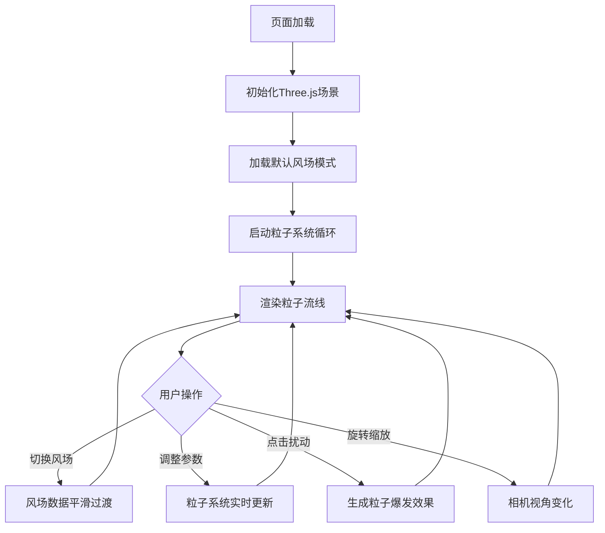

## 1. 产品概述
风场数据实时粒子流线追踪可视化器

本产品是一个基于Three.js的浏览器端3D可视化工具，用于直观展示风场气流运动的交互式可视化应用。通过彩色粒子沿着风场矢量流动，形成丝带或烟雾般的动态视觉效果，支持多种风场模式切换、交互控制和参数调节。

## 2. 核心功能

### 2.1 用户角色
| 角色 | 注册方式 | 核心权限 |
|------|----------|----------|
| 普通用户 | 无需注册，直接访问 | 浏览风场可视化、切换风场模式、调整粒子参数、点击注入扰动 |

### 2.2 功能模块
1. **主可视化页面**：3D风场场景、粒子流线渲染、风场模式选择
2. **控制面板**：粒子密度调节、颜色映射切换、轨迹显示模式切换
3. **状态栏**：实时粒子数、平均风速、帧率显示
4. **交互系统**：鼠标交互（旋转/缩放、点击粒子爆发

### 2.3 页面详情
| 页面名称 | 模块名称 | 功能描述 |
|----------|----------|----------|
| 主可视化页面 | 3D风场场景 | 深蓝灰背景3D场景，中心16:9矩形风场区域，半透明网格辅助线 |
| 主可视化页面 | 粒子流线渲染 | 2000个粒子实时追踪风矢量，HSL颜色映射，渐变拖尾 |
| 主可视化页面 | 风场模式选择 | 下拉菜单切换"旋转台风"、"湍流涡旋"、"直线急流"三种模式，0.8秒平滑过渡 |
| 控制面板 | 粒子密度滑块 | 500-5000粒子数量实时调节 |
| 控制面板 | 颜色映射选择 | 风速-颜色、涡度-颜色、随机多彩三种映射模式 |
| 控制面板 | 轨迹模式切换 | 流线模式(显示拖尾) / 点阵模式(仅瞬时位置)，0.5秒颜色跳变 |
| 状态栏 | 实时状态显示 | 粒子总数、平均风速、FPS帧率，低帧率红色警示 |
| 交互系统 | 视角控制 | 鼠标拖拽旋转、滚轮缩放 |
| 交互系统 | 点击扰动 | 点击风场区域生成100个亮白粒子爆发，1.5秒消散 |

## 3. 核心流程

用户打开页面 → 3D场景初始化加载默认风场(旋转台风) → 粒子系统启动并开始流动 → 用户可切换风场模式/调整参数/点击注入扰动 → 状态栏实时更新显示数据

## 4. 用户界面设计

### 4.1 设计风格
- **主色调**：深蓝灰 #0F172A 背景，石板灰 #1E293B 辅助色
- **强调色**：蓝绿 #14B8A6 滑块头，冷色 #00BFFF 到暖色 #FF6B6B 粒子渐变
- **按钮样式**：圆角12px，悬停背景 #334155 → #475569，过渡0.2秒
- **字体**：无衬线系统字体，深色模式
- **布局风格**：全屏3D场景居中，右下角毛玻璃控制面板，顶部半透明状态栏
- **视觉效果**：毛玻璃 backdrop-filter: blur(8px)，粒子拖尾渐变透明度过渡

### 4.2 页面设计概述
| 页面名称 | 模块名称 | UI元素 |
|----------|----------|--------|
| 主可视化页面 | 3D场景 | 全屏Canvas，深蓝灰背景#0F172A，16:9风场矩形，半透明网格线#1E293B |
| 主可视化页面 | 粒子系统 | 彩色粒子#00BFFF→#FF6B6B渐变，HSL插值，拖尾透明度1.0→0.0 |
| 控制面板 | 容器 | 毛玻璃效果，背景#1E293B/80，边框1px实线#334155，圆角12px |
| 控制面板 | 密度滑块 | 深色轨道#334155，蓝绿滑块头#14B8A6，悬停#2DD4BF |
| 控制面板 | 下拉选单 | 深色下拉，悬停高亮 |
| 控制面板 | 切换按钮 | 圆角按钮，悬停变色 |
| 状态栏 | 容器 | 半透明#0F172A/70，高度40px，flex居中，低FPS淡红警示 |
| 状态栏 | 文本 | 白色无衬线字体，粒子数/风速/FPS三栏显示 |

### 4.3 响应式
- 桌面端优先设计
- 3D场景自适应窗口大小
- 控制面板固定右下角
- 状态栏固定顶部
- 触摸设备支持触摸拖拽和双指缩放

### 4.4 3D场景指引
- **环境**：纯深蓝灰#0F172A背景，无HDRI，科技感深色氛围
- **光照**：环境光 + 轻微定向光，确保粒子清晰可见
- **相机设置**：PerspectiveCamera，初始距离可观察完整风场区域，支持OrbitControls控制
- **构图**：风场矩形位于场景中心XY平面，粒子在矩形区域上方轻微浮动
- **交互动画**：风场模式切换0.8秒缓入缓出，轨迹模式切换0.5秒颜色跳变，粒子透明度0.3-0.8波动
- **后处理效果**：粒子拖尾渐变透明度，点击爆发粒子扩散效果
- **性能预算**：800x600视口，2000粒子60FPS，5000粒子30FPS
