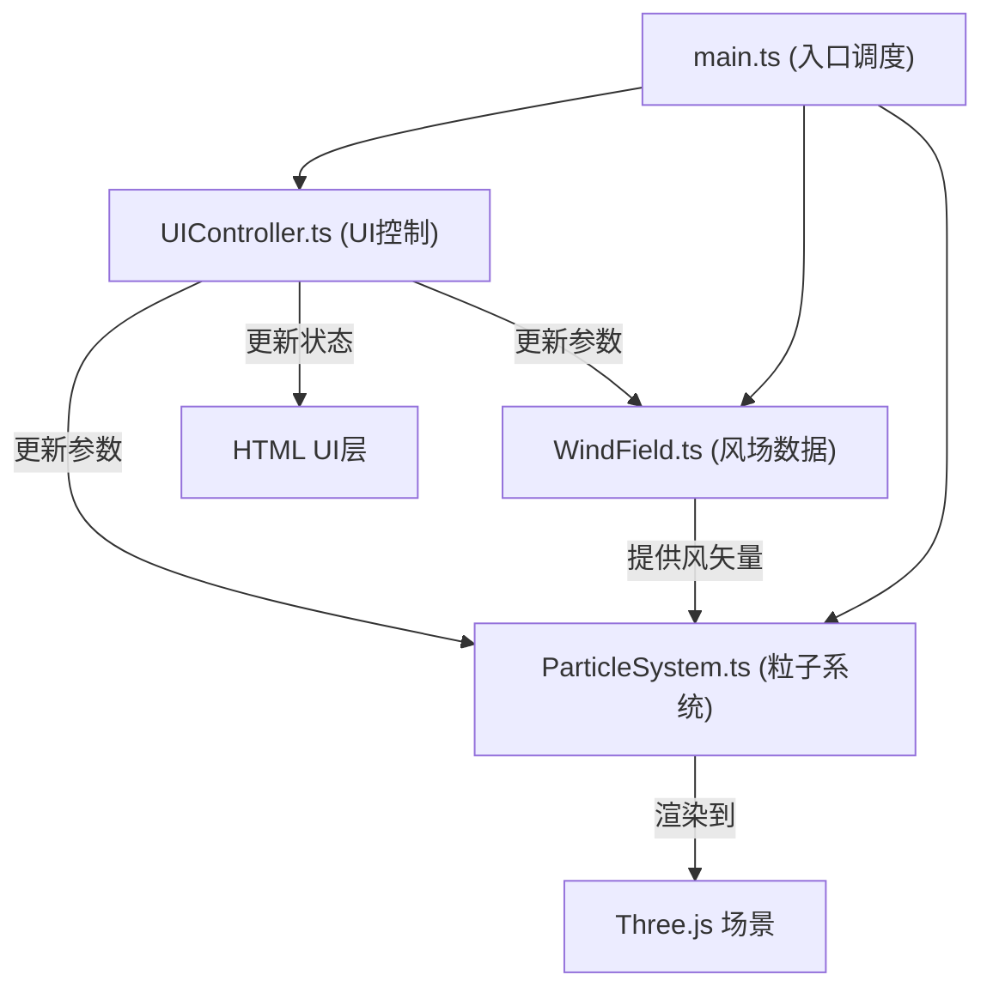

## 1. 架构设计



## 2. 技术说明

- **前端框架**：TypeScript + Three.js + Vite
- **初始化工具**：Vite（手动配置）
- **后端**：无（纯前端应用）
- **数据库**：无（使用内置风场算法生成数据）
- **3D库**：three@^0.160.0, @types/three@^0.160.0
- **构建工具**：Vite@^5.0.0
- **类型系统**：TypeScript@^5.0.0（严格模式，target ES2020）

## 3. 文件结构

| 文件路径 | 用途 |
|----------|------|
| /package.json | 项目依赖和脚本配置 |
| /vite.config.js | Vite构建配置（esbuild目标es2020） |
| /tsconfig.json | TypeScript配置（严格模式，ESModule） |
| /index.html | 入口HTML，包含Canvas容器和UI层 |
| /src/main.ts | 应用入口，初始化场景、相机、渲染器，调度各模块 |
| /src/WindField.ts | 风场类，存储二维矢量网格，插值计算风矢量，预设风场模式 |
| /src/ParticleSystem.ts | 粒子系统类，管理粒子池、位置、速度、拖尾、颜色，渲染Points |
| /src/UIController.ts | UI控制器，绑定DOM事件，更新参数，输出状态栏信息 |

## 4. 核心数据模型

### 4.1 风场数据结构

```typescript
// 风场模式枚举
type WindFieldMode = 'typhoon' | 'turbulence' | 'jetstream';

// 二维矢量
interface Vector2 {
  x: number;
  y: number;
}

// 风场网格
class WindField {
  width: number;           // 风场物理宽度（16单位）
  height: number;          // 风场物理高度（9单位）
  gridResolution: number;  // 网格分辨率
  vectors: Vector2[][];    // 矢量网格数据
  mode: WindFieldMode;     // 当前模式
  
  // 核心方法
  getWindAt(x: number, y: number): Vector2;  // 双线性插值获取风矢量
  getSpeedAt(x: number, y: number): number;  // 获取风速大小
  getVorticityAt(x: number, y: number): number;  // 获取涡度
  setMode(mode: WindFieldMode, transitionTime?: number): void;  // 切换模式
  update(deltaTime: number): void;  // 每帧更新（用于过渡动画）
}
```

### 4.2 粒子系统数据结构

```typescript
// 颜色映射模式
type ColorMode = 'speed' | 'vorticity' | 'random';

// 轨迹显示模式
type TrailMode = 'streamline' | 'dots';

// 单个粒子
interface Particle {
  position: Vector2;      // 当前位置
  velocity: Vector2;      // 当前速度
  trail: Vector2[];       // 拖尾历史点（5-8个）
  color: THREE.Color;     // 当前颜色
  alpha: number;          // 当前透明度
  alphaPhase: number;     // 透明度波动相位
  randomColor: THREE.Color; // 随机颜色（用于random模式）
}

// 爆发粒子
interface BurstParticle {
  position: THREE.Vector3;
  velocity: THREE.Vector3;
  life: number;           // 剩余生命（秒）
  maxLife: number;        // 总生命（1.5秒）
}

class ParticleSystem {
  particles: Particle[];          // 常规粒子池
  burstParticles: BurstParticle[]; // 爆发粒子池
  count: number;                  // 当前粒子数量
  colorMode: ColorMode;           // 颜色映射模式
  trailMode: TrailMode;           // 轨迹模式
  points: THREE.Points;           // Three.js Points对象
  trailGeometry: THREE.BufferGeometry;  // 拖尾几何体
  
  // 核心方法
  setCount(count: number): void;               // 设置粒子数量
  setColorMode(mode: ColorMode): void;         // 设置颜色映射
  setTrailMode(mode: TrailMode): void;         // 设置轨迹模式
  createBurst(x: number, y: number): void;     // 创建粒子爆发
  update(deltaTime: number, windField: WindField): void;  // 每帧更新
}
```

### 4.3 UI控制器

```typescript
interface StatusData {
  particleCount: number;
  avgSpeed: number;
  fps: number;
}

class UIController {
  // DOM元素引用
  modeSelect: HTMLSelectElement;
  densitySlider: HTMLInputElement;
  colorSelect: HTMLSelectElement;
  trailButton: HTMLButtonElement;
  statusBar: HTMLElement;
  particleCountEl: HTMLElement;
  avgSpeedEl: HTMLElement;
  fpsEl: HTMLElement;
  
  // 回调
  onModeChange: (mode: WindFieldMode) => void;
  onDensityChange: (count: number) => void;
  onColorModeChange: (mode: ColorMode) => void;
  onTrailModeChange: (mode: TrailMode) => void;
  onCanvasClick: (x: number, y: number) => void;
  
  // 核心方法
  bindEvents(): void;
  updateStatus(data: StatusData): void;
}
```

## 5. 渲染循环

```typescript
// main.ts 中的主循环
function animate() {
  requestAnimationFrame(animate);
  const deltaTime = clock.getDelta();
  
  // 1. 更新风场（过渡动画）
  windField.update(deltaTime);
  
  // 2. 更新粒子系统
  particleSystem.update(deltaTime, windField);
  
  // 3. 更新相机控制
  controls.update();
  
  // 4. 渲染
  renderer.render(scene, camera);
  
  // 5. 更新UI状态
  uiController.updateStatus({
    particleCount: particleSystem.count,
    avgSpeed: windField.getAverageSpeed(),
    fps: calculateFPS()
  });
}
```

## 6. 性能优化策略

1. **粒子池复用**：使用固定大小粒子数组，避免频繁GC
2. **BufferGeometry**：使用THREE.BufferGeometry存储粒子位置和颜色数据，单批次渲染
3. **双线性插值**：风场查询使用预计算网格 + 双线性插值，避免实时数学计算
4. **requestAnimationFrame**：使用浏览器原生动画循环，自动适配刷新率
5. **拖尾优化**：固定拖尾长度，数组循环复用历史点
6. **HSL颜色插值**：预计算颜色查找表，避免每帧颜色空间转换
