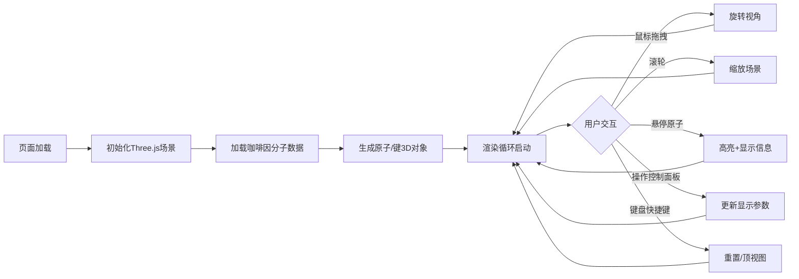

## 1. 产品概述

3D分子结构可视化应用，面向化学教育、科研工作者和学生群体，提供沉浸式的分子三维模型交互体验。

- 支持加载预定义分子结构（如咖啡因 C8H10N4O2），以球棍/空间填充模式展示原子与化学键
- 提供丰富的视角操控、原子拾取和信息查询功能
- 深色科技感UI界面，响应式适配桌面和移动端

## 2. 核心功能

### 2.1 用户角色

| 角色 | 使用场景 | 核心需求 |
|------|----------|----------|
| 化学教师/学生 | 课堂教学/课后学习 | 直观观察分子结构、查看原子信息 |
| 科研工作者 | 论文配图/结构分析 | 精细操控视角、切换显示模式 |

### 2.2 功能模块

1. **3D分子渲染模块**：加载分子数据、生成原子球体与化学键、标准元素配色
2. **视角控制模块**：鼠标拖拽旋转、滚轮缩放、键盘快捷键（重置视角/顶视图）
3. **原子交互模块**：鼠标悬停/点击拾取、高亮高亮、浮动信息卡片展示
4. **UI控制面板**：显示模式切换、旋转速度调节、背景色切换
5. **响应式适配模块**：窗口自适应、移动端汉堡菜单

### 2.3 功能详情

| 模块名称 | 功能点 | 描述 |
|-----------|--------|------|
| 3D分子渲染 | 数据加载 | 解析预定义分子结构数据（3D坐标、元素类型、键连接） |
| 3D分子渲染 | 原子球体 | C灰色、H白色、N蓝色、O红色，根据元素设置半径 |
| 3D分子渲染 | 化学键 | 灰色圆柱体连接原子中心，空间填充模式下隐藏 |
| 视角控制 | 鼠标旋转 | 拖拽旋转整个分子场景，平滑过渡 |
| 视角控制 | 滚轮缩放 | 滚轮控制相机距离，有限范围限制 |
| 视角控制 | 键盘快捷键 | R键重置视角、T键切换顶视图、ESC关闭信息卡片 |
| 原子交互 | 悬停高亮 | 鼠标悬停原子时颜色变亮+外发光效果 |
| 原子交互 | 信息卡片 | 右上角玻璃拟态卡片显示元素符号、坐标、ID |
| UI控制 | 显示模式 | 球棍模式 ↔ 空间填充模式（0.3s过渡） |
| UI控制 | 旋转速度 | 0-5倍速滑块控制自动旋转 |
| UI控制 | 背景切换 | 深空渐变/纯白/纯黑三种背景 |
| 响应式 | 自适应 | 窗口resize时更新相机和渲染器 |
| 响应式 | 移动端 | 宽度<768px时控制面板折叠为汉堡菜单 |

## 3. 核心流程

## 4. 用户界面设计

### 4.1 设计风格

- **主色调**：深蓝 `#0a0e27` → 紫色 `#1a0f3a` 径向渐变（深空背景）
- **元素色**：
  - 碳(C)：`#8c8c8c` 灰色
  - 氢(H)：`#f5f5f5` 白色
  - 氮(N)：`#3050f8` 蓝色
  - 氧(O)：`#ff0d0d` 红色
- **UI元素色**：
  - 控制面板背景：半透明毛玻璃 `rgba(20, 25, 50, 0.75)` + backdrop-blur
  - 信息卡片：毛玻璃效果 `rgba(255,255,255,0.08)` + blur(16px)
  - 边框/高亮：青色 `#00d4ff`
  - 文本：主文本 `#e8eaf0`，次要文本 `#9aa3b2`
- **圆角风格**：统一 12px 圆角，柔和阴影
- **字体**：主字体使用 'Segoe UI' / system-ui，数字使用等宽字体

### 4.2 页面布局

| 区域 | 位置 | UI元素 |
|------|------|--------|
| 3D画布 | 全屏 z-index:0 | WebGL渲染画布，径向渐变背景 |
| 控制面板 | 左上角 z-index:10 | lil-gui 面板（移动端折叠为汉堡菜单） |
| 信息卡片 | 右上角 z-index:10 | 原子信息浮动卡片（默认隐藏） |
| 底部提示 | 底部居中 z-index:5 | 快捷键操作提示文字 |

### 4.3 响应式设计

- **桌面端（≥768px）**：左侧控制面板常驻展开，右上角信息卡片独立浮动
- **移动端（<768px）**：控制面板折叠为左上角汉堡按钮，点击弹出全屏抽屉菜单；信息卡片改为底部弹出

### 4.4 3D场景配置

- **光照**：AmbientLight(0xffffff, 0.5) + DirectionalLight(0xffffff, 0.8) + 2个PointLight补光
- **相机**：PerspectiveCamera(fov:60, near:0.1, far:1000)，初始位置(0,0,15)
- **后处理**：轻微Bloom效果使原子高亮发光更自然
- **动画**：场景自动旋转（可调速），鼠标悬停原子发射光脉冲动画
