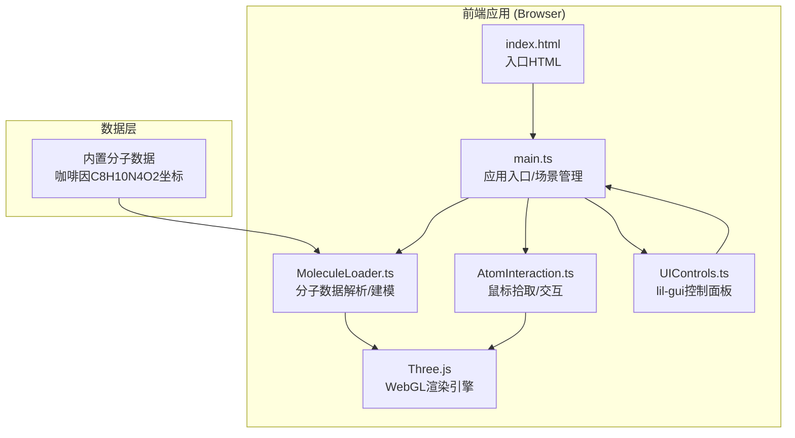

## 1. 架构设计



## 2. 技术选型说明

| 分类 | 技术栈 | 版本要求 | 用途 |
|------|--------|----------|------|
| 前端框架 | Three.js | ^0.160.0 | 3D场景渲染、几何体创建、材质管理 |
| 语言 | TypeScript | ^5.3.0 | 类型安全、接口定义、开发体验 |
| 构建工具 | Vite | ^5.0.0 | 快速开发服务器、TS编译、HMR |
| UI控制库 | lil-gui | ^0.19.0 | 轻量级控制面板、滑块/开关组件 |
| 类型声明 | @types/three | ^0.160.0 | Three.js TypeScript类型支持 |

## 3. 文件结构定义

```
project-root/
├── .trae/documents/
│   ├── PRD.md              # 产品需求文档
│   └── TechArch.md         # 技术架构文档
├── src/
│   ├── main.ts             # 应用入口：场景/相机/渲染器初始化、动画循环
│   ├── MoleculeLoader.ts   # 分子数据解析、原子/键几何体生成
│   ├── AtomInteraction.ts  # 射线拾取、高亮效果、信息卡片
│   └── UIControls.ts       # lil-gui控制面板封装
├── index.html              # HTML入口、CSS样式、Canvas容器
├── package.json            # 依赖配置、dev脚本
├── vite.config.js          # Vite基础配置
└── tsconfig.json           # TypeScript严格模式配置
```

## 4. 核心模块接口定义

### 4.1 MoleculeLoader.ts

```typescript
export interface AtomData {
  id: number;
  element: 'C' | 'H' | 'N' | 'O';
  position: [number, number, number];
}

export interface BondData {
  atom1: number;
  atom2: number;
}

export interface MoleculeData {
  name: string;
  formula: string;
  atoms: AtomData[];
  bonds: BondData[];
}

export class MoleculeLoader {
  static ELEMENT_COLORS: Record<string, number>;
  static ELEMENT_RADII: Record<string, number>;
  static loadCaffeine(): MoleculeData;
  static buildGroup(data: MoleculeData, mode: 'ballstick' | 'spacefill'): THREE.Group;
  static updateDisplayMode(group: THREE.Group, mode: 'ballstick' | 'spacefill'): void;
}
```

### 4.2 AtomInteraction.ts

```typescript
export interface AtomInfo {
  id: number;
  element: string;
  position: { x: number; y: number; z: number };
}

export class AtomInteraction {
  constructor(
    camera: THREE.PerspectiveCamera,
    moleculeGroup: THREE.Group,
    domElement: HTMLElement
  );
  setHoveredAtom(atom: THREE.Mesh | null): void;
  onClick(callback: (info: AtomInfo | null) => void): void;
  onHover(callback: (info: AtomInfo | null) => void): void;
  dispose(): void;
}
```

### 4.3 UIControls.ts

```typescript
export interface ControlParams {
  rotationSpeed: number;       // 0 ~ 5
  displayMode: 'ballstick' | 'spacefill';
  background: 'space' | 'white' | 'black';
  autoRotate: boolean;
}

export class UIControls {
  params: ControlParams;
  constructor(initialParams: Partial<ControlParams>);
  onChange(callback: (params: ControlParams) => void): void;
  toggleMobileMenu(): void;    // 移动端汉堡菜单切换
  destroy(): void;
}
```

## 5. 性能优化策略

### 5.1 渲染优化
- 原子球体共享 SphereGeometry 实例（按半径分类）
- 化学键圆柱体使用 CylinderGeometry + 矩阵变换，避免重复创建几何体
- 材质使用 MeshStandardMaterial，开启 flatShading 降低计算量
- 若原子数 > 50，考虑使用 InstancedMesh 批量渲染

### 5.2 交互优化
- Raycaster 限制为只检测分子 Group 下的原子 Mesh
- 鼠标移动事件使用 requestAnimationFrame 节流，避免重复拾取
- 高亮效果通过修改材质 emissive 属性实现，不额外创建对象

### 5.3 动画优化
- 自动旋转直接修改 Group.rotation，无需逐对象更新
- 过渡动画（模式切换、背景色）使用线性插值，0.3s完成
- 使用 THREE.Clock 计算 deltaTime，保证不同帧率下动画速度一致

## 6. 响应式与兼容性

| 断点 | 行为 |
|------|------|
| ≥ 768px | 控制面板常驻左上角（lil-gui 原生位置） |
| < 768px | 控制面板默认隐藏，添加汉堡按钮 `.hamburger-btn`，点击全屏展开 |

兼容性：使用 `pointerdown/move/up` 事件统一处理鼠标和触摸输入。
