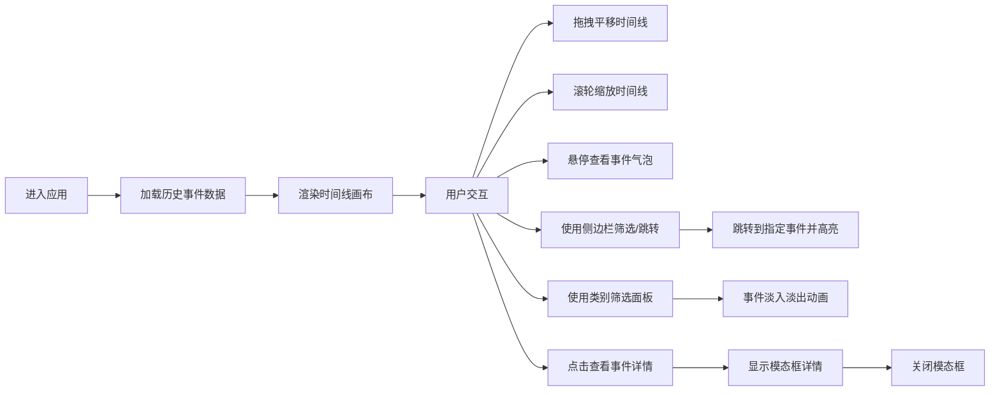

## 1. 产品概述

交互式历史时间线可视化应用，让用户以拖拽和缩放的方式探索从古代到现代的重大历史事件。通过Canvas绘制时间线，配合D3.js进行数据绑定和布局，提供沉浸式的历史事件浏览体验。

- 主要用途：历史学习、事件研究、时间线探索
- 目标用户：历史爱好者、学生、研究人员
- 产品价值：以可视化、交互式方式呈现历史事件，提升学习效率和探索乐趣

## 2. 核心功能

### 2.1 功能模块
1. **主时间线视图**：Canvas绘制的水平时间线，支持无限滚动和缩放
2. **事件节点展示**：圆点/星形图标表示历史事件，按类别着色
3. **筛选面板**：按事件类别筛选显示
4. **事件详情模态框**：点击事件查看详细信息
5. **侧边栏事件列表**：按年代分组的折叠列表，支持快速跳转
6. **快速跳转工具**：输入年份快速定位

### 2.2 页面详情
| 页面名称 | 模块名称 | 功能描述 |
|-----------|-------------|---------------------|
| 主页面 | 时间线画布 | 水平无限滚动、滚轮缩放（0.1x-10x）、拖拽平移、缩放中心跟随鼠标 |
| 主页面 | 事件节点 | 圆点大小由重要性决定、重要事件星形图标+发光效果、悬停气泡提示 |
| 主页面 | 类别筛选 | 5种类别筛选（政治/科技/文化/战争/其他）、淡入淡出动画（300ms） |
| 主页面 | 事件详情 | 模态框展示、缩放进入动画、半透明遮罩、星级评分 |
| 主页面 | 侧边栏 | 年代分组折叠列表（古代/中世纪/近代/现代）、手风琴展开、点击跳转高亮 |
| 主页面 | 信息展示 | 左上角显示当前中心年份和缩放级别、右下角年份跳转输入框 |

## 3. 核心流程

## 4. 用户界面设计

### 4.1 设计风格
- **主色调**：深色背景 #1a1a2e，搭配柔和渐变
- **事件类别颜色**：政治-红色、科技-蓝色、文化-绿色、战争-橙色、其他-灰色
- **时间轴线**：发光白色细线
- **按钮风格**：圆角设计，微动效过渡（500ms内完成）
- **字体**：现代无衬线字体，清晰易读
- **整体风格**：科技感、沉浸式、深色主题

### 4.2 页面设计概述
| 页面名称 | 模块名称 | UI元素 |
|-----------|-------------|-------------|
| 主页面 | 时间线画布 | 深色渐变背景、发光时间轴线、彩色事件节点、悬停气泡 |
| 主页面 | 侧边栏 | 滚动条、手风琴折叠分组、事件列表项、高亮脉冲动画 |
| 主页面 | 筛选面板 | 复选框、类别色块、淡入淡出动画 |
| 主页面 | 模态框 | 半透明遮罩、缩放动画、星级评分、关闭按钮 |
| 主页面 | 信息栏 | 左上角年份/缩放显示、右下角跳转输入框 |

### 4.3 响应式设计
- **桌面端**：中间时间线占80%宽度，右侧侧边栏占20%宽度
- **移动端**（<768px）：侧边栏变为底部抽屉面板
- **触摸优化**：支持触摸拖拽和双指缩放

### 4.4 性能要求
- 支持至少500个事件节点
- 拖拽和缩放时保持60fps帧率
- 事件气泡弹出延迟不超过100ms
