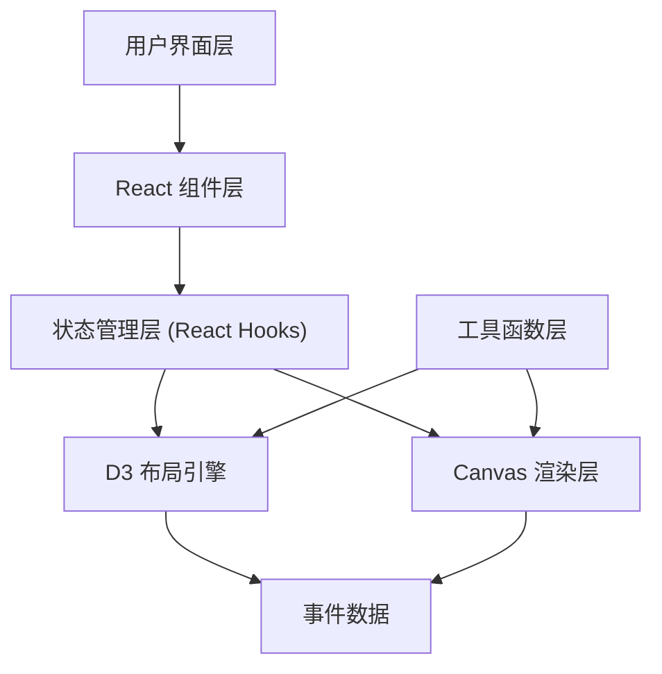

## 1. 架构设计



## 2. 技术描述

- **前端框架**：React 18 + TypeScript
- **构建工具**：Vite 5
- **UI渲染**：HTML5 Canvas 2D
- **数据可视化**：D3.js（比例尺、布局计算）
- **样式方案**：CSS Modules / 内联样式
- **数据生成**：模拟数据，uuid 生成唯一标识
- **类型系统**：TypeScript 严格模式

## 3. 文件结构

```
src/
├── main.tsx              # 应用入口
├── App.tsx               # 主布局组件
├── components/
│   └── TimelineCanvas.tsx # Canvas时间线组件
├── data/
│   └── events.ts         # 历史事件模拟数据
└── utils/
    └── layoutEngine.ts   # D3布局计算工具
```

## 4. 数据模型

### 4.1 事件数据模型

```typescript
interface HistoricalEvent {
  id: string;
  year: number;
  title: string;
  description: string;
  category: 'political' | 'technology' | 'culture' | 'war' | 'other';
  importance: number; // 1-10
}

interface EraGroup {
  name: string;
  startYear: number;
  endYear: number;
  events: HistoricalEvent[];
}
```

### 4.2 视图状态模型

```typescript
interface TimelineState {
  zoom: number;       // 缩放级别 0.1-10
  offsetX: number;    // 水平偏移量
  centerYear: number; // 中心年份
}

interface FilterState {
  categories: Record<string, boolean>;
}
```

## 5. 核心模块说明

### 5.1 TimelineCanvas 组件
- 负责Canvas绑定和事件监听
- 处理鼠标拖拽、滚轮缩放
- 调用D3比例尺计算坐标
- 实现事件节点的Canvas绘制
- 处理悬停检测和气泡显示
- 性能优化：requestAnimationFrame 渲染循环

### 5.2 layoutEngine 工具
- 使用D3 scaleTime 创建时间比例尺
- 计算事件节点的x坐标位置
- 根据重要性计算节点大小
- 处理节点碰撞检测和层级布局

### 5.3 App 主组件
- 管理全局状态（缩放、偏移、筛选、选中事件）
- 布局：时间线区域 + 侧边栏
- 侧边栏手风琴事件列表
- 模态框事件详情展示
- 响应式布局适配

## 6. 性能优化策略

1. **Canvas批量绘制**：使用单个绘制周期完成所有节点渲染
2. **视口裁剪**：只绘制可见区域内的事件节点
3. **requestAnimationFrame**：确保60fps流畅动画
4. **事件委托**：Canvas上通过坐标计算检测鼠标事件，避免大量DOM节点
5. **数据缓存**：预计算节点位置，避免重复计算
6. **离屏渲染**：复杂图形使用离屏Canvas缓存
