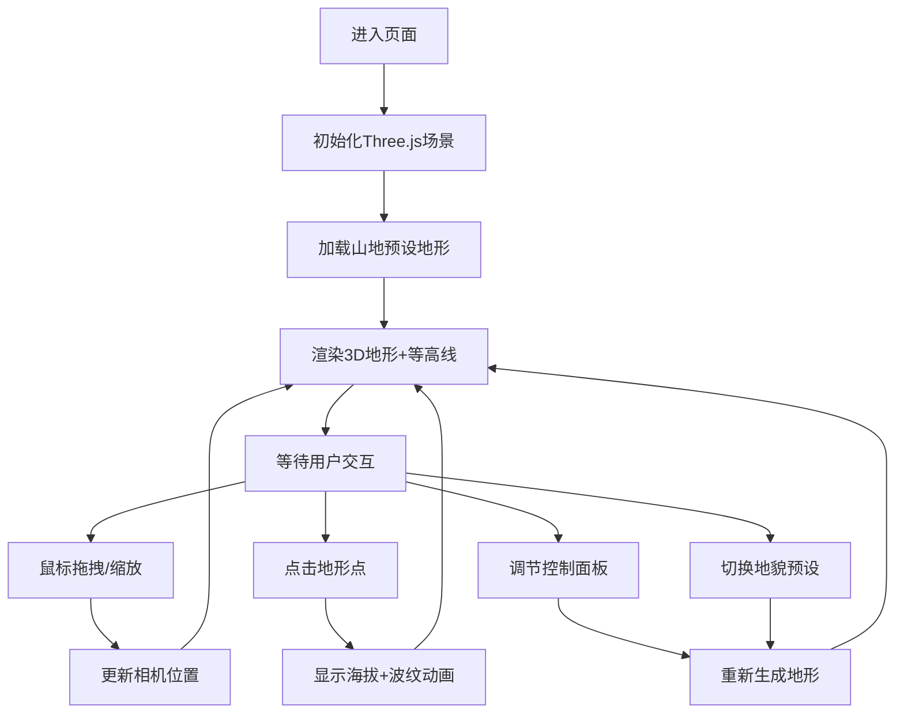

## 1. 产品概述
3D地形探索应用是一款面向地理课堂的交互式教学工具，通过可视化三维地形帮助学生直观理解等高线、海拔和地貌特征。
- 目标用户：地理教师与学生，地理爱好者
- 产品价值：将抽象地理概念转化为可交互的3D可视化体验，提升课堂教学效果

## 2. 核心功能

### 2.1 功能模块
1. **主场景页面**：3D地形渲染区、信息面板、控制面板

### 2.2 页面详情
| 页面名称 | 模块名称 | 功能描述 |
|---------|---------|---------|
| 主场景 | 地形渲染 | 基于噪声算法生成3D地形，支持山地/丘陵两种预设地貌，顶点数≤20000 |
| 主场景 | 等高线叠加 | 动态绘制等高线，颜色随海拔渐变，支持显示/隐藏切换，更新延迟<100ms |
| 主场景 | 交互探索 | 鼠标拖拽旋转视角、滚轮缩放、点击显示海拔数值（波纹动画标记） |
| 主场景 | 实时调节 | 滑块控制地形粗糙度和海拔缩放比例，调整后实时重新生成 |
| 主场景 | 自动旋转 | 按钮切换自动缓慢旋转视角，平滑过渡动画 |
| 主场景 | 信息面板 | 左上角半透明面板显示当前海拔、坐标、等高线状态 |
| 主场景 | 控制面板 | 右下角面板：地貌下拉菜单、两个滑块、自动旋转按钮，移动端折叠为底部弹出 |

## 3. 核心流程
用户进入页面后，默认加载山地地貌3D地形。可通过右下角控制面板切换地貌预设、调节粗糙度和海拔缩放、开启/关闭自动旋转、切换等高线显示。通过鼠标拖拽旋转视角、滚轮缩放、点击地形任意位置查看该点海拔（触发波纹动画），左上角信息面板实时显示当前状态数据。移动端控制面板自动折叠为底部抽屉式。

## 4. 用户界面设计
### 4.1 设计风格
- 主色：#0a0a2e（深邃科技蓝）
- 辅色：#4fc3f7（亮青色高亮）
- 渐变色带：等高线海拔颜色从低到高：#00e676 → #ffeb3b → #ff9800 → #f44336 → #e91e63
- UI风格：圆角玻璃毛玻璃效果（backdrop-filter: blur(12px)），背景 rgba(10,10,46,0.6)，边框 1px solid rgba(79,195,247,0.2)
- 按钮：圆角12px，悬停时 #4fc3f7 发光阴影动画
- 滑块：渐变轨道（#4fc3f7 → #0a0a2e），圆形滑块带发光

### 4.2 页面设计概述
| 页面名称 | 模块名称 | UI元素 |
|---------|---------|--------|
| 主场景 | 信息面板 | 左上角半透明卡片，海拔/坐标/等高线状态文字标签，间距12px，字体14px |
| 主场景 | 控制面板 | 右下角半透明卡片，地貌下拉（styled select）、两个滑块组（带数值标签）、自动旋转切换按钮 |
| 主场景 | 点击标记 | 点击位置出现白色同心圆波纹，向外扩散渐隐，持续1.2s |
| 主场景 | 移动端控制抽屉 | 底部半透明弹出条，点击展开控制面板，高度自适应 |

### 4.3 响应式
- 桌面端（>768px）：信息面板左上，控制面板右下，常驻显示
- 移动端（≤768px）：信息面板顶部全屏宽度简化版，控制面板折叠为底部弹出抽屉，触摸手势适配（双指缩放、单指旋转）

### 4.4 3D场景指导
- 环境：深空蓝色背景 #0a0a2e，雾化效果近透明远景渐隐
- 光照：DirectionalLight（主光源，色温偏冷）+ HemisphereLight（环境补光，蓝紫色调）+ AmbientLight（微弱基础光）
- 相机：PerspectiveCamera，FOV 60°，初始距离150单位，俯仰角45°
- 地形材质：MeshStandardMaterial + 顶点颜色（海拔映射到颜色渐变），wireframe可选
- 等高线材质：LineBasicMaterial，颜色按海拔映射渐变，透明叠加
- 后处理：轻微抗锯齿，无其他后期效果以保证性能
