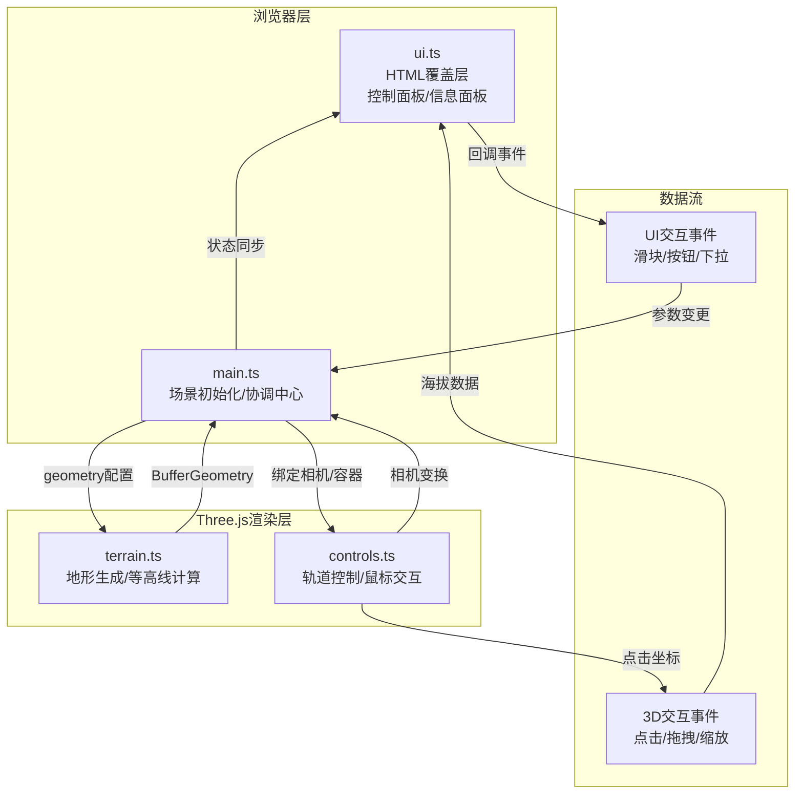

## 1. 架构设计

## 2. 技术描述
- 前端框架：原生 TypeScript（无React/Vue，符合用户明确指定的文件结构）
- 3D渲染：Three.js @0.160.x + @types/three
- 构建工具：Vite @5.x
- 编程语言：TypeScript 5.x（严格模式 strict: true，ESModule target: ES2020）
- 噪声算法：内置 Simplex Noise 实现（纯TS，无外部依赖）
- 后端：无（纯前端应用）
- 数据库：无

## 3. 文件结构与职责
| 文件路径 | 职责描述 | 输出/接口 |
|---------|---------|----------|
| package.json | 项目依赖、脚本配置 | three, @types/three, vite, typescript；dev脚本 |
| vite.config.js | Vite基础配置，server.port=5173 | 无插件纯ESM配置 |
| tsconfig.json | TS严格模式配置 | strict:true, module:ESNext, target:ES2020 |
| index.html | 入口HTML，全屏canvas容器#app，引入main.ts | DOM容器 |
| src/main.ts | 场景初始化、协调各模块、主循环、事件分发 | init()、render()循环、地形更新触发 |
| src/terrain.ts | 地形网格生成、噪声计算、等高线提取、海拔查询 | createTerrain(opts)→BufferGeometry, getContours(geo, levels)→Line[], getHeightAt(x,z)→number |
| src/controls.ts | 轨道控制、鼠标事件绑定、相机更新、点击拾取 | createControls(camera, dom, onTerrainClick, onStateChange)→{ update, setAutoRotate, dispose } |
| src/ui.ts | DOM UI构建、控件事件绑定、状态显示、波纹标记 | createUI(opts)→{ setElevation, setCoords, setContourStatus, setTerrainParams, on(event, cb) } |
| src/style.css | 全局样式、毛玻璃UI、滑块、按钮、动画、响应式 | 所有视觉样式定义 |

**调用关系与数据流向**：
1. `index.html` → 加载 `src/main.ts`
2. `main.ts` → 调用 `terrain.createTerrain()` 获取地形geometry → 添加到场景
3. `main.ts` → 调用 `terrain.getContours()` 获取等高线 → 添加到场景
4. `main.ts` → 调用 `controls.createControls()` → 传入相机、容器、onTerrainClick回调
5. `main.ts` → 调用 `ui.createUI()` → 传入 onChange 回调、初始参数
6. UI滑块变化 → `ui`触发onChange → `main`接收新参数 → 调用`terrain.createTerrain()`重新生成
7. 用户点击地形 → `controls`通过Raycaster拾取 → 回调`onTerrainClick(point, elevation)` → `main` → `ui.setElevation()` + `ui.showRipple(point)`
8. 每一帧 → `main.animate()` → `controls.update()` → `renderer.render()`

## 4. 关键技术实现说明

### 4.1 地形生成算法
- 网格分辨率：128×128（16384顶点，<20000约束）
- 高度计算：多层Simplex Noise叠加（fBm分形布朗运动）
  - 山地预设：6 octaves，lacunarity=2.0，gain=0.5，基础频率0.008
  - 丘陵预设：4 octaves，lacunarity=1.8，gain=0.55，基础频率0.004
- 顶点颜色：将高度值归一化后映射到5段渐变色彩带
- 着色：MeshStandardMaterial + vertexColors: true，flatShading可选

### 4.2 等高线实现
- 方案：遍历网格三角形边，使用Marching Squares算法提取等值线段
- 层级：默认10层，按地形高度范围等间距分布
- 性能：geometry更新时重新计算，使用LineSegments + BufferGeometry，合并为一个Line对象减少draw call
- 渐变：每条等高线取对应层级海拔映射到统一渐变色带

### 4.3 交互控制
- 轨道控制：自制OrbitControls简化版（无外部依赖），支持左键旋转、滚轮缩放、右键平移
- 点击拾取：Raycaster + mouse坐标归一化，intersectObjects命中地形mesh
- 自动旋转：每帧绕Y轴增量0.003弧度，启用/禁用时使用lerp平滑过渡（系数0.1）
- 波纹标记：创建THREE.RingGeometry动画缩放+透明度衰减，持续1200ms后移除

### 4.4 UI实现
- 纯DOM + CSS，无框架依赖，性能最优
- 毛玻璃：`backdrop-filter: blur(12px) saturate(150%)` + 半透明背景
- 滑块渐变：`linear-gradient(to right, #4fc3f7, #0a0a2e)`
- 按钮悬停发光：`box-shadow: 0 0 20px rgba(79,195,247,0.6)` + transition
- 响应式：`@media (max-width: 768px)` 媒体查询，移动端抽屉CSS transform动画
