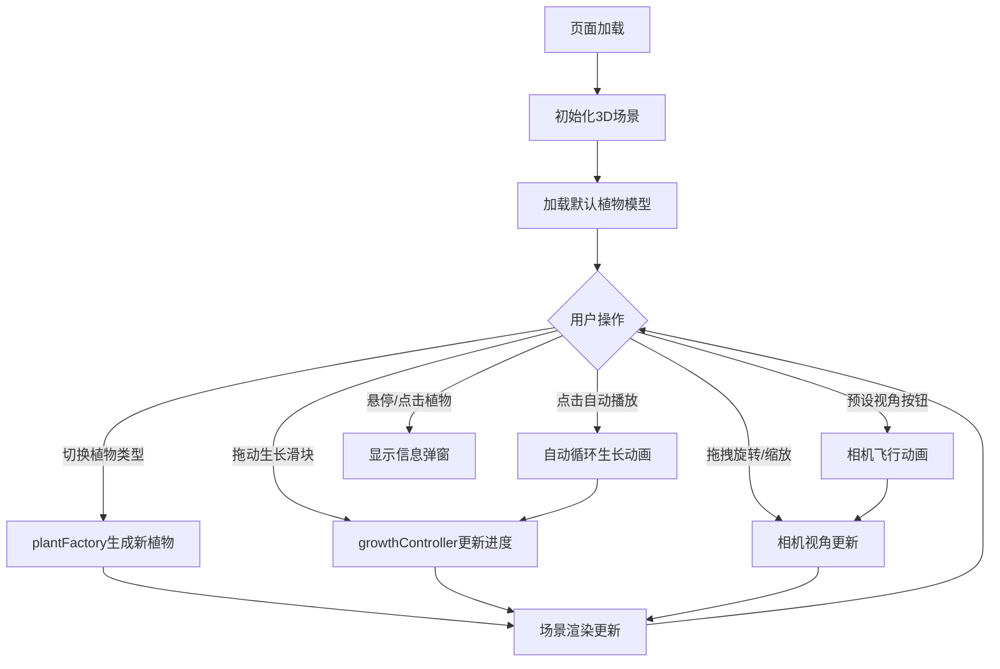

## 1. 产品概述

植物园3D植物生长模拟展示工具——一个基于Web的交互式3D可视化应用，让游客在触摸屏上直观观察不同植物从幼苗到开花的完整生长周期和器官形态变化。

- 目标用户：植物园游客、教育工作者、植物爱好者
- 核心价值：将抽象的植物生长过程转化为直观的3D动态展示，兼具科学性与观赏性

## 2. 核心功能

### 2.1 功能模块

1. **3D植物展示页**：全屏3D场景，植物模型居中展示，左上角控制面板，右上角视角按钮
2. **植物信息弹窗**：选中植物后显示详细信息（名称、科属、生长周期描述）

### 2.2 页面详情

| 页面名称 | 模块名称 | 功能描述 |
|----------|----------|----------|
| 3D植物展示页 | 3D场景渲染 | Three.js渲染植物3D模型，包含茎干、叶片、花朵，支持bloom后期处理光晕效果 |
| 3D植物展示页 | 植物建模 | 至少两种植物类型（向日葵、蕨类），每种3个生长阶段，叶片螺旋排列，花瓣旋转展开 |
| 3D植物展示页 | 生长动画 | 5秒内从幼苗到开花的平滑过渡，茎干伸长+叶片展开+花苞绽放，easeInOutQuad缓动 |
| 3D植物展示页 | 生长控制 | 滑块手动调节0%-100%、自动播放2倍速循环、当前阶段文字描述和天数进度条 |
| 3D植物展示页 | 视角控制 | 鼠标拖拽Y轴360度旋转、滚轮0.5x-3x缩放、0.3s平滑阻尼、4个预设视角按钮（1s飞行动画） |
| 3D植物展示页 | 光照雾效 | 三盏方向光+环境光、指数雾效（浓度随视角高度变化） |
| 3D植物展示页 | UI控制面板 | 毛玻璃半透明面板、生长滑块、自动播放开关、植物类型下拉菜单 |
| 3D植物展示页 | 响应式适配 | 桌面端完整UI，移动端(<768px)折叠为汉堡菜单，触控单指旋转+双指缩放 |

## 3. 核心流程

用户打开页面 → 3D场景加载默认植物（向日葵幼苗） → 用户通过下拉菜单切换植物类型 → 拖动滑块或点击"自动播放"观察生长动画 → 切换视角观察植物各角度形态 → 悬停/点击植物查看信息弹窗

## 4. 用户界面设计

### 4.1 设计风格

- 主题：深色科技风
- 主色调：深灰色背景(#1a1a2e)，绿色光晕(#00ff88)，金色渐变(#ffd700)
- 按钮：圆角微光按钮，悬停发光效果
- 字体：等宽字体(monospace)，生长描述文字从绿色渐变到金色
- 布局：左上角控制面板，右上角视角按钮，全屏3D画布
- 毛玻璃效果：backdrop-filter: blur，半透明面板

### 4.2 页面设计概览

| 页面名称 | 模块名称 | UI元素 |
|----------|----------|--------|
| 3D植物展示页 | 控制面板 | 毛玻璃半透明面板，生长进度滑块，自动播放开关，植物类型下拉菜单，0.2s淡入淡出交互 |
| 3D植物展示页 | 视角按钮 | 右上角4个按钮（正面/俯视/左侧/右侧），微光悬停效果 |
| 3D植物展示页 | 进度信息 | 滑块下方实时显示当前阶段文字描述，monospace字体，绿到金色渐变 |
| 3D植物展示页 | 信息弹窗 | 选中植物后弹出，显示植物名称和描述 |

### 4.3 响应式

- 桌面端(≥768px)：完整UI面板，鼠标交互
- 移动端(<768px)：UI控件折叠为汉堡菜单，触控支持单指旋转和双指缩放

### 4.4 3D场景指导

- 环境：深色背景(#1a1a2e)，淡蓝色指数雾效，绿色bloom光晕
- 光照：三盏方向光（主光暖白偏右上、补光冷蓝偏左、背光偏下）+ 低强度环境光
- 相机：透视相机，FOV 45度，近裁面0.1，远裁面1000，初始距离5
- 焦点元素：居中植物模型，bloom绿色光晕环绕
- 交互：鼠标拖拽旋转（Y轴360度），滚轮缩放（0.5x-3x），预设视角1s飞行动画
- 后期处理：UnrealBloomPass实现绿色光晕效果
- 性能预算：顶点总数≤50000，帧率≥30fps，帧间隔≤33ms
