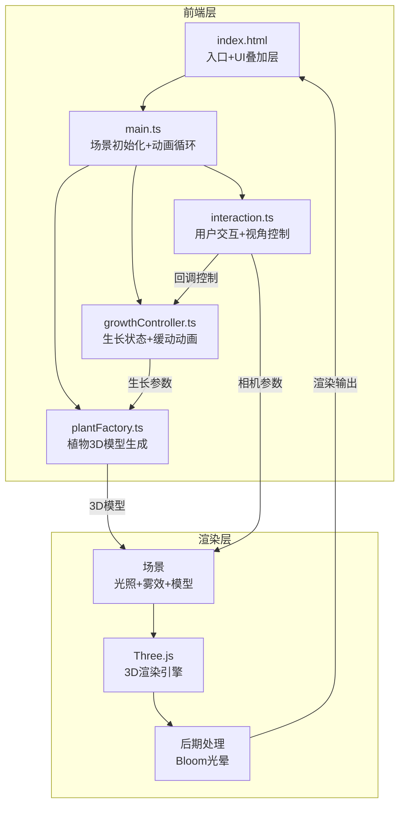

## 1. 架构设计



数据流向：
- **growthController → plantFactory**：生长进度(0-1)和阶段参数传递，plantFactory据此生成/更新植物几何体
- **interaction → growthController**：用户滑块/播放操作通过回调影响生长状态
- **interaction → 场景相机**：鼠标拖拽和预设视角控制相机位置
- **main.ts**：协调所有模块，管理动画循环，每帧调用growthController.update()和渲染

## 2. 技术说明

- 前端：TypeScript + Three.js + Vite（纯前端项目，无后端）
- 初始化工具：Vite
- 后端：无
- 数据库：无（纯客户端应用）

### 依赖清单

| 依赖 | 版本 | 用途 |
|------|------|------|
| three | ^0.170.0 | 3D渲染引擎 |
| @types/three | ^0.170.0 | Three.js类型定义 |
| vite | ^6.0.0 | 构建工具和开发服务器 |
| typescript | ^5.7.0 | TypeScript编译器 |
| dat.gui | ^0.7.9 | 调试GUI（开发辅助） |

## 3. 文件结构

```
├── package.json          # 依赖与脚本
├── vite.config.js        # Vite配置
├── tsconfig.json         # TypeScript严格模式配置
├── index.html            # 入口HTML（全屏canvas+UI叠加层）
├── src/
│   ├── main.ts           # 入口：场景/相机/渲染器初始化，动画循环
│   ├── plantFactory.ts   # 植物生成：接收阶段参数，输出3D模型
│   ├── growthController.ts # 生长控制：状态管理，lerp插值，缓动曲线
│   └── interaction.ts    # 交互：鼠标/触控事件，信息弹窗，视角控制
```

### 模块调用关系

```
main.ts
  ├── import { PlantFactory } from './plantFactory'
  ├── import { GrowthController } from './growthController'
  ├── import { InteractionManager } from './interaction'
  │
  ├── 初始化场景、相机、渲染器、光照、雾效、后期处理
  ├── 创建 PlantFactory 实例
  ├── 创建 GrowthController 实例（持有 PlantFactory 引用）
  ├── 创建 InteractionManager 实例（持有 GrowthController 引用）
  └── 动画循环：
       ├── growthController.update(deltaTime) → 计算生长进度
       ├── plantFactory.updateGrowth(progress) → 更新植物几何体
       └── renderer.render() → 渲染输出

growthController.ts
  ├── 持有 PlantFactory 引用
  ├── 管理：当前进度、目标进度、自动播放状态、播放速度
  ├── update(dt)：按缓动曲线推进进度，调用 plantFactory.updateGrowth()
  └── 回调接口：onProgressChange, onStageChange

plantFactory.ts
  ├── createPlant(type: 'sunflower' | 'fern', progress: number): THREE.Group
  ├── updateGrowth(progress: number): void
  ├── 内部方法：buildStem(), buildLeaves(), buildFlower()
  └── 植物类型配置：茎干高度曲线、叶片数量/角度、花朵形态

interaction.ts
  ├── 监听鼠标/触控事件
  ├── OrbitControls 风格的旋转缩放（带阻尼）
  ├── 预设视角飞行动画
  ├── UI控件绑定（滑块、按钮、下拉菜单）
  └── 回调 → growthController.setProgress() / toggleAutoPlay()
```

## 4. 核心算法

### 4.1 缓动曲线

```typescript
function easeInOutQuad(t: number): number {
  return t < 0.5 ? 2 * t * t : 1 - Math.pow(-2 * t + 2, 2) / 2;
}
```

### 4.2 生长进度到形态映射

- 0%-33%：幼苗阶段（茎干短，1-2片小叶，无花）
- 33%-66%：成长阶段（茎干伸长，叶片增多展开，花苞出现）
- 66%-100%：开花阶段（茎干最高，叶片完全展开，花朵绽放）

### 4.3 相机飞行动画

使用 THREE.Vector3.lerp + easeInOutQuad，1秒内从当前位置飞行到预设位置。

### 4.4 雾效浓度随视角高度变化

相机Y坐标越高 → 雾密度越低（清晰），Y越低 → 雾密度越高（朦胧）。
