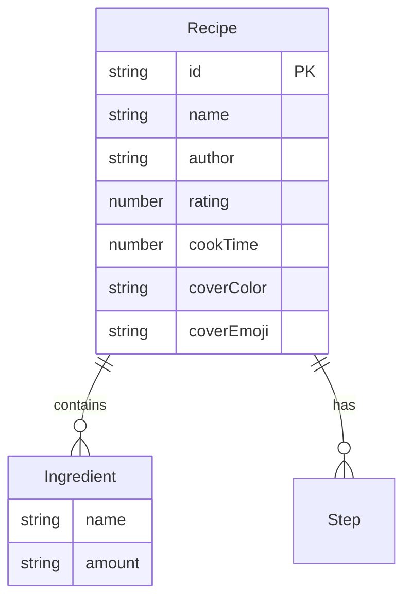

## 1. 架构设计

```mermaid
flowchart TB
    "Frontend[前端 React + TypeScript]" --> "Router[React Router]"
    "Router" --> "RecipeList[食谱列表页]"
    "Router" --> "RecipeDetail[食谱详情页]"
    "Router" --> "CreateRecipe[创建食谱页]"
    "RecipeList" --> "RecipeCard[食谱卡片组件]"
    "RecipeList" --> "MockAPI[Mock API 层]"
    "RecipeDetail" --> "MockAPI"
    "CreateRecipe" --> "MockAPI"
    "MockAPI" --> "MockData[Mock数据层]"
    "RecipeDetail" --> "LocalStorage[localStorage 收藏持久化]"
```

## 2. 技术说明
- 前端：React 18 + TypeScript + Vite
- 初始化工具：vite-init (react-ts模板)
- 样式：Tailwind CSS + CSS Modules（动画部分）
- 路由：react-router-dom v6
- 状态管理：zustand（收藏状态、食谱列表状态）
- 后端：Mock服务（mockjs生成数据，拦截fetch请求）
- 数据库：无，使用内存数据 + localStorage持久化

## 3. 路由定义
| 路由 | 用途 |
|------|------|
| / | 食谱列表页，展示所有食谱卡片，支持搜索过滤 |
| /recipe/:id | 食谱详情页，展示完整信息，食材勾选和收藏 |
| /create | 创建食谱页，表单创建新食谱 |

## 4. API定义

### 4.1 数据类型
```typescript
interface Recipe {
  id: string;
  name: string;
  author: string;
  rating: number;
  cookTime: number;
  ingredients: Ingredient[];
  steps: string[];
  coverColor: string;
  coverEmoji: string;
}

interface Ingredient {
  name: string;
  amount: string;
}
```

### 4.2 API端点
| 方法 | 路径 | 描述 | 请求体 | 响应 |
|------|------|------|--------|------|
| GET | /api/recipes | 获取所有食谱 | - | Recipe[] |
| GET | /api/recipes/:id | 获取单个食谱 | - | Recipe |
| POST | /api/recipes | 创建新食谱 | Recipe | Recipe |

## 5. 数据模型



## 6. 文件结构
```
├── index.html
├── package.json
├── vite.config.js
├── tsconfig.json
├── src/
│   ├── main.tsx
│   ├── App.tsx
│   ├── pages/
│   │   ├── RecipeList.tsx
│   │   ├── RecipeDetail.tsx
│   │   └── CreateRecipe.tsx
│   ├── components/
│   │   └── RecipeCard.tsx
│   ├── mock/
│   │   ├── mockData.ts
│   │   └── mockServer.ts
│   ├── types/
│   │   └── index.ts
│   └── store/
│       └── useRecipeStore.ts
```
