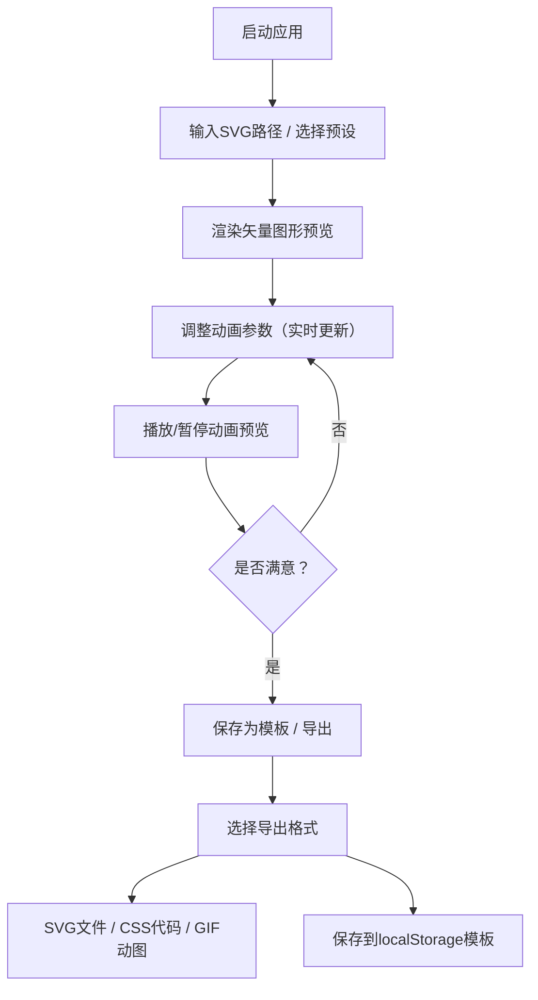

## 1. 产品概述

SVG动画Logo生成器是一款面向设计师、开发者和品牌创作者的在线工具，允许用户通过直观的参数调节界面，实时生成并导出高质量的动态矢量Logo动画。

- 核心用途：快速生成可导出的动态SVG Logo，无需编写复杂的CSS/SVG动画代码
- 目标用户：UI/UX设计师、前端开发者、创业者、营销内容创作者
- 产品价值：降低动态Logo制作门槛，提供即时预览与多格式导出，赋能品牌视觉创意

## 2. 核心特性

### 2.1 功能模块

1. **SVG画布编辑区**：路径文本输入、预设形状库、矢量图形预览、变换手柄
2. **动画参数控制面板**：时长滑块、缓动函数选择、旋转/缩放调节、颜色循环开关
3. **播放控制栏**：播放/暂停（空格快捷键）、重置、循环开关
4. **导出模态框**：SVG文件导出、CSS动画代码片段复制、GIF动图导出（进度条）
5. **模板管理系统**：模板保存（localStorage）、模板加载列表、最多5个模板上限

### 2.2 页面详情

| 页面名称 | 模块名称 | 功能描述 |
|-----------|-------------|---------------------|
| 主工作区 | SVG画布编辑区 | 路径输入框、预设形状按钮组、可交互矢量预览、拖动手柄 |
| 主工作区 | 动画参数面板 | 时长滑块(0.5-5s)、缓动下拉、旋转滑块(0-360°)、缩放滑块(0.5-2.0)、颜色循环开关 |
| 主工作区 | 播放控制栏 | 播放/暂停按钮、重置按钮、循环开关、进度指示 |
| 主工作区 | 模板管理 | 模板名称输入框、保存按钮、模板下拉列表（5个上限）、加载按钮 |
| 导出弹窗 | 格式选择区 | SVG/CSS/GIF三个导出选项卡、对应操作按钮 |
| 导出弹窗 | GIF导出区 | 编码进度条、取消按钮、下载按钮 |

## 3. 核心流程

用户启动应用后，在左侧画布输入SVG路径或选择预设形状，通过右侧面板调节动画参数，实时预览效果，满意后通过导出功能获取文件或代码。可随时将当前配置保存为模板，后续一键加载复用。

## 4. 用户界面设计

### 4.1 设计风格

- **主色调**：深空蓝紫渐变主题，背景 `#1a1a2e`、面板 `#16213e`、控件 `#0f3460`
- **强调色**：青蓝渐变 `#00d9ff → #7b61ff`，用于滑块轨道、按钮悬停发光、进度条
- **按钮样式**：圆角8px，悬停时box-shadow从透明过渡到 `0 0 20px rgba(0,217,255,0.5)`，动画0.2s
- **字体**：标题使用 Space Grotesk 或 JetBrains Mono 等现代几何无衬线字体；正文使用 Inter 或系统等宽字体
- **布局风格**：左右分栏（3:7），卡片式面板，毛玻璃边框效果（backdrop-filter）
- **图标风格**：线性风格SVG图标，统一使用24px尺寸，颜色与主题一致

### 4.2 页面设计概述

| 页面名称 | 模块名称 | UI 元素 |
|-----------|-------------|-------------|
| 主工作区 | 顶部标题栏 | 应用Logo名、主题装饰线条、最大宽度1200px居中 |
| 主工作区 | SVG画布区（70%） | 深色渐变画布背景、中心十字参考线、路径输入textarea、预设形状按钮栏、变换手柄 |
| 主工作区 | 控制面板区（30%） | 分组折叠卡片、渐变滑块轨道、发光焦点输入框、标签左对齐 |
| 主工作区 | 播放控制栏 | 固定在画布下方，按钮横向排列，循环开关切换样式 |
| 导出弹窗 | 模态层 | 半透明暗色遮罩、圆角16px卡片、顶部关闭按钮、三选项卡切换 |
| 导出弹窗 | 进度条 | 圆角渐变条（青→紫）、百分比数字居中 |

### 4.3 响应式适配

- **桌面端（>768px）**：左右3:7分栏布局，最大宽度1200px水平居中
- **平板端（≤768px）**：控制面板折叠到底部，提供展开/收起按钮，画布占满全宽
- **手机端（≤480px）**：路径输入框高度压缩，滑块尺寸适配触摸操作（≥44px高度）
- **触摸优化**：所有可交互元素最小触摸区域44×44px，按钮间距≥12px

### 4.4 动效与微交互

- 页面加载：分区块渐入（staggered fade-in，延迟50ms递增）
- 滑块拖动：轨道渐变填充实时跟随进度，手柄放大1.2倍
- 按钮悬停：发光阴影+轻微上浮（translateY(-2px)），0.2s过渡
- 弹窗打开：缩放+淡入（0.3s cubic-bezier(0.34,1.56,0.64,1)）
- 循环切换：开关颜色平滑过渡，带脉冲涟漪
- 动画循环衔接：每次循环结束0.2s淡入淡出
