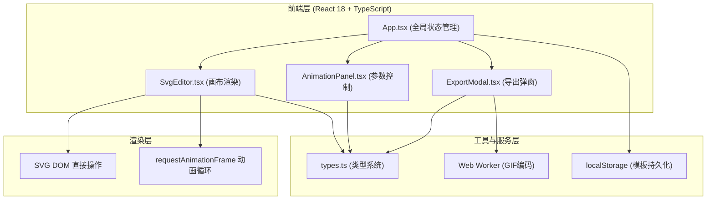

## 1. 架构设计



## 2. 技术描述

- **前端框架**：React@18 + TypeScript@5（严格模式）
- **构建工具**：Vite@5 + @vitejs/plugin-react
- **样式方案**：原生CSS Modules + CSS变量（无需Tailwind，保持轻量）
- **动画引擎**：requestAnimationFrame + CSS transform，自定义缓动函数映射
- **GIF编码**：gif.js + 内联Web Worker（Blob URL方式，避免外部资源依赖）
- **文件下载**：file-saver@2
- **唯一标识**：uuid@9
- **后端**：无（纯前端单页应用）
- **数据存储**：浏览器 localStorage（模板管理）

## 3. 核心模块结构

| 文件路径 | 职责定义 |
|-------|---------|
| `package.json` | 依赖声明：react, react-dom, typescript, vite, @vitejs/plugin-react, uuid, file-saver, gif.js |
| `vite.config.js` | React插件配置，端口默认5173 |
| `tsconfig.json` | strict: true，target: ES2020，jsx: react-jsx |
| `index.html` | 入口HTML，`<div id="root">` 容器，引入字体CDN |
| `src/types.ts` | 导出 SvgElement, AnimationParams, ExportFormat, Template 等核心接口 |
| `src/App.tsx` | 顶层状态容器，props分发，响应式布局逻辑，模板CRUD |
| `src/SvgEditor.tsx` | SVG路径渲染、变换矩阵、requestAnimationFrame动画循环、播放控制、拖动手柄 |
| `src/AnimationPanel.tsx` | 滑块/下拉/开关控件，useThrottle(30fps) 防抖，参数向上传递 |
| `src/ExportModal.tsx` | 模态框、三种导出格式实现、GIF Web Worker管理、进度条 |
| `src/gif.worker.ts` | 内嵌gif.js worker脚本（通过Blob URL加载） |

## 4. 性能优化方案

### 4.1 动画帧率保障（60fps）
- 使用 `requestAnimationFrame` 驱动渲染循环，而非 setInterval
- 所有变换通过 CSS `transform: matrix()` 一次性应用，避免多次重排
- SVG元素使用 `will-change: transform` 提示浏览器创建合成层
- 动画时间戳使用 `performance.now()` 高精度计时

### 4.2 参数调节流畅度（30fps滑块响应）
- 滑块onChange使用 `useThrottle` Hook，节流间隔 ~33ms（对应30fps）
- 动画状态独立于参数更新状态，避免参数变化导致动画循环重建
- 颜色循环动画使用HSL插值，通过CSS变量直接更新，不触发React re-render

### 4.3 GIF导出不卡UI
- 使用独立的 `Web Worker` 执行gif.js编码，数据通过 `postMessage` 传输
- 进度回调使用 `Transferable Objects` 传递二进制数据，减少拷贝
- 画布帧采样使用 `OffscreenCanvas`（如浏览器支持），否则离屏canvas

## 5. 核心数据模型

### 5.1 类型定义

```typescript
// src/types.ts
export interface SvgElement {
  id: string;
  pathData: string;
  fill: string;
  stroke: string;
  strokeWidth: number;
  viewBox: string;
}

export type EasingFunction =
  | 'ease'
  | 'ease-in'
  | 'ease-out'
  | 'ease-in-out'
  | 'elastic'
  | 'bounce';

export interface AnimationParams {
  duration: number;           // 0.5 - 5 秒
  easing: EasingFunction;
  rotation: number;           // 0 - 360 度
  scale: number;              // 0.5 - 2.0
  colorCycle: boolean;
  hueStart: number;           // 0 - 360
  hueRange: number;           // 30 - 360
}

export type ExportFormat = 'svg' | 'css' | 'gif';

export interface Template {
  id: string;
  name: string;               // 英数，≤20字符
  createdAt: number;
  svgElement: SvgElement;
  animationParams: AnimationParams;
}

export interface PlaybackState {
  isPlaying: boolean;
  isLooping: boolean;
  currentTime: number;        // 秒
  progress: number;           // 0 - 1
}
```

### 5.2 预设形状路径库

```
圆形:   "M 50,10 a 40,40 0 1,1 -0.01,0 z"
星形:   "M50 5 L61 40 L98 40 L68 62 L79 97 L50 75 L21 97 L32 62 L2 40 L39 40 Z"
波浪线: "M 10,50 Q 30,20 50,50 T 90,50"
螺旋线: "M50,50 m0,-45 a45,45 0 1,1 -0.1,0 a40,40 0 1,0 0.1,0 a35,35 0 1,1 -0.1,0 ..."
```

## 6. 快捷键定义

| 按键 | 功能 |
|-----|------|
| `Space` | 播放 / 暂停（焦点不在输入框时生效） |
| `R` | 重置动画到初始状态 |
| `Ctrl+S` | 触发保存模板对话框 |
| `Esc` | 关闭导出弹窗 |

## 7. 关键算法

### 7.1 缓动函数映射表

```
ease:        cubic-bezier(0.25, 0.1, 0.25, 1)
ease-in:     cubic-bezier(0.42, 0, 1, 1)
ease-out:    cubic-bezier(0, 0, 0.58, 1)
ease-in-out: cubic-bezier(0.42, 0, 0.58, 1)
elastic:     自定义: t => sin(-13π/2*(t+1)) * 2^(-10t) + 1
bounce:      自定义分段函数: 4段抛物线衰减弹跳
```

### 7.2 颜色循环（HSL渐变动画）

```
每帧 hue = (hueStart + progress * hueRange) % 360
fill = `hsl(${hue}, 80%, 55%)`
启用时覆盖原始填充色
```
