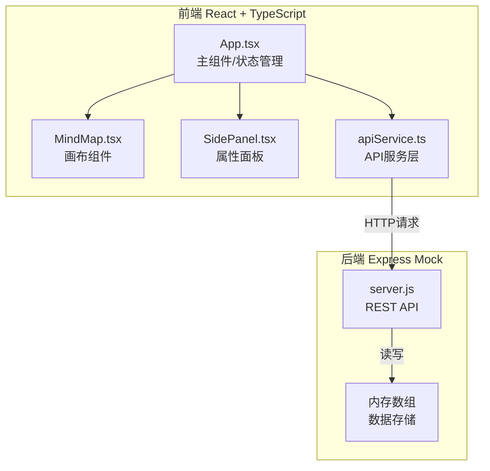
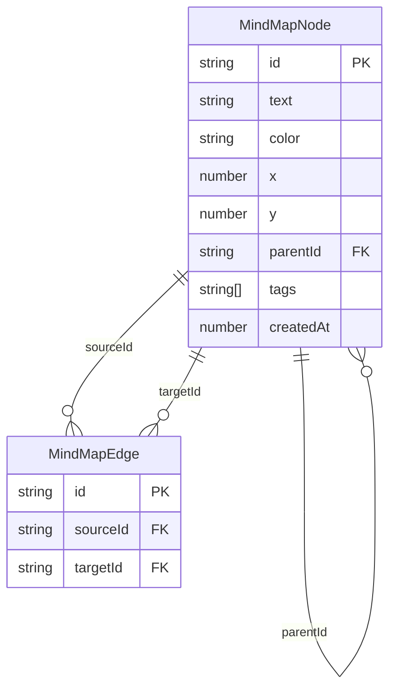

## 1. 架构设计



## 2. 技术说明

- 前端：React@18 + TypeScript + Vite + Tailwind CSS + Zustand（状态管理）
- 初始化工具：vite-init（react-express-ts模板）
- 后端：Express@4（Mock服务，内存数据存储）
- 数据库：无（内存数组存储，服务重启后数据清空）
- 关键依赖：react-color（颜色拾取器）、uuid（节点ID生成）、axios（HTTP请求）

## 3. 路由定义

| 路由 | 用途 |
|------|------|
| / | 脑图画布主页面（单页应用） |

## 4. API定义

### 4.1 数据类型

```typescript
interface MindMapNode {
  id: string;
  text: string;
  color: string;
  x: number;
  y: number;
  parentId: string | null;
  tags: string[];
  createdAt: number;
}

interface MindMapEdge {
  id: string;
  sourceId: string;
  targetId: string;
}

interface MindMapData {
  nodes: MindMapNode[];
  edges: MindMapEdge[];
}
```

### 4.2 API端点

| 方法 | 路径 | 请求体 | 响应 | 说明 |
|------|------|--------|------|------|
| GET | /api/mindmap | - | MindMapData | 获取全部脑图数据 |
| POST | /api/nodes | MindMapNode | MindMapNode | 创建新节点 |
| PUT | /api/nodes/:id | Partial<MindMapNode> | MindMapNode | 更新节点 |
| DELETE | /api/nodes/:id | - | {success: boolean} | 删除节点及其子边 |

## 5. 服务端架构图

```mermaid
graph LR
    "Controller<br/>路由处理" --> "Service<br/>业务逻辑" --> "Repository<br/>内存数据存储"
```

## 6. 数据模型

### 6.1 数据模型定义



### 6.2 文件调用关系与数据流向

```
App.tsx (主组件)
  ├── 管理全局状态 (nodes, edges, selectedNode) via Zustand
  ├── 调用 apiService 发送HTTP请求
  ├── 渲染 MindMap 组件 (传入 nodes, edges, 回调函数)
  └── 渲染 SidePanel 组件 (传入 selectedNode, 回调函数)

MindMap.tsx (画布组件)
  ├── 接收 App 的 nodes 和 edges
  ├── Canvas 渲染节点和连线
  ├── 处理双击创建节点 → 回调 App.onCreateNode
  ├── 处理拖拽建立关联 → 回调 App.onConnectNodes
  ├── 处理缩放/平移手势
  └── 选中节点 → 回调 App.onSelectNode

SidePanel.tsx (属性面板)
  ├── 接收 App 的 selectedNode
  ├── 显示节点属性（标题、颜色、标签）
  ├── 颜色修改 → 回调 App.onUpdateNode
  └── 删除操作 → 回调 App.onDeleteNode

apiService.ts (API服务)
  ├── createNode() → POST /api/nodes
  ├── updateNode() → PUT /api/nodes/:id
  ├── deleteNode() → DELETE /api/nodes/:id
  └── getMindMap() → GET /api/mindmap

server.js (Mock服务)
  ├── 内存数组存储 nodes[] 和 edges[]
  └── 提供 RESTful API 端点
```
