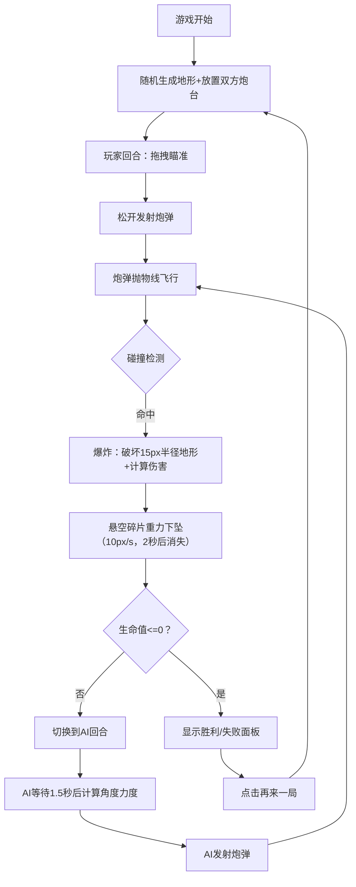

## 1. 产品概述

一款基于Web的二维弹射对战游戏，灵感来源于"百战天虫"，玩家通过抛物线弹道与AI对手进行回合制对战，体验地形破坏与策略射击的乐趣。

- 核心目的：提供单人挑战AI的弹射策略游戏体验，无需网络对战
- 目标用户：休闲游戏爱好者、喜欢策略和物理模拟的玩家
- 产品价值：在浏览器中即可体验经典的抛物线射击+地形破坏玩法

## 2. 核心功能

### 2.1 用户角色
| 角色 | 注册方式 | 核心权限 |
|------|----------|----------|
| 单人玩家 | 无需注册，直接进入游戏 | 控制炮台射击、查看游戏状态、重新开始游戏 |

### 2.2 功能模块
1. **游戏主界面**：800x600游戏画布、渐变黄昏天空背景、深灰色页面背景
2. **地形系统**：随机起伏山丘生成、像素块可破坏、悬空碎片重力下坠
3. **玩家控制**：鼠标拖拽调整角度力度、抛物线轨迹预览、发射炮弹
4. **AI对战**：敌方自动瞄准估算、带随机偏移的发射、1.5秒发射间隔
5. **战斗系统**：炮弹爆炸（半径15像素）、地形破坏、伤害计算、生命值系统
6. **回合系统**：玩家→AI交替回合、炮弹落地后切换、碎片重力下坠
7. **UI系统**：双方血条显示（蓝/红）、胜利/失败提示面板、再来一局按钮
8. **特效系统**：黄橙爆炸粒子（20个方块，0.5秒淡出）、轨迹预览虚线

### 2.3 页面详情
| 页面名称 | 模块名称 | 功能描述 |
|----------|----------|----------|
| 游戏主页面 | 游戏画布 | 800x600 Canvas，居中显示，承载所有游戏渲染 |
| 游戏主页面 | 顶部血条区 | 左侧玩家蓝色血条（100HP），右侧AI红色血条（100HP） |
| 游戏主页面 | 游戏结束面板 | 居中显示胜利/失败文字，提供"再来一局"按钮重置游戏 |
| 游戏主页面 | 交互提示 | 鼠标拖拽时显示白色半透明抛物线轨迹预览 |

## 3. 核心流程

游戏开始时随机生成地形并放置双方炮台，玩家先手。玩家拖拽鼠标瞄准并松开发射，炮弹沿抛物线飞行，碰撞地形后爆炸破坏地形并计算伤害。爆炸完成后检查悬空地碎片并执行重力下坠，随后切换到AI回合，AI自动计算角度力度并发射，循环往复直到一方生命值归零。

## 4. 用户界面设计

### 4.1 设计风格
- 主色调：黄昏渐变天空（浅蓝→深蓝）、深棕色地形、深蓝（玩家）/深红（AI）炮台
- 辅助色：黄色+橙色爆炸粒子、白色半透明轨迹虚线、黑色描边
- 页面背景：深灰色纯色 (#2a2a2a)
- 布局：居中800x600画布，画布外为深灰背景
- 字体：简洁无衬线字体，血条数字清晰可读
- 视觉特点：像素块地形带亮色边缘描边，炮台圆形带黑色描边

### 4.2 页面设计概览
| 页面名称 | 模块名称 | UI元素 |
|----------|----------|--------|
| 游戏主页面 | 游戏画布 | 800x600像素、居中、渐变天空背景、像素地形、圆形炮台 |
| 游戏主页面 | 血条UI | 画布顶部左右两侧、蓝色/红色矩形条、白色生命值数字 |
| 游戏主页面 | 结束面板 | 半透明黑色遮罩、白色标题文字、蓝底白字按钮 |
| 游戏主页面 | 轨迹预览 | 白色半透明虚线、跟随鼠标、抛物线形状 |
| 游戏主页面 | 爆炸特效 | 20个黄/橙色小方块、随机方向飞散、0.5秒淡出 |

### 4.3 响应式
- 桌面端优先：画布固定800x600像素居中显示
- 无需移动端适配，专注桌面浏览器体验
- 鼠标交互为主（拖拽、点击）

### 4.4 性能要求
- 渲染帧率：不低于30fps，目标60fps
- 爆炸计算和粒子特效无卡顿
- 像素块地形数据采用高效数组存储和访问
