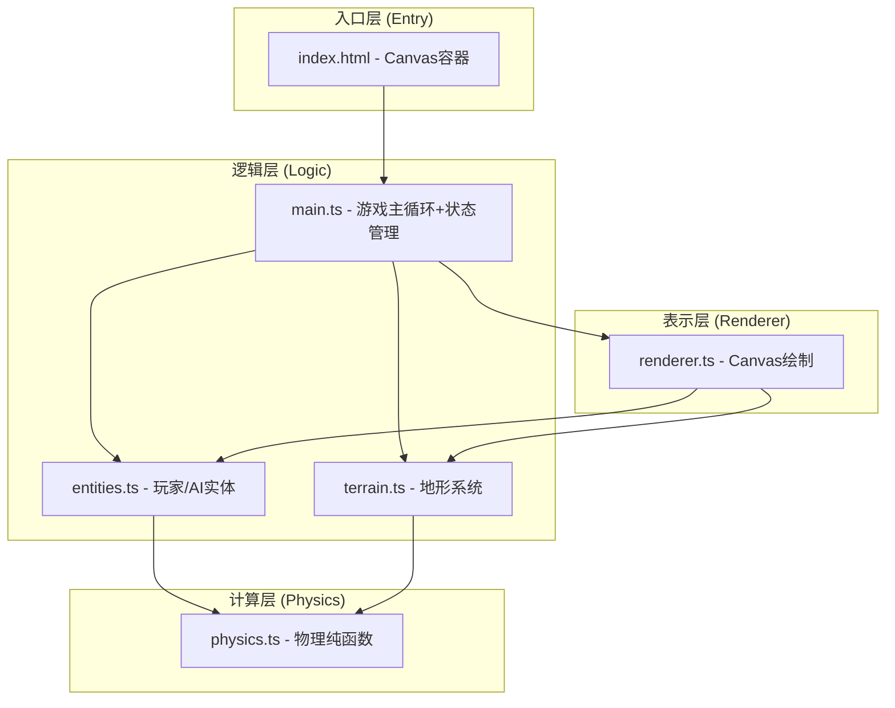

## 1. 架构设计



## 2. 技术说明

- 前端技术栈：TypeScript 5.x + HTML5 Canvas API + Vite 5.x
- 构建工具：Vite（基础配置，无特殊插件）
- 后端：无后端，纯前端游戏
- 数据库：无
- 模块设计：严格分离关注点，physics为纯函数模块，terrain/entities管理状态，renderer负责所有绘制，main orchestrate

## 3. 文件结构

```
auto40/
├── package.json          # 依赖：vite, typescript；脚本：dev
├── vite.config.js        # Vite基础配置
├── tsconfig.json         # 严格模式，ESModule
├── index.html            # 入口，id=game的canvas
└── src/
    ├── main.ts           # 游戏主循环、初始化Canvas、状态管理、帧循环
    ├── terrain.ts        # 地形生成、像素破坏、重力下坠
    ├── entities.ts       # 玩家/AI位置、生命值、发射逻辑、AI计算
    ├── physics.ts        # 抛物线弹道、碰撞检测、爆炸范围（纯函数）
    └── renderer.ts       # 背景、地形、角色、轨迹、粒子、血条、UI绘制
```

## 4. 核心数据结构定义

### 4.1 地形 (Terrain)
```typescript
// 二维像素数组：0=空气，1=实心地形
type TerrainGrid = Uint8Array[]; // 每行一个Uint8Array(WIDTH)
interface Terrain {
  grid: TerrainGrid;
  width: number;  // 800
  height: number; // 600
}
```

### 4.2 实体 (Entity)
```typescript
interface Cannon {
  x: number;
  y: number;       // 位置
  hp: number;      // 0-100
  radius: number;  // 炮台半径
  color: string;
}
interface Projectile {
  x: number; y: number;
  vx: number; vy: number;
  active: boolean;
}
interface Particle {
  x: number; y: number;
  vx: number; vy: number;
  life: number;    // 剩余生命（秒）
  color: string;
  size: number;
}
interface FallingDebris {
  x: number; y: number;
  vy: number;
  life: number;    // 剩余时间（秒）
}
```

### 4.3 游戏状态
```typescript
type Turn = 'player' | 'ai';
type GameState = 'aiming' | 'flying' | 'ai_thinking' | 'ai_flying' | 'settling' | 'gameover';
interface Game {
  terrain: Terrain;
  player: Cannon;
  ai: Cannon;
  projectile: Projectile | null;
  particles: Particle[];
  debris: FallingDebris[];
  turn: Turn;
  state: GameState;
  aimStart: { x: number; y: number } | null;  // 拖拽起点
  aimCurrent: { x: number; y: number } | null; // 当前鼠标位置
  winner: 'player' | 'ai' | null;
}
```

## 5. 物理常量

```
GRAVITY = 0.3 px/frame²  (约18 px/s² @60fps)
EXPLOSION_RADIUS = 15 px
DEBRIS_FALL_SPEED = 10 px/s (约0.167 px/frame)
DEBRIS_LIFETIME = 2.0 s
PARTICLE_COUNT = 20
PARTICLE_LIFETIME = 0.5 s
AI_FIRE_DELAY = 1.5 s
MAX_HP = 100
DAMAGE_DIVISOR = 5   // 伤害 = 摧毁像素数 / 5，取整
```

## 6. 关键算法

### 6.1 地形生成
- 使用多层正弦波叠加 + 随机扰动生成山丘轮廓
- 轮廓以下填充为实心地形像素

### 6.2 抛物线计算
```
位置: x(t) = x0 + vx * t
      y(t) = y0 + vy * t + 0.5 * g * t²
```

### 6.3 AI瞄准估算
- 根据玩家位置和地形高度差，使用简化斜抛公式估算初速度和角度
- 添加 ±15% 力度随机偏移和 ±3° 角度偏移

### 6.4 爆炸破坏
- 以爆炸点为中心，遍历半径15px内所有像素
- 标记为空气(0)，统计摧毁数量
- 检测双方是否在爆炸范围内并施加伤害

### 6.5 悬空碎片检测
- 从底部向上扫描每列，标记有支撑（下方有地形）的像素
- 未被标记的实心像素视为悬空，转为碎片下落并从地形中移除
