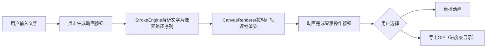

## 1. 产品概述
像素艺术风格手写字迹动画生成器 - 用户输入中文文字，以像素化笔触逐笔书写动画形式呈现，可导出GIF用于电子贺卡或视频片头。
- 目标用户：需要制作个性化电子贺卡、短视频片头、社交媒体素材的创作者
- 产品价值：将传统书写美学与像素艺术结合，提供低门槛、高趣味性的动态文字创作工具

## 2. 核心功能

### 2.1 功能模块
1. **主页面**：文字输入、画布展示、控制面板、重播/导出功能

### 2.2 页面详情
| 页面名称 | 模块名称 | 功能描述 |
|-----------|-------------|---------------------|
| 主页面 | 输入区域 | 最多20个中文字符输入框 + 生成动画按钮 |
| 主页面 | 画布区域 | 600x400像素画布，米黄色背景，像素化书写动画展示 |
| 主页面 | 控制面板 | 颜色选择（色环）、三种笔触模式切换（细楷/粗楷/行书） |
| 主页面 | 操作按钮 | 重播动画、导出GIF（含进度条） |

## 3. 核心流程
用户输入文字 → 点击生成动画 → 笔画引擎解析为像素路径 → 画布逐像素渲染动画（带弹跳效果）→ 书写完成 → 可选择重播或导出GIF

## 4. 用户界面设计
### 4.1 设计风格
- 主色调：米黄(#f5f0e1)、暗红(#8b4513)、金色(#d4a017)
- 按钮：圆角矩形，悬停变深色+轻微上升阴影（0.2秒过渡）
- 输入框聚焦：边框暗红变金色+柔光发光
- 字体：衬线体（Georgia），复古文艺风格
- 布局：桌面端左右布局（左70%画布，右30%控制面板），移动端上下布局

### 4.2 页面设计概述
| 页面名称 | 模块名称 | UI元素 |
|-----------|-------------|-------------|
| 主页面 | 输入区域 | 衬线字体输入框、暗红边框、金色聚焦发光、圆角按钮 |
| 主页面 | 画布区域 | 米黄色背景(#f5f0e1)、像素块放大弹跳动画 |
| 主页面 | 控制面板 | 色环选择器、三种笔触模式单选、预览区实时更新 |
| 主页面 | 操作区 | 重播按钮、导出GIF按钮、进度条（0%-100%） |

### 4.3 响应式
桌面优先，屏幕宽度<768px时自动切换为上下布局（画布在上，控制面板在下）
