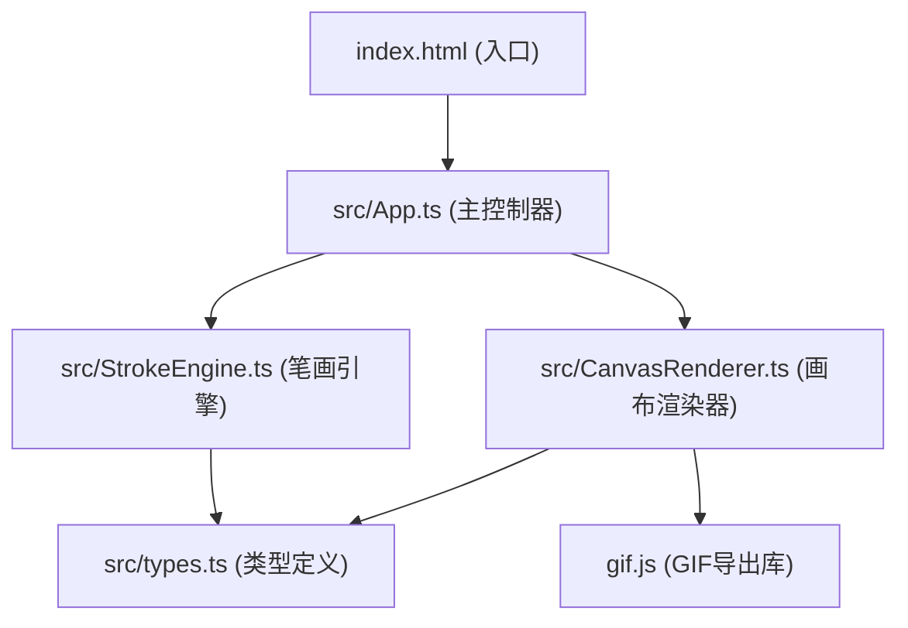

## 1. 架构设计


## 2. 技术说明
- 前端框架：无框架，原生TypeScript + Canvas API
- 构建工具：Vite 5.x
- 语言：TypeScript（严格模式，ESModule，target ES2020）
- 第三方库：gif.js（GIF导出）
- 设计风格：复古文艺，像素艺术

## 3. 文件结构

```
auto47/
├── package.json
├── vite.config.js
├── tsconfig.json
├── index.html
└── src/
    ├── App.ts            # 主模块，UI事件管理
    ├── StrokeEngine.ts   # 笔画引擎，像素路径生成
    ├── CanvasRenderer.ts # 画布渲染，动画循环，GIF导出
    └── types.ts          # 类型定义
```

## 4. 模块职责

### 4.1 src/types.ts
- `PixelPoint`：像素点坐标接口 { x, y, size, delay }
- `StrokeMode`：笔触模式枚举（FINE/THICK/SEMI_CURSIVE）
- `AnimationState`：动画状态类型（IDLE/PLAYING/COMPLETED）
- `StrokePath`：笔画路径接口

### 4.2 src/StrokeEngine.ts
- 解析输入文字为像素路径序列
- 为每个笔画生成像素坐标数组和出现时间戳
- `setStrokeMode(mode)` 切换笔触模式
- 内置常用汉字笔画数据（点阵式）

### 4.3 src/CanvasRenderer.ts
- 管理Canvas渲染循环（requestAnimationFrame，目标30fps+）
- 像素块逐帧绘制（从中心放大弹跳动画）
- 颜色管理
- `startAnimation()`：开始播放
- `replay()`：清除并重播
- `exportGif()`：使用gif.js导出动画（每帧0.1秒）

### 4.4 src/App.ts
- 初始化DOM元素
- 绑定UI事件（输入、按钮、颜色选择、笔触切换）
- 协调StrokeEngine和CanvasRenderer
- 响应式布局处理

### 4.5 index.html
- 布局结构：左侧70%画布区，右侧30%控制面板
- 输入框、按钮、画布容器、控制面板
- 引入主脚本（ESModule方式）

## 5. 动画参数
- 笔画间隔：0.3秒
- 像素块出现速率：0.05秒/块
- 像素块动画：从中心放大弹跳
- 总时长控制：5-10秒
- 帧率目标：30fps+
