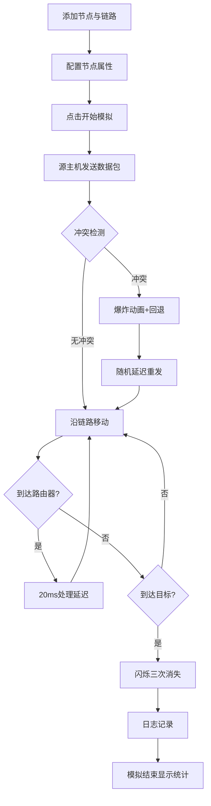

## 1. 产品概述

网络拓扑数据包流动与冲突模拟可视化应用，面向计算机网络教学场景，帮助理解数据链路层与网络层协议工作原理。
- 解决计算机网络教学中协议工作原理难以直观理解的问题
- 目标用户为计算机网络课程教师与学生

## 2. 核心功能

### 2.1 功能模块
1. **拓扑编辑画布**: 600×400 Canvas 画布，支持添加最多10个网络节点（PC/路由器/服务器），拖拽创建直连链路
2. **节点配置面板**: 点击节点弹出浮动面板，设置IP地址、自动生成MAC地址、选择角色（源主机/目标主机/中转路由器）
3. **数据包模拟**: 点击"开始模拟"后数据包沿路径逐跳传递，彩色圆点动画，路由器处理延迟，目标节点闪烁消失
4. **冲突模拟**: 两包同时到达同一链路时碰撞爆炸效果，灰色回退并随机延迟重发
5. **日志面板**: 右侧面板记录每跳时间戳和带宽占用，冲突记录标红，最多50条，模拟结束显示平均延迟和吞吐量
6. **拓扑管理**: 右键上下文菜单（删除节点/链路、修改带宽），撤销支持（最多10步）

### 2.2 页面详情
| 页面名称 | 模块名称 | 功能描述 |
|----------|----------|----------|
| 主页面 | 拓扑画布 | 600×400 Canvas，添加节点、拖拽创建链路、右键菜单管理 |
| 主页面 | 配置面板 | 浮动卡片，IP/MAC/角色设置，IP格式校验，角色唯一性校验 |
| 主页面 | 控制栏 | 顶部工具栏：开始模拟、撤销按钮及计数器 |
| 主页面 | 日志面板 | 右侧面板，时间戳+带宽占用+冲突标记，自动滚动截断 |
| 主页面 | 冲突动画 | 链路上碰撞点红色星形爆炸，0.5秒渐隐 |

## 3. 核心流程

用户在画布上添加节点和链路构建拓扑 → 配置节点IP/MAC/角色 → 点击"开始模拟" → 数据包从源主机出发沿路径逐跳传递 → 路由器处理延迟 → 冲突检测与回退重发 → 到达目标节点闪烁消失 → 日志记录 → 模拟结束显示统计信息

## 4. 用户界面设计

### 4.1 设计风格
- 主色：深蓝渐变背景(#1a2332到#2c3e50)科技感
- 强调色：青色(#00e5ff)选中发光，淡蓝色(#64b5f6)链路激活
- 节点风格：半透明磨砂玻璃（背景模糊、白色边框、阴影）
- 配置面板：深灰圆角卡片(#2a2a3a)，亮白文字(#e0e0e0)，光效聚焦边框(#00bcd4)
- 按钮：微光波纹反馈，平滑过渡动画(0.3s)
- 冲突动画：红色星形爆炸(半径15px)，0.5秒渐隐
- 字体：Fira Code（等宽，科技感）+ Noto Sans SC（中文）

### 4.2 页面设计概览
| 页面名称 | 模块名称 | UI 元素 |
|----------|----------|----------|
| 主页面 | 顶部控制栏 | 深色背景，"开始模拟"按钮+撤销按钮+计数器，按钮hover发光 |
| 主页面 | 拓扑画布 | 600×400 Canvas，深蓝渐变背景，节点圆形+图标+标签，链路灰色线段+带宽标签 |
| 主页面 | 配置面板 | 浮动卡片，IP输入框+MAC显示+角色下拉，输入框聚焦发光边框 |
| 主页面 | 日志面板 | 右侧面板，深色背景，条目列表，冲突条目红色标记，底部统计区域 |

### 4.3 响应式
桌面优先设计，画布600×400固定尺寸，日志面板自适应右侧空间

### 4.4 动效
- 节点选中：青色外发光过渡0.3s
- 链路激活：灰色→淡蓝色0.3s过渡，持续0.5s
- 数据包移动：沿链路匀速动画，30fps
- 碰撞爆炸：红色星形0.5秒渐隐
- 目标闪烁：3次闪烁后消失
- 按钮波纹：点击时细微波纹扩散
