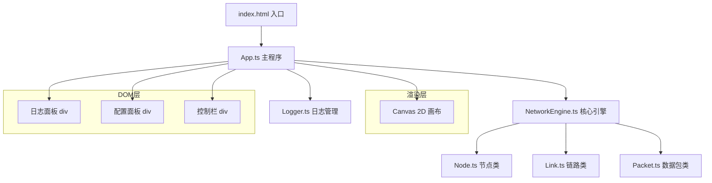

## 1. 架构设计



## 2. 技术说明
- 前端：TypeScript + Canvas 2D API + Vite
- 初始化工具：Vite
- 后端：无
- 数据库：无（纯前端模拟）

## 3. 文件结构
| 文件 | 用途 |
|------|------|
| package.json | 依赖管理（vite, typescript），启动脚本 npm run dev |
| vite.config.js | Vite 基础配置 |
| tsconfig.json | 严格模式，ESModule |
| index.html | 入口 HTML，全屏 Canvas 容器 + 日志面板 div |
| src/App.ts | 主程序，管理布局、事件监听、初始化引擎和日志、渲染循环 |
| src/NetworkEngine.ts | 核心模拟引擎，管理 Node/Link/Packet，冲突检测，暴露操作接口 |
| src/Node.ts | 节点类，位置/半径/IP/MAC/角色，draw/碰撞检测/上下文菜单数据 |
| src/Link.ts | 链路类，两端节点/带宽/延迟/占用状态，draw/路径插值 |
| src/Packet.ts | 数据包类，源/目标IP/位置/速度/颜色/路径/重试，move/draw/碰撞回退 |
| src/Logger.ts | 日志管理，addEntry/render，自动截断50条 |

## 4. 核心类设计

### 4.1 Node
- 属性：id, x, y, radius(30), ip, mac, role(source/target/router), type(pc/router/server), selected
- 方法：draw(ctx), isInside(x,y), getConfigData()

### 4.2 Link
- 属性：id, nodeA, nodeB, bandwidth(10/100/1000), delay(1-50), active, activeTimer
- 方法：draw(ctx), getPacketPath()→Point[], getMidPoint()

### 4.3 Packet
- 属性：sourceIp, targetIp, x, y, speed, color(HSL), pathIndex, retryCount, colliding, retreating
- 方法：move(delta), draw(ctx), handleCollision(), retreat()

### 4.4 NetworkEngine
- 属性：nodes[], links[], packets[], undoStack[], simulating
- 方法：addNode(), addLink(), removeNode(), removeLink(), startSimulation(), undo(), update(timestamp), handleCollisionDetection()

### 4.5 Logger
- 属性：entries[](max 50)
- 方法：addEntry(type, message), render(container), showStats(avgDelay, throughput)

## 5. 渲染循环
```
requestAnimationFrame → App.update(timestamp)
  → NetworkEngine.update(timestamp)
    → Packet.move(delta) for each packet
    → 碰撞检测算法
    → Node.draw(ctx) for each node
    → Link.draw(ctx) for each link
    → Packet.draw(ctx) for each packet
    → 爆炸动画绘制
  → Logger.render(logContainer)
```

## 6. 事件处理
- Canvas mousedown/mousemove/mouseup：节点拖拽创建链路
- Canvas click：节点选中→弹出配置面板
- Canvas contextmenu：右键菜单（删除/修改）
- 配置面板：IP输入校验、MAC自动生成、角色唯一性校验
- 控制栏：开始模拟、撤销按钮
