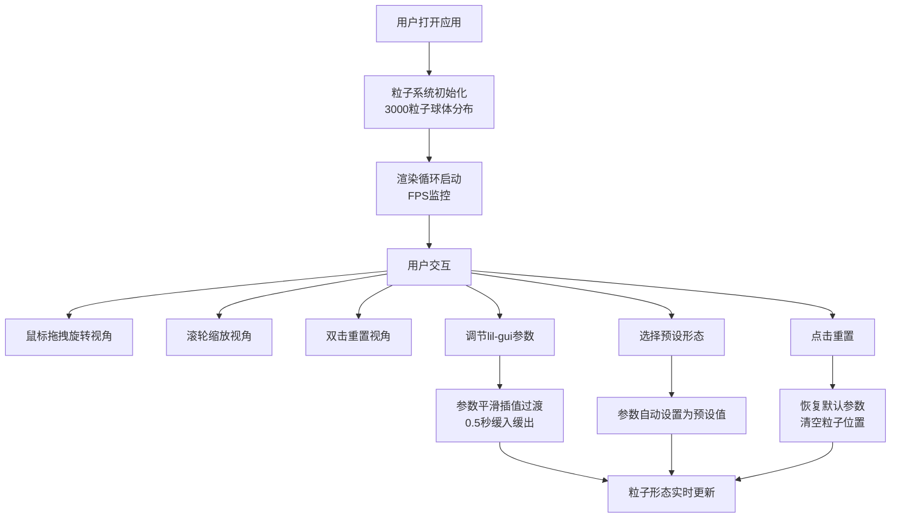

## 1. 产品概述

一款面向数字艺术策展人的交互式3D粒子雕塑应用，用户可通过手势拖拽和参数调节，实时塑造流动的彩色粒子雕塑形态，用于展览展示和直播背景。

- 核心价值：为数字艺术创作提供直观、高性能的粒子雕塑工具
- 目标用户：数字艺术策展人、视觉设计师、直播创作者

## 2. 核心功能

### 2.1 用户角色

| 角色 | 注册方式 | 核心权限 |
|------|----------|----------|
| 数字艺术策展人 | 无需注册，本地应用 | 完整的粒子参数调节、预设切换、视角控制权限 |

### 2.2 功能模块

1. **3D粒子渲染画布**：全屏WebGL渲染区域，实时粒子动画
2. **参数控制面板**：lil-gui折叠面板，调节粒子形态、颜色、运动参数
3. **预设形态系统**：旋转星系、双螺旋、混沌云三种预设
4. **性能监控面板**：实时FPS和粒子数量显示
5. **视角控制系统**：OrbitControls拖拽旋转、滚轮缩放、双击重置

### 2.3 页面详情

| 页面名称 | 模块名称 | 功能描述 |
|----------|----------|----------|
| 主页面 | 3D渲染画布 | 全屏粒子渲染，鼠标拖拽旋转视角，滚轮缩放，双击重置 |
| 主页面 | 控制面板 | 右上角折叠面板，调节吸引子位置、引力系数、颜色参数、粒子大小、尾迹开关 |
| 主页面 | 预设按钮组 | 三种预设形态一键切换，重置按钮恢复默认 |
| 主页面 | 性能监控 | 左下角半透明FPS和粒子数量显示 |

## 3. 核心流程

用户进入应用 → 粒子系统初始化（3000粒子球体分布）→ 拖拽旋转视角 → 调节参数（吸引子位置、引力、颜色等）→ 粒子平滑过渡到新形态 → 选择预设形态一键切换 → 点击重置恢复初始状态

## 4. 用户界面设计

### 4.1 设计风格

- **主色调**：纯黑背景 (#000000)，粒子为HSL动态彩色，文字白色 (#ffffff)
- **控制面板**：半透明深灰色背景 (rgba(30, 30, 30, 0.85))，圆角4px，紧凑间距
- **字体**：现代无衬线字体，数字采用等宽字体确保性能监控对齐
- **视觉风格**：深邃空灵，粒子发光柔和，边缘羽化，无多余装饰元素
- **动效风格**：所有状态切换采用0.5秒缓入缓出 (ease-in-out) 插值

### 4.2 页面设计概述

| 页面名称 | 模块名称 | UI元素 |
|----------|----------|--------|
| 主页面 | 3D渲染画布 | 全屏黑色背景，发光粒子，可选半透明白色尾迹线 |
| 主页面 | lil-gui控制面板 | 右上角折叠，分组显示：粒子参数、吸引子1、吸引子2、颜色控制、预设 |
| 主页面 | 性能监控 | 左下角半透明文字，FPS绿色/黄色/红色动态变色 |
| 主页面 | 加载提示 | 居中白色文字"加载中..."，粒子系统就绪后淡出 |

### 4.3 响应式设计

- **桌面端**（≥768px）：lil-gui面板右上角折叠，粒子数量默认3000
- **移动端**（<768px）：控制面板变为底部固定条（高度60px），横向排列常用滑块，粒子数量自动减半至1500
- **触摸优化**：支持双指缩放、单指拖拽旋转

### 4.4 3D场景指导

- **环境**：纯黑背景，无环境光，粒子自身为唯一光源，营造深邃太空感
- **光照**：采用PointsMaterial的自发光属性，配合圆形羽化纹理实现柔和发光效果
- **相机**：PerspectiveCamera，视场角75度，初始位置(0, 0, 20)，看向原点
- **粒子纹理**：圆形径向渐变纹理，中心不透明，边缘羽化透明
- **后处理**：轻微Bloom效果增强发光感（性能允许时）
- **动画**：粒子系统整体轻微自转（0.001 rad/frame），营造呼吸感
- **性能预算**：稳定30fps以上，粒子上限8000，超限时自动降级

## 5. 非功能性需求

- **性能**：帧率稳定≥30fps，粒子数量>5000时自动降低粒子大小至0.1并关闭颜色渐变
- **交互响应**：参数调节后0.5秒内完成平滑过渡动画
- **兼容性**：支持WebGL 2.0的现代浏览器
