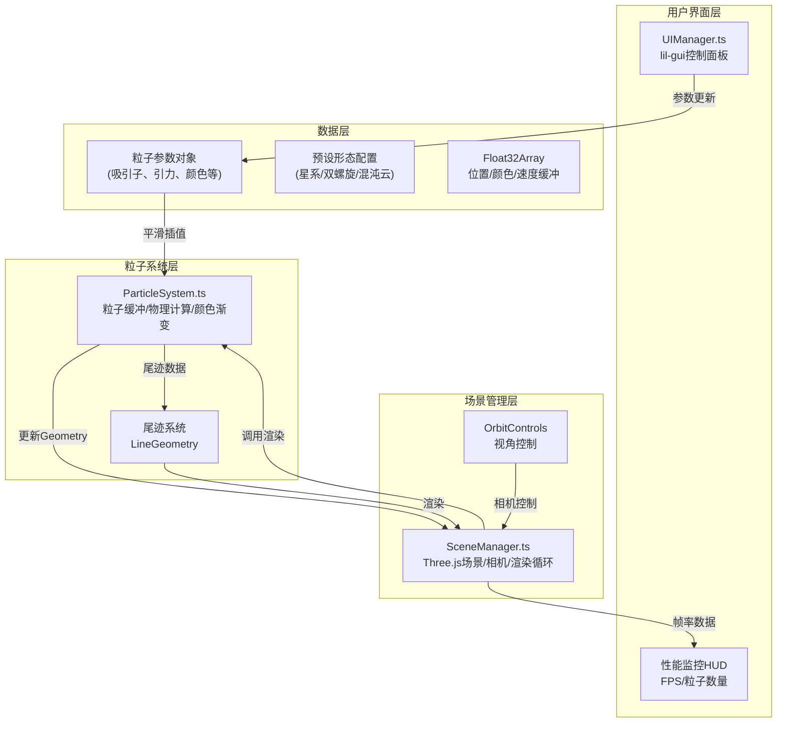

## 1. 架构设计



## 2. 技术栈描述

- **前端框架**：纯TypeScript + Three.js，无UI框架
- **构建工具**：Vite 5.x
- **语言**：TypeScript 5.x（严格模式，ESModule）
- **3D引擎**：Three.js 0.160.x
- **UI控件**：lil-gui 0.19.x
- **类型定义**：@types/three

### 模块职责与调用关系

| 文件 | 职责 | 输入 | 输出 | 依赖 |
|------|------|------|------|------|
| `ParticleSystem.ts` | 粒子物理计算、颜色渐变、缓冲管理 | 用户参数、时间增量 | 更新后的BufferGeometry | three |
| `SceneManager.ts` | Three.js场景初始化、渲染循环、相机控制 | ParticleSystem实例、UIManager实例 | 渲染画面 | three, OrbitControls |
| `UIManager.ts` | lil-gui面板构建、参数变更通知 | 粒子参数对象引用 | 参数更新回调 | lil-gui |
| `main.ts` | 入口文件，实例化各模块并建立关联 | - | - | 所有模块 |

### 数据流

```
UIManager → params对象 → ParticleSystem (平滑插值) → Geometry → SceneManager → WebGLRenderer
                                                                ↑
                                                      时间增量delta
```

## 3. 核心数据结构

### 3.1 粒子参数接口

```typescript
interface ParticleParams {
  count: number;              // 粒子数量
  sphereRadius: number;       // 初始球体分布半径
  particleSize: number;       // 粒子基础大小
  attractionK: number;        // 引力系数k
  attractor1: { x: number; y: number; z: number };  // 吸引子1
  attractor2: { x: number; y: number; z: number };  // 吸引子2
  hueBase: number;            // 色相基准 0-360
  saturation: number;         // 饱和度 0.5-1.0
  lightness: number;          // 亮度 0.3-0.8
  colorCyclePeriod: number;   // 颜色渐变周期(秒)
  enableColorGradient: boolean; // 是否启用颜色渐变
  enableTrail: boolean;       // 是否启用尾迹
  trailDuration: number;      // 尾迹持续时间(秒)
  rotationSpeed: number;      // 自转速度
  sizeByVelocity: boolean;    // 粒子大小随速度变化
}
```

### 3.2 预设形态配置

```typescript
const PRESETS = {
  galaxy: {
    name: '旋转星系',
    params: {
      attractionK: 2.5,
      attractor1: { x: 5, y: 0, z: 0 },
      attractor2: { x: -5, y: 0, z: 0 },
      hueBase: 200,
      rotationSpeed: 0.005
    }
  },
  helix: {
    name: '双螺旋',
    params: {
      attractionK: 1.8,
      attractor1: { x: 0, y: 6, z: 0 },
      attractor2: { x: 0, y: -6, z: 0 },
      hueBase: 320,
      rotationSpeed: 0.003
    }
  },
  chaos: {
    name: '混沌云',
    params: {
      attractionK: 3.2,
      attractor1: { x: 3, y: 4, z: -2 },
      attractor2: { x: -4, y: -3, z: 3 },
      hueBase: 60,
      rotationSpeed: 0.008
    }
  }
};
```

### 3.3 粒子内部数据

```typescript
interface ParticleData {
  positions: Float32Array;    // 当前位置 [x1,y1,z1, x2,y2,z2, ...]
  prevPositions: Float32Array; // 上一帧位置（用于尾迹）
  velocities: Float32Array;   // 速度向量
  targetPositions: Float32Array; // 目标位置（用于插值）
  colors: Float32Array;       // 颜色 [r1,g1,b1, ...]
  sizes: Float32Array;        // 每个粒子大小
  birthTimes: Float32Array;   // 粒子创建时间（用于颜色周期）
}
```

## 4. 物理与渲染算法

### 4.1 牛顿引力模型

```
对于每个粒子i：
  轴向量axis = attractor2 - attractor1
  轴上最近点投影t = clamp((pos_i - attractor1) · axis / |axis|², 0, 1)
  目标点target = attractor1 + t * axis
  
  距离r = |target - pos_i|
  若r < 0.1，跳过（避免除零）
  
  引力大小F = k / r²
  引力方向norm = (target - pos_i) / r
  加速度a = F * norm
  速度v_i += a * delta
  速度阻尼 v_i *= 0.98
  位置pos_i += v_i * delta
```

### 4.2 颜色渐变算法

```
对于每个粒子i：
  生命时间t = (currentTime - birthTime[i]) % colorCyclePeriod
  相位p = t / colorCyclePeriod
  
  色相h = (hueBase + p * 180) % 360  // 渐变至互补色
  HSLtoRGB(h, saturation, lightness) → colors[i*3..i*3+2]
```

### 4.3 平滑插值算法（ease-in-out）

```
参数变化时：
  保存当前值为startValue
  保存目标值为endValue
  记录startTime
  
  每一帧更新：
    elapsed = currentTime - startTime
    if elapsed >= 0.5:
      currentValue = endValue
    else:
      t = elapsed / 0.5
      easedT = t * t * (3 - 2 * t)  // smoothstep
      currentValue = lerp(startValue, endValue, easedT)
```

### 4.4 尾迹渲染

```
启用尾迹时：
  每个粒子保存最近N个历史位置（N = trailDuration * 60）
  使用LineSegment连接连续位置点
  顶点透明度从1.0线性渐变到0.0
  叠加模式使用Additive Blending
```

## 5. 性能优化策略

### 5.1 自动降级机制

```typescript
function checkPerformance(fps: number, particleCount: number) {
  if (particleCount > 8000) {
    // 超过上限，强制限制
    params.count = 8000;
    rebuildParticles();
  }
  
  if (particleCount > 5000) {
    // 高负载，自动降级
    params.particleSize = 0.1;
    params.enableColorGradient = false;
  }
  
  if (fps < 30 && params.enableTrail) {
    // 帧率不足，关闭尾迹
    params.enableTrail = false;
  }
}
```

### 5.2 渲染优化

- 使用BufferGeometry而非Geometry，所有数据存储在GPU缓冲区
- 粒子使用Points + PointsMaterial，Draw Call仅1次
- 尾迹使用LineSegments + InstancedBufferGeometry（可选）
- 纹理使用Canvas生成圆形羽化图，避免外部资源加载
- 避免在渲染循环中创建新对象，复用TypedArray

## 6. 初始化流程

```mermaid
flowchart LR
    A["main.ts入口"] --> B["创建默认params对象"]
    B --> C["实例化ParticleSystem(params)"]
    C --> D["生成圆形羽化纹理"]
    D --> E["初始化粒子位置<br/>球体随机分布"]
    E --> F["实例化SceneManager(particleSystem)"]
    F --> G["创建Three.js场景/相机/渲染器"]
    G --> H["添加OrbitControls"]
    H --> I["实例化UIManager(params, onChange)"]
    I --> J["构建lil-gui控制面板"]
    J --> K["启动requestAnimationFrame循环"]
    K --> L["粒子系统就绪<br/>隐藏加载提示"]
```



## 7. 项目文件结构

```
auto50/
├── .trae/documents/
│   ├── PRD-3D粒子雕塑工具.md
│   └── TECH-3D粒子雕塑工具.md
├── src/
│   ├── main.ts              # 入口文件
│   ├── ParticleSystem.ts    # 粒子系统核心
│   ├── SceneManager.ts      # 场景管理
│   ├── UIManager.ts         # UI控制面板
│   └── types.ts             # 类型定义
├── index.html               # HTML入口
├── package.json
├── vite.config.js
├── tsconfig.json
└── README.md
```
