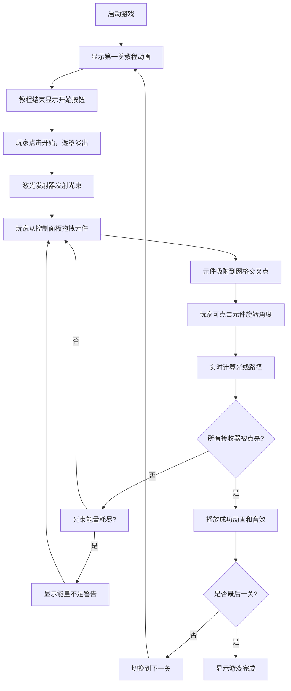

## 1. 产品概述

本产品是一款基于几何光学物理模拟的2D益智游戏，玩家通过放置和旋转镜面、透镜等光学元件来引导激光束到达目标接收器。游戏融合了真实的物理规律（反射定律、斯涅尔折射定律）与渐进式关卡设计，为玩家提供兼具教育性和娱乐性的解谜体验。

- **核心价值**：将抽象的光学物理概念转化为可视化的互动游戏，让玩家在解谜过程中直观理解光的反射、折射、色散等现象
- **目标用户**：学生、物理爱好者、益智游戏玩家
- **市场定位**：Steam/网页端休闲益智类游戏，可用于物理教学辅助工具

## 2. 核心功能

### 2.1 用户角色
本游戏为单用户单机游戏，无角色区分。

### 2.2 功能模块
1. **游戏主界面**：Canvas画布、左侧控制面板、顶部菜单栏、状态显示区
2. **光线物理模拟系统**：激光束追踪、反射/折射/色散计算、能量衰减
3. **光学元件系统**：镜面（反射）、凸透镜/凹透镜（折射）、三棱镜（色散）
4. **关卡系统**：5个预置关卡 + 自由模式、关卡进度管理、得分计算
5. **交互系统**：元件拖拽放置、旋转调整、吸附网格、碰撞检测
6. **视觉反馈系统**：发光效果、动画过渡、教程演示、成功/失败提示

### 2.3 页面详情

| 页面名称 | 模块名称 | 功能描述 |
|---------|---------|---------|
| 游戏主界面 | 画布渲染模块 | 60fps实时渲染激光路径、光学元件、网格背景 |
| 游戏主界面 | 控制面板模块 | 元件仓库、拖拽放置、数量限制警告 |
| 游戏主界面 | 菜单控制模块 | 重置关卡、帮助、关卡选择下拉菜单 |
| 游戏主界面 | 状态显示模块 | 关卡序号、已用元件数、光束能量状态 |
| 关卡入口 | 教程动画模块 | Canvas绘制的镜面反射示例动画，持续3秒 |
| 关卡完成 | 胜利反馈模块 | 绿色渐变文字放大动画、AudioContext生成成功音效 |

## 3. 核心流程

## 4. 用户界面设计

### 4.1 设计风格

**深色科幻光学实验台主题**：
- 主色调：深黑色(#0a0a0a)背景，红色(#ff4444)激光，蓝色(#4488ff)接收器/透镜
- 辅助色：灰色(#c0c0c0-#e0e0e0)镜面，深灰色(#2a2a2a)控制面板
- 按钮风格：半透明毛玻璃效果，悬停白色光晕边线，点击0.1秒缩放反馈
- 字体：主文本使用无衬线字体，状态显示使用等宽字体
- 布局：左侧控制面板 + 中央主画布 + 顶部菜单栏
- 视觉特效：激光发光(shadowBlur=15px)、镜面高光条、元件放置吸附动画

### 4.2 页面设计概述

| 页面名称 | 模块名称 | UI元素 |
|---------|---------|---------|
| 游戏主界面 | 画布区域 | 深黑背景+六边形网格(#222,间距40px)、红色激光发射器(8px圆点)、蓝色菱形接收器(20px)、各种光学元件 |
| 游戏主界面 | 控制面板 | 深灰色(#2a2a2a)背景、元件图标(白线描绘)、拖拽时半透明跟随 |
| 游戏主界面 | 顶部菜单 | 毛玻璃背景(rgba(20,20,30,0.8), blur(10px))、红色重置按钮、问号帮助按钮、关卡选择下拉 |
| 游戏主界面 | 状态显示 | 右上角等宽字体：关卡序号、已用/限制元件数、光束状态(OK绿色/不足红色闪烁) |
| 关卡入口 | 教程遮罩 | 半透明黑色遮罩、Canvas动画演示镜面反射、3秒后显示开始按钮 |
| 关卡完成 | 胜利提示 | 画布中央绿色渐变文字、从中心放大弹出动画(0.8秒) |

### 4.3 响应式设计

- **设计策略**：桌面优先，移动端自适应
- **断点**：宽度 < 768px 时触发移动端布局
- **移动端适配**：控制面板转移到画布底部，所有元件图标缩小至50%
- **触摸优化**：增大触摸区域，支持触摸拖拽放置元件

### 4.4 动画规范

| 动画类型 | 时长 | 效果 |
|---------|------|------|
| 元件吸附 | 0.3s | 从拖拽位置平滑滑动到网格点 |
| 反射高亮 | 0.1s | 反射点颜色变白闪烁 |
| 遮罩淡出 | 0.5s | 教程遮罩透明度渐变到0 |
| 胜利动画 | 0.8s | 文字从中心放大弹出 |
| 按钮反馈 | 0.1s | 点击时缩放效果 |
| 状态闪烁 | 0.5s间隔 | 能量不足时红色文字闪烁 |

## 5. 性能要求

- 帧率：稳定60fps
- 光束线段限制：单帧不超过200条，超出时合并相邻共线线段
- 关卡切换延迟：不超过0.5秒
- 光线追踪：每帧重新计算，基于几何光学算法
