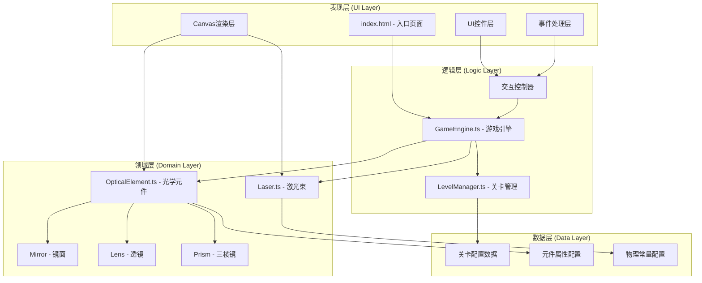

## 1. 架构设计



## 2. 技术说明

- **前端框架**: TypeScript + Vite (无React，使用原生Canvas API)
- **初始化工具**: Vite 原生脚手架
- **后端**: 无后端，纯前端单机游戏
- **数据库**: 无数据库，使用内存对象存储关卡数据
- **渲染引擎**: HTML5 Canvas 2D API
- **音频引擎**: Web Audio API (AudioContext)
- **物理引擎**: 自主实现几何光学计算（反射定律、斯涅尔定律）

## 3. 目录结构

```
auto51/
├── index.html                 # 入口HTML，包含canvas和UI容器
├── package.json              # 项目依赖配置
├── vite.config.js            # Vite构建配置
├── tsconfig.json             # TypeScript配置
└── src/
    ├── main.ts               # 应用入口，初始化引擎
    ├── types.ts              # 全局类型定义
    ├── GameEngine.ts         # 游戏引擎核心
    ├── Laser.ts              # 激光束类
    ├── OpticalElement.ts     # 光学元件基类及子类
    ├── LevelManager.ts       # 关卡管理器
    ├── Renderer.ts           # Canvas渲染器
    ├── InputHandler.ts       # 输入事件处理器
    ├── SoundManager.ts       # 音效管理器
    └── config/
        ├── levels.ts         # 关卡配置数据
        └── physics.ts        # 物理常量配置
```

## 4. 核心数据类型定义

```typescript
// 2D向量
interface Vector2 {
  x: number;
  y: number;
}

// 光线线段
interface LightSegment {
  start: Vector2;
  end: Vector2;
  color: string;
  intensity: number;
}

// 碰撞检测结果
interface CollisionResult {
  hit: boolean;
  point: Vector2;
  normal: Vector2;
  element: OpticalElement | null;
  distance: number;
}

// 光学元件类型
type ElementType = 'mirror' | 'convex-lens' | 'concave-lens' | 'prism' | 'obstacle' | 'emitter' | 'receiver';

// 元件基础属性
interface ElementConfig {
  type: ElementType;
  position: Vector2;
  rotation: number;
  vertices?: Vector2[];
}

// 关卡配置
interface LevelConfig {
  id: number;
  name: string;
  description: string;
  elementLimit: number;
  emitters: { position: Vector2; direction: Vector2; color: string }[];
  receivers: { position: Vector2; requiredColor?: string }[];
  obstacles: ElementConfig[];
  availableElements: { type: ElementType; count: number }[];
  preplacedElements?: ElementConfig[];
}

// 游戏状态
type GameState = 'tutorial' | 'playing' | 'paused' | 'completed' | 'failed';
```

## 5. 核心类设计

### 5.1 GameEngine (游戏引擎)

**职责**：管理游戏循环、协调各模块、光线追踪调度

```typescript
class GameEngine {
  private canvas: HTMLCanvasElement;
  private ctx: CanvasRenderingContext2D;
  private renderer: Renderer;
  private levelManager: LevelManager;
  private inputHandler: InputHandler;
  private soundManager: SoundManager;
  
  private lasers: Laser[] = [];
  private elements: OpticalElement[] = [];
  private gameState: GameState = 'tutorial';
  private lastTime: number = 0;
  private fps: number = 60;
  
  // 主循环
  public start(): void;
  private loop(timestamp: number): void;
  private update(deltaTime: number): void;
  private render(): void;
  
  // 光线追踪核心算法
  public traceLight(laser: Laser): LightSegment[];
  private computeReflection(direction: Vector2, normal: Vector2): Vector2;
  private computeRefraction(direction: Vector2, normal: Vector2, n1: number, n2: number): Vector2;
  private computeDispersion(color: string): string[];
  
  // 碰撞检测
  private checkRayCollision(origin: Vector2, direction: Vector2, maxDist: number): CollisionResult;
  private checkLineLineIntersection(p1: Vector2, p2: Vector2, p3: Vector2, p4: Vector2): Vector2 | null;
}
```

### 5.2 Laser (激光束)

**职责**：表示激光束，管理能量、颜色、路径追踪

```typescript
class Laser {
  public origin: Vector2;
  public direction: Vector2;
  public color: string;
  public intensity: number = 1.0;
  public reflectionCount: number = 0;
  public maxReflections: number = 5;
  
  private segments: LightSegment[] = [];
  
  constructor(origin: Vector2, direction: Vector2, color: string);
  
  public reset(): void;
  public addSegment(segment: LightSegment): void;
  public attenuate(): void;          // 能量衰减
  public shiftHue(degrees: number): void;  // 色调偏移
  public isDepleted(): boolean;
  public getSegments(): LightSegment[];
}
```

### 5.3 OpticalElement (光学元件)

**职责**：基类，定义所有光学元件的通用接口

```typescript
abstract class OpticalElement {
  public type: ElementType;
  public position: Vector2;
  public rotation: number;
  public vertices: Vector2[];
  public isDragging: boolean = false;
  public dragOffset: Vector2 = { x: 0, y: 0 };
  public snapAnimation: { active: boolean; startPos: Vector2; targetPos: Vector2; progress: number } | null = null;
  
  constructor(config: ElementConfig);
  
  // 几何方法
  public getWorldVertices(): Vector2[];
  public getBoundingBox(): { minX: number; maxX: number; minY: number; maxY: number };
  public containsPoint(point: Vector2): boolean;
  
  // 光学交互
  public abstract interact(laser: Laser, hitPoint: Vector2, normal: Vector2): Laser[];
  
  // 动画
  public updateAnimation(deltaTime: number): void;
  public startSnapAnimation(target: Vector2): void;
  
  // 渲染
  public abstract draw(ctx: CanvasRenderingContext2D): void;
}

class Mirror extends OpticalElement {
  public interact(laser: Laser, hitPoint: Vector2, normal: Vector2): Laser[];
  public draw(ctx: CanvasRenderingContext2D): void;
}

class Lens extends OpticalElement {
  public lensType: 'convex' | 'concave';
  public focalLength: number = 150;
  
  public interact(laser: Laser, hitPoint: Vector2, normal: Vector2): Laser[];
  public draw(ctx: CanvasRenderingContext2D): void;
}

class Prism extends OpticalElement {
  public interact(laser: Laser, hitPoint: Vector2, normal: Vector2): Laser[];
  public draw(ctx: CanvasRenderingContext2D): void;
}
```

### 5.4 LevelManager (关卡管理器)

**职责**：管理关卡数据、切换、得分

```typescript
class LevelManager {
  private levels: LevelConfig[] = [];
  private currentLevelIndex: number = 0;
  private score: number = 0;
  private placedElements: OpticalElement[] = [];
  private activatedReceivers: Set<number> = new Set();
  
  constructor();
  
  public loadLevel(index: number): void;
  public resetLevel(): void;
  public nextLevel(): void;
  public getCurrentLevel(): LevelConfig;
  public canPlaceElement(type: ElementType): boolean;
  public placeElement(element: OpticalElement): void;
  public removeElement(element: OpticalElement): void;
  public getUsedElementCount(): number;
  public activateReceiver(index: number): void;
  public isLevelComplete(): boolean;
  public calculateScore(): number;
  public getLevels(): LevelConfig[];
}
```

## 6. 物理算法说明

### 6.1 反射定律 (Reflection)
```
反射向量 R = I - 2 * (I · N) * N
其中 I 是入射方向，N 是法线单位向量
```

### 6.2 斯涅尔折射定律 (Refraction)
```
n1 * sin(θ1) = n2 * sin(θ2)
其中 n1, n2 是两种介质的折射率
```

### 6.3 透镜折射公式
- **凸透镜**：光线向外发散，偏折角 = arctan(distanceFromAxis / focalLength)
- **凹透镜**：光线向内汇聚，虚焦点在透镜另一侧

### 6.4 三棱镜色散
- 将白光分解为红、绿、蓝三束光
- 不同颜色偏折角度不同（短波偏折更大）

### 6.5 光线-多边形碰撞检测
使用分离轴定理(SAT)或线段相交检测

### 6.6 线段合并优化
当相邻线段方向向量点积 > 0.999（近似共线）时合并

## 7. 性能优化策略

1. **空间分区**：使用网格空间划分减少碰撞检测次数
2. **线段合并**：共线线段合并减少绘制调用
3. **对象池**：Laser和LightSegment对象复用
4. **脏标记**：仅在元件位置变化时重新计算光线
5. **帧率控制**：使用requestAnimationFrame，固定时间步长更新
6. **离屏Canvas**：静态背景预渲染到离屏canvas

## 8. 关卡配置示例

```typescript
export const LEVELS: LevelConfig[] = [
  {
    id: 1,
    name: "初识反射",
    description: "使用镜面将激光反射到接收器",
    elementLimit: 3,
    emitters: [{ position: { x: 100, y: 300 }, direction: { x: 1, y: 0 }, color: '#ff4444' }],
    receivers: [{ position: { x: 700, y: 500 } }],
    obstacles: [
      { type: 'obstacle', position: { x: 400, y: 300 }, rotation: 0, vertices: [...] }
    ],
    availableElements: [
      { type: 'mirror', count: 2 }
    ]
  },
  // ... 更多关卡
];
```
