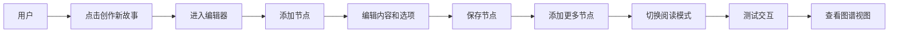
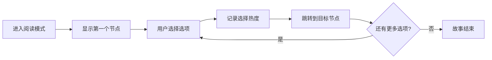

## 1. 产品概述

交互式多分支故事创作与分享平台，让用户以剧本形式创作非线性故事，支持多分支节点、阅读路径热度可视化和故事图谱展示。

- **主要用途**：用户可以创作多分支互动故事，阅读他人作品，查看阅读路径的热度数据
- **解决的问题**：传统线性叙事缺乏互动性，创作者无法直观了解读者的选择偏好
- **目标用户**：故事创作者、互动叙事爱好者、游戏设计师
- **产品价值**：提供可视化的创作工具和数据反馈，让互动故事创作更直观高效

## 2. 核心功能

### 2.1 用户角色
| 角色 | 注册方式 | 核心权限 |
|------|----------|----------|
| 普通用户 | 无需注册，本地使用 | 创建故事、编辑节点、阅读故事、查看图谱热度 |

### 2.2 功能模块
1. **首页**：展示"创作新故事"入口，引导用户开始创作
2. **编辑器页面**：左侧节点列表（可拖拽排序），右侧节点编辑区（富文本输入、选项卡片）
3. **阅读模式页面**：展示节点内容和选项，跟踪阅读进度，显示选项热度条
4. **故事图谱视图**：有向图可视化展示所有节点和连接，节点大小和连线颜色反映热度

### 2.3 页面详情
| 页面名称 | 模块名称 | 功能描述 |
|----------|----------|----------|
| 首页 | Hero区域 | 展示平台名称、简介和"创作新故事"按钮 |
| 编辑器 | 节点列表 | 可拖拽排序的节点列表，支持折叠/展开，可删除节点 |
| 编辑器 | 编辑区 | 富文本输入框（加粗、斜体、标题），选项卡片管理（描述、目标节点） |
| 阅读模式 | 内容展示 | 节点内容渲染，选项卡片，热度条，阅读进度显示 |
| 图谱视图 | 可视化 | d3-force有向图布局，拖拽/缩放交互，节点点击跳转 |

## 3. 核心流程

### 3.1 创作流程
用户点击"创作新故事" → 进入编辑器 → 添加第一个节点 → 编辑节点内容和选项 → 继续添加节点 → 切换到阅读模式测试 → 查看图谱可视化

### 3.2 阅读流程
用户进入阅读模式 → 从第一个节点开始 → 做出选择 → 跳转到对应节点 → 记录选择热度 → 直到故事结束

## 4. 用户界面设计

### 4.1 设计风格
- **主背景色**：深蓝黑 `#1a1a2e`
- **卡片风格**：半透明磨砂玻璃 `rgba(255,255,255,0.08)`，带 `blur(12px)` 和白色半透明边框
- **主按钮色**：珊瑚橙 `#ff6b6b`，悬停变亮 `#ff8787`，0.2秒平滑过渡
- **副按钮色**：青蓝色 `#4ecdc4`
- **文字颜色**：标题白色 `#ffffff`，正文浅灰 `#e0e0e0`
- **字体**：展示字体使用 "Playfair Display" 或 "Cinzel"，正文字体使用 "Source Serif Pro" 或 "Merriweather"
- **选项卡片悬停**：上浮3px，背景透明度加深，阴影从 `0 4px 12px` 变为 `0 8px 24px`
- **设计风格**：沉浸式黑暗叙事风格，神秘而富有层次感

### 4.2 页面设计概述
| 页面名称 | 模块名称 | UI元素 |
|----------|----------|--------|
| 首页 | Hero区域 | 大标题、副标题、主按钮、背景渐变、飞入动画 |
| 编辑器 | 节点列表 | 侧边栏280px（可折叠至44px）、汉堡菜单、拖拽句柄、飞入/消失动画 |
| 编辑器 | 编辑区 | 富文本工具栏、选项卡片、添加按钮、删除按钮 |
| 阅读模式 | 内容区 | 最大800px居中、节点内容、选项卡片、热度条、进度侧边栏 |
| 图谱视图 | 画布 | SVG画布、节点圆形、连线箭头、浮窗预览、拖拽缩放 |

### 4.3 响应式设计
- **桌面端**：完整侧边栏、双栏布局
- **平板端**：折叠侧边栏，点击展开
- **手机端**（<768px）：侧边栏自动隐藏，选项卡片全宽，内边距从12px增至20px
- **触摸优化**：增大点击区域，支持触摸滑动

### 4.4 动画效果
- **创建动画**：从左上角飞入 `translate(-20px, -20px) + opacity 0 → 1`，持续0.4秒
- **删除动画**：缩小 `scale 0.9` + 半透明 + 向上折叠，持续0.3秒
- **页面切换**：圆形切割动画 `clip-path: circle(0%) → circle(100%)`，持续0.6秒
- **选项悬停**：上浮3px + 阴影加深，0.2秒过渡
- **按钮悬停**：颜色变亮，0.2秒过渡

## 5. 性能指标
| 指标 | 要求 |
|------|------|
| 阅读模式选项切换延迟 | < 300ms |
| 图谱视图帧率（≤50节点/≤100连线） | ≥ 30fps |
| 图谱拖拽/缩放卡顿 | ≤ 50ms |
| 页面切换动画流畅度 | 无明显掉帧 |
