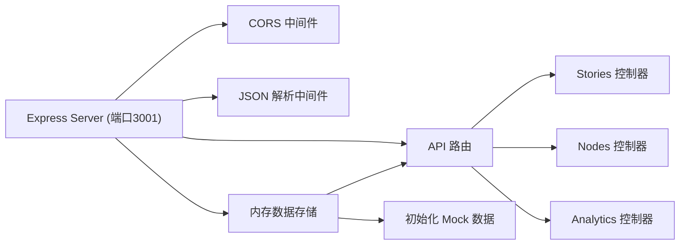
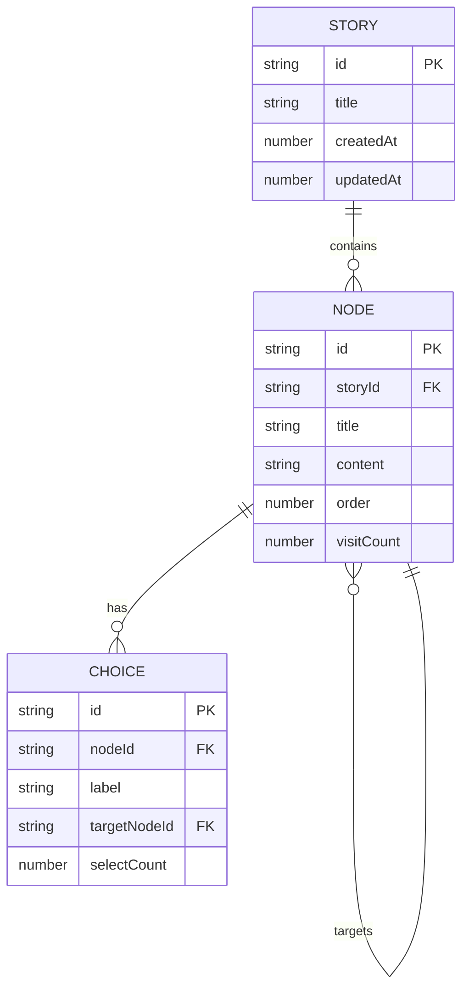

## 1. 架构设计

```mermaid
flowchart TB
    subgraph 前端
        A["React + TypeScript + Vite"]
        B["React Router"]
        C["React Context"]
        D["react-dnd (拖拽)"]
        E["d3-force (图谱)"]
        F["Styled Components (样式]
    end

    subgraph 后端
        G["Node.js + Express"]
        H["内存数据存储"]
        I["Mock API"]
    end

    subgraph 数据层
        J["内存存储 (每次启动重置)"]
    end

    A --> B
    A --> C
    A --> D
    A --> E
    A --> F
    A --> G
    G --> H
    H --> J
    G --> I
```

## 2. 技术描述

- **前端**：React@18 + TypeScript@5 + Vite@5
- **后端**：Express@4
- **构建工具**：Vite@5 + @vitejs/plugin-react@4
- **状态管理**：React Context
- **拖拽库**：react-dnd@16 + react-dnd-html5-backend@16
- **图谱可视化**：d3-force@3
- **HTTP客户端**：axios@1
- **唯一ID**：uuid@9
- **图表库**：chart.js@4 + react-chartjs-2@5
- **数据存储**：内存存储（每次启动重置）

## 3. 路由定义

| 路由 | 页面组件 | 用途 |
|--------|-----------|------|
| `/` | App.tsx (首页) | 展示"创作新故事"按钮和故事列表 |
| `/editor/:storyId` | EditorPage.tsx | 故事编辑器，节点编辑和拖拽排序 |
| `/reader/:storyId` | ReaderPage.tsx | 阅读模式，展示节点内容和选项 |
| `/graph/:storyId` | GraphView.tsx | 故事图谱可视化视图 |

## 4. API 定义

### 4.1 类型定义

```typescript
interface Story {
  id: string;
  title: string;
  createdAt: number;
  updatedAt: number;
}

interface StoryNode {
  id: string;
  storyId: string;
  title: string;
  content: string;
  order: number;
  visitCount: number;
  choices: Choice[];
}

interface Choice {
  id: string;
  label: string;
  targetNodeId: string;
  selectCount: number;
}

interface Analytics {
  totalVisits: number;
  nodeVisitCounts: Record<string, number>;
  choiceCounts: Record<string, number>;
  pathHeatmap: string[][];
}
```

### 4.2 接口定义

| 方法 | 路径 | 描述 |
|------|------|------|
| GET | `/api/stories` | 获取所有故事列表 |
| POST | `/api/stories` | 创建新故事 |
| GET | `/api/stories/:id` | 获取单个故事详情 |
| PUT | `/api/stories/:id` | 更新故事信息 |
| DELETE | `/api/stories/:id` | 删除故事 |
| GET | `/api/stories/:id/nodes` | 获取故事的所有节点 |
| POST | `/api/stories/:id/nodes` | 向故事添加新节点 |
| PUT | `/api/nodes/:id` | 更新节点内容 |
| DELETE | `/api/nodes/:id` | 删除节点 |
| POST | `/api/choices` | 记录用户选择（增加热度） |
| GET | `/api/stories/:id/analytics` | 获取故事分析数据（热度） |

### 4.3 请求/响应示例

```typescript
// GET /api/stories/:id/nodes
Response: {
  nodes: StoryNode[] }
```

```typescript
// POST /api/stories
Request: {
  title: string }
Response: Story
```

```typescript
// POST /api/choices
Request: {
  choiceId: string; storyId: string }
Response: {
  success: true }
```

## 5. 服务端架构



## 6. 数据模型

### 6.1 数据模型定义



### 6.2 项目文件结构

```
auto52/
├── package.json
├── vite.config.js
├── tsconfig.json
├── index.html
├── src/
│   ├── App.tsx              # 主组件，路由和全局状态
│   ├── EditorPage.tsx       # 编辑器页面
│   ├── ReaderPage.tsx       # 阅读模式页面
│   ├── GraphView.tsx        # 图谱视图
│   ├── api.ts               # API 封装
│   ├── types.ts             # TypeScript 类型定义
│   └── index.css           # 全局样式
└── server/
    └── mockServer.js        # Express Mock 服务
```

## 7. 性能优化策略

### 7.1 前端性能
- 阅读模式使用 React.memo 避免不必要重渲染
- 图谱视图使用 Canvas 或 SVG 优化渲染
- 节点拖拽使用 requestAnimationFrame 平滑动画
- 页面切换动画使用 CSS transform 和 clip-path 硬件加速

### 7.2 图谱性能
- d3-force 冷却后停止模拟，仅在交互时重启
- 节点拖拽时使用 transform 而非重新渲染
- 缩放使用 SVG transform 避免重排
