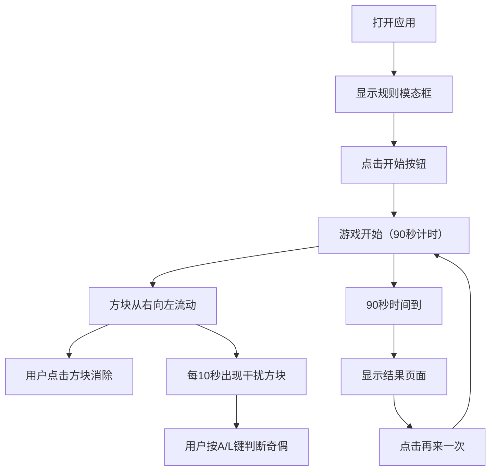

## 1. 产品概述

本产品是一个二维快速反应测试与视觉兼容性评估应用，将认知科学实验与娱乐结合，用户通过动态变化的色块和符号测试反应速度与色彩分辨能力，同时记录测试数据并生成可视化统计图表。

- 核心目标：提供趣味性的反应速度和色彩分辨能力测试
- 目标用户：需要进行认知能力训练或娱乐的普通用户
- 市场价值：可用于认知科学研究、教育训练、休闲娱乐等场景

## 2. 核心功能

### 2.1 用户角色
无角色区分，所有用户使用相同功能。

### 2.2 功能模块
1. **游戏主模块**：滚动彩色方块流，点击消除计分
2. **干扰方块模块**：特殊数字方块，奇偶判断键盘操作
3. **结果统计模块**：游戏结束后显示详细统计数据和图表
4. **UI交互模块**：开始模态框、分数显示、计时器、警告提示

### 2.3 页面详情
| 页面名称 | 模块名称 | 功能描述 |
|-----------|-------------|---------------------|
| 游戏主页面 | 方块流动画 | 方块从右向左移动，每2秒变色，点击消除计分 |
| 游戏主页面 | 干扰方块交互 | 每隔10秒出现数字方块，按A/L键判断奇偶 |
| 结果页面 | 统计展示 | 显示得分、点击次数、正确率、平均反应时间 |
| 结果页面 | 柱状图 | Canvas绘制反应时间分布柱状图，蓝红渐变 |

## 3. 核心流程

用户打开应用 → 显示规则说明模态框 → 点击开始 → 游戏开始（90秒倒计时） → 方块流动并可点击 → 每隔10秒出现干扰方块 → 时间结束 → 显示结果页面 → 可选择再来一次

## 4. 用户界面设计

### 4.1 设计风格
- 主色调：深色主题，背景 #1a1a2e
- 方块色板：10种高饱和度颜色（#FF5733, #33FF57, #3357FF, #FF33A8等）
- 强调色：绿色对勾（成功）、红色X/闪烁（失败/警告）、金色闪烁（干扰正确）
- 字体：白色无衬线字体，分数/计时器24px
- 布局：顶部中央显示分数和计时器，中央为游戏区域
- 圆角和阴影：方块带圆角和轻微阴影，游戏区域为黑色边框圆角矩形

### 4.2 页面设计概述
| 页面名称 | 模块名称 | UI元素 |
|-----------|-------------|-------------|
| 游戏主页面 | 游戏区域 | 800x400px（桌面）/90%宽度（移动）圆角矩形，黑色边框 |
| 游戏主页面 | 顶部信息栏 | 分数、计时器，白色24px字体，居中显示 |
| 游戏主页面 | 开始模态框 | 半透明深色背景，浅灰色文字，开始按钮 |
| 游戏主页面 | 警告提示 | 顶部红色闪烁（0.3秒） |
| 结果页面 | 统计面板 | 得分、点击次数、正确率、平均反应时间 |
| 结果页面 | 柱状图 | 反应时间分布，蓝红渐变色，圆角柱体 |
| 结果页面 | 操作按钮 | 再来一次按钮 |

### 4.3 响应式设计
- 桌面端（>1024px）：游戏区域800x400px，居中显示
- 平板端（600-1024px）：游戏区域90%宽度，400px高度
- 移动端（<600px）：游戏区域90%宽度，400px高度，触摸优化

### 4.4 动画效果
- 方块移动：每秒80像素匀速向左
- 方块消除：0.2秒内缩放至0消失
- 点击反馈：白色光环扩散效果
- 成功提示：绿色对勾图标，持续0.5秒
- 警告闪烁：红色闪烁，持续0.3秒
- 模态框淡出：点击开始后淡出消失
