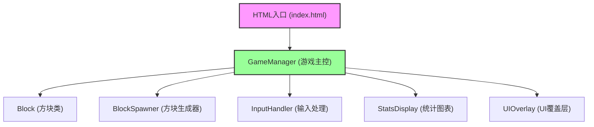

## 1. 架构设计

本项目采用纯前端架构，使用TypeScript + Canvas实现，不依赖任何第三方UI库或框架。所有逻辑在浏览器端完成，无需后端服务。



## 2. 技术描述

- 前端技术栈：TypeScript 5.x + Vite 5.x + HTML5 Canvas API
- 构建工具：Vite
- 编程语言：TypeScript（严格模式，ESModule）
- 无第三方运行时依赖，仅使用浏览器原生API

## 3. 文件结构

| 文件路径 | 职责描述 |
|----------|----------|
| `package.json` | 项目配置，依赖：vite, typescript |
| `vite.config.js` | Vite构建配置 |
| `tsconfig.json` | TypeScript编译配置（严格模式） |
| `index.html` | 入口HTML，包含Canvas容器和UI覆盖层 |
| `src/GameManager.ts` | 游戏主控制器，协调所有模块，管理游戏状态 |
| `src/Block.ts` | 方块类，定义属性和绘制方法 |
| `src/BlockSpawner.ts` | 方块生成器，控制生成频率和参数 |
| `src/InputHandler.ts` | 输入处理，监听鼠标点击和键盘事件 |
| `src/StatsDisplay.ts` | 统计图表绘制，反应时间分布柱状图 |
| `src/UIOverlay.ts` | UI覆盖层管理，DOM元素操作 |

## 4. 核心模块接口定义

### 4.1 GameManager 状态
```typescript
type GameState = 'idle' | 'playing' | 'ended';

interface GameStats {
  score: number;
  totalClicks: number;
  correctClicks: number;
  misses: number;
  reactionTimes: number[];
  averageReactionTime: number;
  accuracy: number;
}
```

### 4.2 Block 接口
```typescript
interface BlockData {
  x: number;
  y: number;
  size: number;
  color: string;
  isDistractor: boolean;
  number?: number;
  createdAt: number;
  isDisappearing?: boolean;
  disappearStartTime?: number;
}
```

### 4.3 回调接口
```typescript
interface GameCallbacks {
  onBlockClick: (block: Block, reactionTime: number) => void;
  onBlockMiss: (block: Block) => void;
  onDistractorCorrect: () => void;
  onDistractorWrong: () => void;
  onGameEnd: () => void;
}
```

## 5. 性能优化策略

1. **帧率控制**：使用 `requestAnimationFrame` 实现稳定60fps渲染
2. **自适应生成**：BlockSpawner根据当前帧率动态调整方块生成数量
3. **对象池化**：复用Block对象，减少GC开销
4. **分层渲染**：静态UI元素使用DOM，动态元素使用Canvas
5. **移动优化**：限制同时存在的方块数量，确保移动设备30fps以上

## 6. 数据模型

### 6.1 颜色配置
```typescript
const COLOR_PALETTE = [
  '#FF5733', '#33FF57', '#3357FF', '#FF33A8',
  '#F3FF33', '#33FFF5', '#FF8C33', '#8C33FF',
  '#33FF8C', '#FF3333'
];
```

### 6.2 游戏配置常量
```typescript
const GAME_CONFIG = {
  GAME_DURATION: 90000,        // 90秒
  BLOCK_SPEED: 80,             // 每秒80像素
  BLOCK_MIN_SIZE: 30,
  BLOCK_MAX_SIZE: 60,
  COLOR_CHANGE_INTERVAL: 2000, // 每2秒变色
  DISTRACTOR_INTERVAL: 10000,  // 每10秒干扰方块
  DISAPPEAR_DURATION: 200,     // 消失动画0.2秒
  CHECKMARK_DURATION: 500,     // 对勾显示0.5秒
  WARNING_DURATION: 300,       // 警告闪烁0.3秒
  DISTRACTOR_SIZE_MULTIPLIER: 1.2,
};
```
