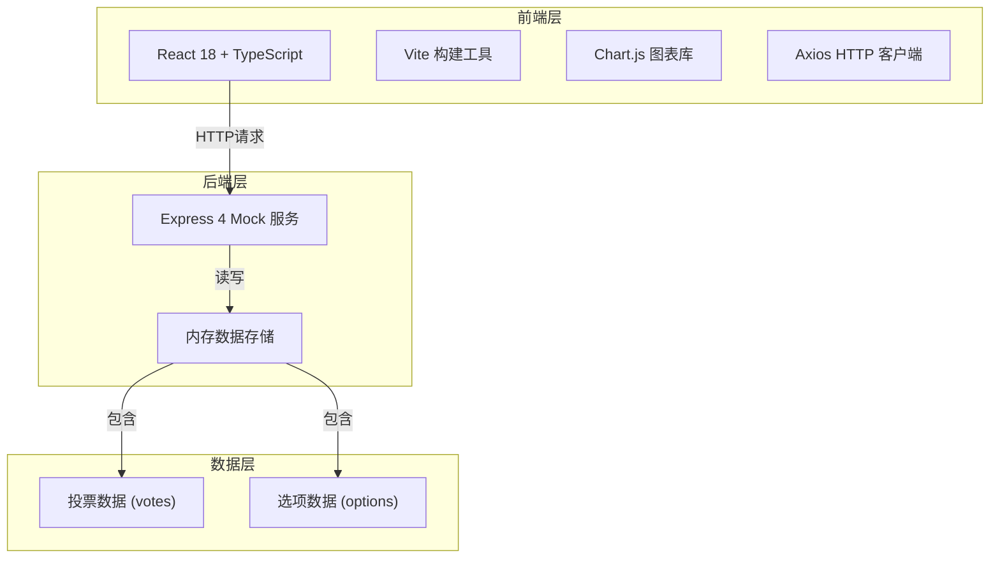
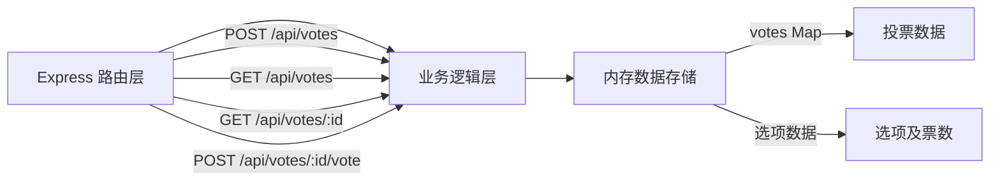
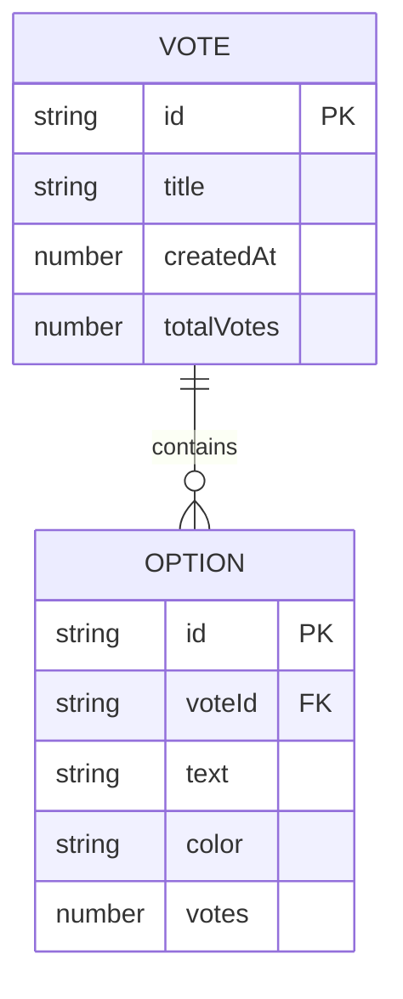

## 1. 架构设计



## 2. 技术描述

- 前端框架：React 18 + TypeScript
- 构建工具：Vite 5 + @vitejs/plugin-react
- 图表库：chart.js + react-chartjs-2
- HTTP客户端：axios
- 后端服务：Express 4（本地 Mock 服务）
- 唯一ID生成：uuid
- 数据存储：内存存储（开发阶段）
- 开发服务器：Vite devServer + 代理至 Express Mock 服务

## 3. 路由定义

| 路由 | 页面/组件 | 用途 |
|------|-----------|------|
| / | App.tsx (首页) | 投票创建 + 投票列表展示 |
| /vote/:id | VoteDetail (详情页) | 投票详情 + 实时结果图表 + 投票交互 |

注：使用 React useState + 条件渲染实现简易路由，不引入 react-router 以保持轻量。

## 4. API 定义

### 4.1 创建投票

- **POST** `/api/votes`
- 请求体：
```typescript
interface CreateVoteRequest {
  title: string;
  options: {
    text: string;
    color: string;
  }[];
}
```
- 响应：
```typescript
interface VoteResponse {
  id: string;
  title: string;
  options: {
    id: string;
    text: string;
    color: string;
    votes: number;
  }[];
  totalVotes: number;
  createdAt: number;
}
```

### 4.2 获取投票详情

- **GET** `/api/votes/:id`
- 响应：`VoteResponse`

### 4.3 提交投票

- **POST** `/api/votes/:id/vote`
- 请求体：
```typescript
interface SubmitVoteRequest {
  optionId: string;
}
```
- 响应：`VoteResponse`

### 4.4 获取投票列表

- **GET** `/api/votes`
- 响应：
```typescript
interface VoteListResponse {
  votes: {
    id: string;
    title: string;
    optionCount: number;
    totalVotes: number;
  }[];
}
```

## 5. 服务端架构图



## 6. 数据模型

### 6.1 数据模型定义



### 6.2 数据结构说明

- **Vote（投票）**
  - `id`: 唯一标识符（uuid v4）
  - `title`: 投票标题
  - `createdAt`: 创建时间戳
  - `totalVotes`: 总票数（冗余字段，便于快速查询）
  
- **Option（选项）**
  - `id`: 唯一标识符
  - `voteId`: 所属投票ID
  - `text`: 选项文本
  - `color`: 选项颜色（十六进制）
  - `votes`: 该选项的票数

## 7. 前端组件结构

```
src/
├── App.tsx              # 主组件，路由与状态管理
├── VoteCreator.tsx      # 投票创建表单组件
├── VoteChart.tsx        # 投票结果图表组件
├── VoteList.tsx         # 投票列表组件（可选拆分）
├── VoteDetail.tsx       # 投票详情页组件（可选拆分）
├── styles/
│   └── index.css        # 全局样式
├── types/
│   └── index.ts         # TypeScript 类型定义
└── utils/
    └── api.ts           # API 请求封装
```

## 8. 性能优化策略

- 图表更新使用 Chart.js 原生动画，避免重渲染
- 轮询使用 axios 取消机制，避免竞态条件
- 组件使用 React.memo 减少不必要重渲染
- 数字滚动动画使用 requestAnimationFrame 保证 60fps
- 首屏加载优化：按需加载 Chart.js 模块
