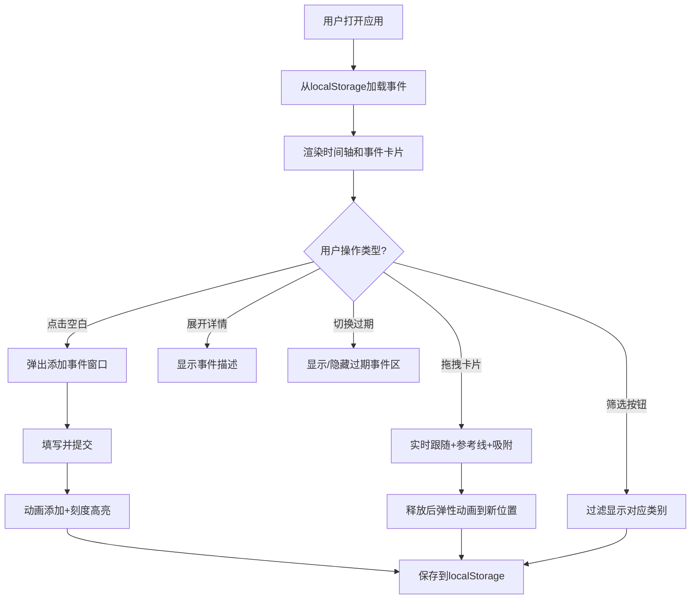

## 1. 产品概述

时间线看板应用是一款帮助用户在浏览器中快速规划日常行程的工具。主要解决日程安排碎片化、缺乏直观时间视图的问题，通过垂直时间轴的形式提供清晰的时间感知，支持事件快速创建、拖拽调整、分类筛选等功能。

- **目标用户**：需要高效管理日常时间安排的个人用户、职场人士、学生
- **核心价值**：直观的时间可视化、流畅的交互体验、离线可用的本地存储

## 2. 核心功能

### 2.1 功能模块

1. **主页面**：时间轴显示、事件卡片渲染、快捷筛选栏
2. **事件管理**：添加事件弹窗、编辑事件、拖拽调整时间、展开/收起详情
3. **数据持久化**：localStorage存储、自动恢复、跨午夜事件拆分
4. **筛选系统**：类别筛选、过期事件显示开关

### 2.2 页面详情

| 页面名称 | 模块名称 | 功能描述 |
|---------|---------|---------|
| 主页面 | 时间轴区域 | 垂直滚动时间轴，以当前时间为中心，上下各6小时，每30分钟刻度线 |
| 主页面 | 事件卡片 | 彩色圆角卡片，左边缘类别色条，支持展开/收起详情 |
| 主页面 | 快捷筛选栏 | 全部/工作/个人/学习/其他筛选按钮 |
| 主页面 | 过期事件区 | 折叠区域，显示灰色半透明的已过期事件 |
| 主页面 | 日期导航 | 日期分隔线及标签，点击跳转任意日期 |
| 添加弹窗 | 事件表单 | 标题输入、时间选择器、类别下拉、描述文本域 |

## 3. 核心流程

用户打开应用 → 时间轴以当前时间为中心显示 → 用户点击空白处创建事件 → 填写事件信息并提交 → 事件卡片动画出现在时间轴上 → 用户可拖拽调整时间位置 → 选择类别筛选查看 → 页面刷新后自动恢复所有数据

## 4. 用户界面设计

### 4.1 设计风格

- **主色调**：浅色主题，主背景#F7F8FA，卡片背景#FFFFFF
- **类别色**：工作蓝色#4A90D9、个人绿色#50C878、学习橙色#FF8C00、其他紫色#9B59B6
- **阴影**：box-shadow: 0 2px 8px rgba(0,0,0,0.06)
- **字体**：系统无衬线字体，刻度13px#888，卡片标题16px加粗，时间13px灰色
- **圆角**：事件卡片8px圆角
- **动效**：弹性动画cubic-bezier(0.34, 1.56, 0.64, 1)

### 4.2 页面设计概览

| 页面名称 | 模块名称 | UI元素 |
|---------|---------|---------|
| 主页面 | 时间轴 | 灰色细线刻度(30分钟)、12小时制标签、当前时间指示器 |
| 主页面 | 事件卡片 | 左边缘色条、标题、时间文字、右侧三角展开指示器 |
| 主页面 | 筛选栏 | 横向按钮组，选中状态高亮 |
| 主页面 | 过期开关 | 滑动式切换开关，默认关闭 |
| 添加弹窗 | 表单 | 居中模态框，带表单验证 |
| 拖拽状态 | 交互 | 卡片半透明、蓝色虚线参考线(stroke-dasharray:5 5)、15分钟刻度吸附 |

### 4.3 响应式

- **桌面端**(≥768px)：标准布局，卡片宽度80%
- **移动端**(<768px)：筛选按钮变为顶部横向滚动，卡片宽度95%
- 触摸操作优化：拖拽支持触摸事件

### 4.4 性能要求

- 时间轴滚动和拖拽帧率≥50fps
- 事件数量上限200个，超过时弹出提示阻止添加
- 使用requestAnimationFrame处理拖拽动画
