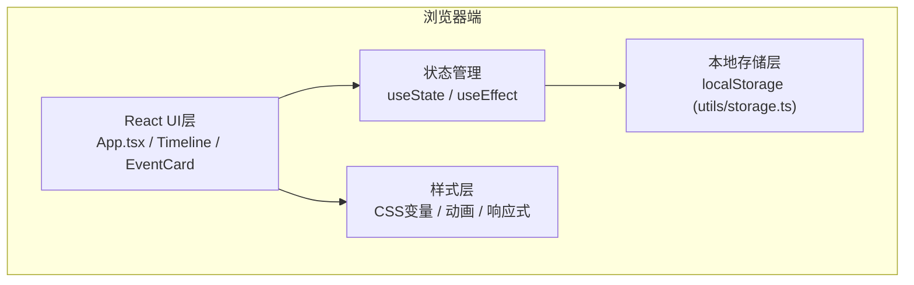

## 1. 架构设计



## 2. 技术说明

- **前端框架**：React 18 + TypeScript
- **构建工具**：Vite + @vitejs/plugin-react
- **状态管理**：React Hooks (useState, useEffect, useRef, useCallback)
- **数据持久化**：浏览器 localStorage
- **唯一标识**：uuid 库生成事件ID
- **网络请求库**：axios (预留API扩展能力)
- **样式方案**：原生CSS (CSS变量, 媒体查询, 关键帧动画)

## 3. 项目结构

```
auto56/
├── index.html                 # 入口HTML
├── package.json               # 依赖配置
├── vite.config.js             # Vite配置
├── tsconfig.json              # TypeScript配置(严格模式)
├── src/
│   ├── App.tsx               # 主组件 - 全局状态、筛选逻辑、布局
│   ├── main.tsx              # React入口文件
│   ├── styles.css            # 全局样式 - 颜色变量、动画、响应式
│   ├── components/
│   │   ├── Timeline.tsx      # 时间轴组件 - 刻度渲染、拖拽、动画管理
│   │   └── EventCard.tsx     # 事件卡片组件 - 展开/折叠、色条、拖拽句柄
│   └── utils/
│       └── storage.ts        # localStorage工具 - loadEvents/saveEvents
```

## 4. 数据模型

### 4.1 类型定义

```typescript
// 事件类别
type EventCategory = 'work' | 'personal' | 'study' | 'other';

// 事件模型
interface CalendarEvent {
  id: string;              // uuid唯一标识
  title: string;           // 事件标题
  startTime: number;       // 开始时间戳(ms)
  endTime: number;         // 结束时间戳(ms)
  category: EventCategory; // 类别
  description?: string;    // 描述(可选)
  isExpired?: boolean;     // 是否已过期(计算属性)
}

// 类别颜色映射
const CATEGORY_COLORS: Record<EventCategory, string> = {
  work: '#4A90D9',
  personal: '#50C878',
  study: '#FF8C00',
  other: '#9B59B6'
};

// 筛选状态
type FilterType = 'all' | EventCategory;
```

### 4.2 存储格式

localStorage key: `timeline_events_v1`

```json
{
  "events": [
    {
      "id": "uuid-string",
      "title": "团队会议",
      "startTime": 1718164800000,
      "endTime": 1718168400000,
      "category": "work",
      "description": "讨论Q2季度计划"
    }
  ],
  "lastSaved": 1718164800000
}
```

## 5. 核心算法逻辑

### 5.1 时间轴计算

- **时间范围**：当前时间 ±6小时，共12小时
- **像素/分钟比例**：每分钟对应1.5px，每小时90px
- **刻度线**：每30分钟一条细线，整点加粗显示标签
- **当前时间线**：红色实线贯穿面板，随系统时间实时更新

### 5.2 跨午夜事件拆分

```
输入: 事件A (23:00 - 次日01:30)
输出:
  事件A-1 (23:00 - 24:00) 显示在当天时间轴末尾
  事件A-2 (00:00 - 01:30) 显示在次日时间轴开头
  视觉上通过同一天标签色条关联
```

### 5.3 事件重叠处理

当多个事件时间段重叠时：
1. 按开始时间排序分组
2. 计算重叠数量N
3. 卡片宽度调整为 `80% / N` (桌面端) 或 `95% / N` (移动端)
4. 根据索引左右错开：`left = 0%, 80%/N, 2*80%/N, ...`

### 5.4 拖拽吸附逻辑

```
拖拽偏移 = 鼠标Y - 初始Y
目标时间 = 开始时间 + (拖拽偏移 / 像素比例)
吸附时间 = Math.round(目标时间 / 15分钟) * 15分钟
```

## 6. 性能优化策略

- **虚拟滚动**：只渲染可视区域内的刻度和事件（时间轴较短时可全量渲染）
- **requestAnimationFrame**：所有拖拽动画和位置更新走RAF
- **debounced保存**：拖拽结束后延迟保存，避免频繁写入
- **useMemo/useCallback**：避免不必要的重渲染
- **CSS transform**：位置变化优先使用transform，避免重排重绘

## 7. 动画规范

| 动画场景 | 时长 | 缓动函数 |
|---------|------|---------|
| 事件卡片添加（扩散） | 0.3s | ease-out |
| 刻度高亮闪烁 | 0.3s | ease-in-out |
| 拖拽弹入新位置 | 0.2s | cubic-bezier(0.34, 1.56, 0.64, 1) |
| 筛选淡入淡出 | 0.3s | ease-out |
| 卡片展开/收起 | 0.2s | ease-in-out |
