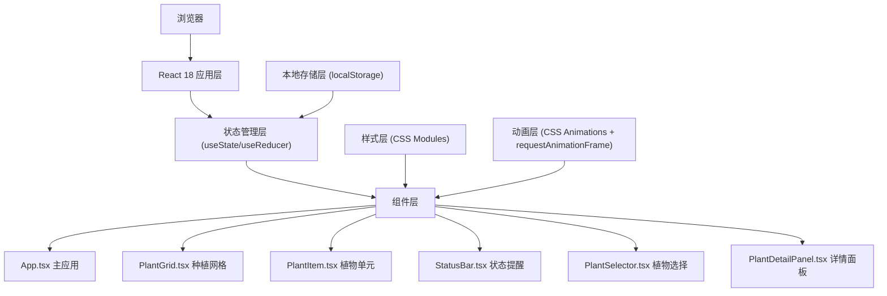
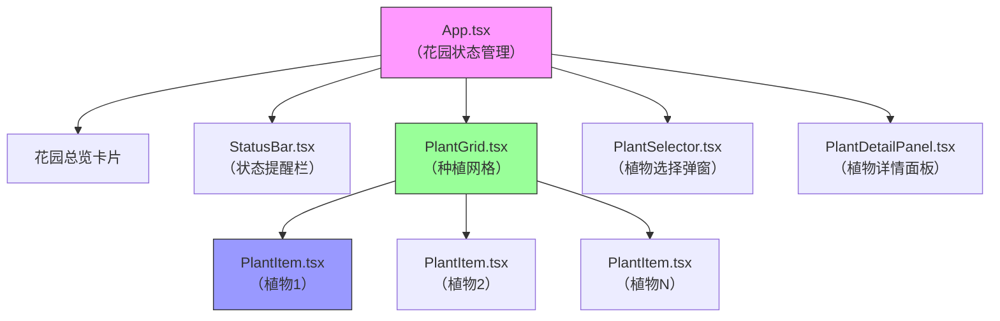

## 1. 架构设计



## 2. 技术描述

- **前端框架**：React 18 + TypeScript 5
- **构建工具**：Vite 5 + @vitejs/plugin-react
- **状态管理**：React useState + useReducer（轻量级，无需Redux）
- **样式方案**：纯CSS + CSS Variables，不使用Tailwind
- **唯一ID生成**：uuid
- **数据持久化**：localStorage存储花园状态
- **动画方案**：CSS Animations + Transitions + requestAnimationFrame
- **图标方案**：Emoji + SVG混合实现

## 3. 目录结构

```
e:\solo\VersionFast\tasks\auto60\
├── index.html
├── package.json
├── tsconfig.json
├── vite.config.js
└── src\
    ├── App.tsx
    ├── main.tsx
    ├── types.ts
    ├── constants.ts
    ├── utils.ts
    ├── PlantGrid.tsx
    ├── PlantItem.tsx
    ├── StatusBar.tsx
    ├── PlantSelector.tsx
    ├── PlantDetailPanel.tsx
    └── styles\
        ├── global.css
        ├── animations.css
        └── variables.css
```

## 4. 核心数据模型

### 4.1 类型定义

```typescript
// 植物类型
type PlantType = 'strawberry' | 'sunflower' | 'cactus';

// 稀有度
type Rarity = 'common' | 'rare' | 'legendary';

// 植物状态
type PlantStatus = 'growing' | 'mature' | 'needs_water' | 'needs_fertilizer';

// 植物定义
interface PlantDefinition {
  type: PlantType;
  name: string;
  icon: string;
  matureIcon: string;
  growthCycleHours: number;
  rarity: Rarity;
  ringColor: string;
  expReward: number;
}

// 植物实例
interface Plant {
  id: string;
  type: PlantType;
  gridIndex: number;
  progress: number;
  status: PlantStatus;
  plantedAt: number;
  lastWateredAt: number;
  lastFertilizedAt: number;
}

// 花园状态
interface GardenState {
  level: number;
  exp: number;
  expToNextLevel: number;
  plants: Plant[];
  unlockedGridCount: number;
  todos: number;
}

// 提醒消息
interface StatusMessage {
  id: string;
  type: 'water' | 'fertilizer' | 'info';
  text: string;
  plantId?: string;
}
```

### 4.2 常量定义

```typescript
// 植物配置
const PLANT_DEFINITIONS: Record<PlantType, PlantDefinition> = {
  strawberry: {
    type: 'strawberry',
    name: '草莓',
    icon: '🌱',
    matureIcon: '🍓',
    growthCycleHours: 24,
    rarity: 'common',
    ringColor: '#FF4C4C',
    expReward: 10,
  },
  sunflower: {
    type: 'sunflower',
    name: '向日葵',
    icon: '🌱',
    matureIcon: '🌻',
    growthCycleHours: 48,
    rarity: 'rare',
    ringColor: '#FFD700',
    expReward: 25,
  },
  cactus: {
    type: 'cactus',
    name: '仙人掌',
    icon: '🌱',
    matureIcon: '🌵',
    growthCycleHours: 72,
    rarity: 'legendary',
    ringColor: '#32CD32',
    expReward: 50,
  },
};

// 网格配置
const GRID_ROWS = 6;
const GRID_COLS_DESKTOP = 4;
const GRID_COLS_MOBILE = 3;
const BASE_GRID_COUNT = 24;

// 等级配置
const MAX_LEVEL = 10;
const EXP_PER_LEVEL = 100;
const GRID_PER_LEVEL = 1;

// 生长配置
const GROWTH_INTERVAL_MS = 10 * 60 * 1000; // 10分钟
const GROWTH_AMOUNT_PER_INTERVAL = 1; // 每次增长1%
const CARE_BOOST_AMOUNT = 2; // 浇水施肥增加2%

// 提醒配置
const REMINDER_DISPLAY_MS = 3000;
const WATER_REMINDER_INTERVAL_MS = 30 * 60 * 1000; // 30分钟需要浇水
const FERTILIZER_REMINDER_INTERVAL_MS = 60 * 60 * 1000; // 60分钟需要施肥
```

## 5. 组件层级与数据流



## 6. 性能优化策略

### 6.1 渲染优化
- 使用 `React.memo` 包装 `PlantItem` 组件，避免不必要的重渲染
- 生长进度更新使用 `requestAnimationFrame` 批量处理
- 使用 CSS `transform` 和 `opacity` 实现动画，触发GPU加速
- 避免在渲染函数中创建新对象/数组，使用 `useMemo` 缓存计算结果

### 6.2 动画优化
- 进度环使用 SVG `stroke-dasharray` 实现，纯CSS过渡
- 粒子特效使用 CSS `::before`/`::after` 伪元素，减少DOM节点
- 种子下落动画使用 CSS `cubic-bezier` 贝塞尔曲线
- 成熟脉动效果使用 CSS `@keyframes` 呼吸动画

### 6.3 状态优化
- 植物生长定时器集中管理，使用单个 `setInterval` 更新所有植物
- 状态更新使用函数式 `setState` 避免闭包陷阱
- 本地存储防抖写入，避免频繁IO操作

## 7. 核心算法

### 7.1 经验值与等级计算
```typescript
function calculateLevel(exp: number): { level: number; expToNext: number } {
  const level = Math.min(Math.floor(exp / EXP_PER_LEVEL) + 1, MAX_LEVEL);
  const expToNext = EXP_PER_LEVEL - (exp % EXP_PER_LEVEL);
  return { level, expToNext };
}
```

### 7.2 生长进度更新
```typescript
function updatePlantGrowth(plant: Plant, deltaTimeMs: number): Plant {
  const intervalsPassed = Math.floor(deltaTimeMs / GROWTH_INTERVAL_MS);
  const progressIncrease = intervalsPassed * GROWTH_AMOUNT_PER_INTERVAL;
  const newProgress = Math.min(plant.progress + progressIncrease, 100);
  
  return {
    ...plant,
    progress: newProgress,
    status: newProgress >= 100 ? 'mature' : plant.status,
  };
}
```

## 8. 浏览器兼容性

- **目标浏览器**：Chrome 90+、Firefox 88+、Safari 14+、Edge 90+
- **CSS特性**：使用 `@supports` 检测CSS变量和Grid支持
- **Polyfill**：无需额外polyfill，React 18自动处理
- **存储限制**：localStorage配额5MB足够存储花园状态
