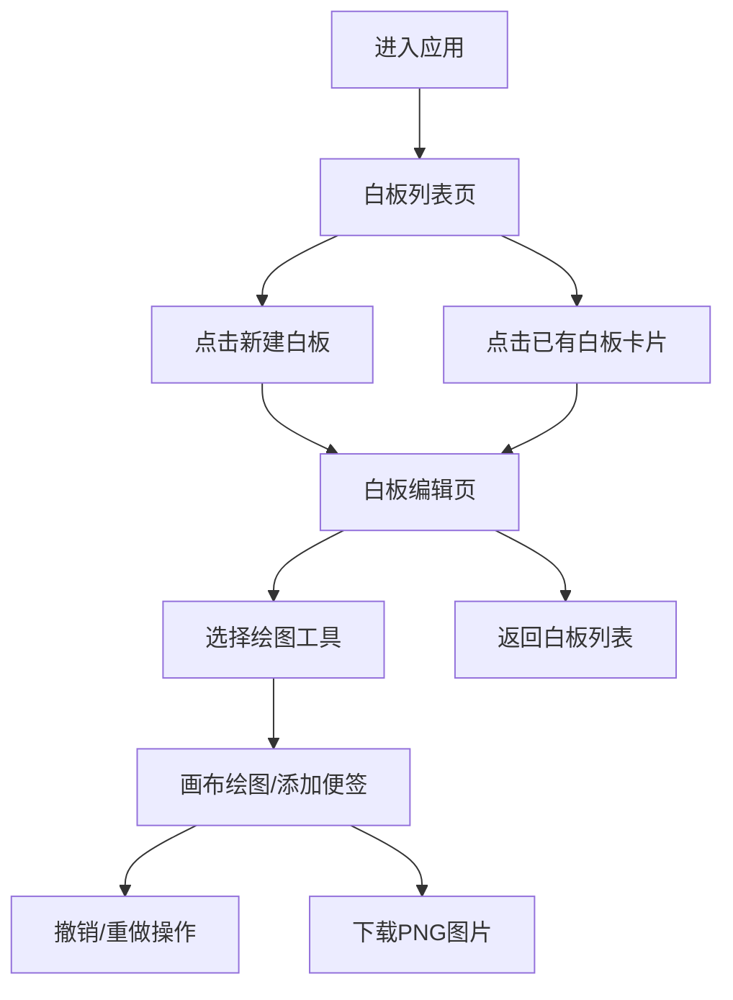

## 1. 产品概述

在线互动白板应用，为小型创业团队提供轻量的实时协作绘图工具，支持多板管理，让远程头脑风暴更高效。

- 核心价值：提供直观的绘图和便签功能，支持多白板管理，提升远程协作效率
- 目标用户：创业团队成员、产品经理、设计师、远程工作者
- 市场定位：轻量型团队协作工具，替代传统实体白板，降低团队沟通成本

## 2. 核心功能

### 2.1 用户角色

| 角色 | 注册方式 | 核心权限 |
|------|----------|---------|
| 团队成员 | 无需注册（本地Mock） | 创建/删除白板、绘图、添加便签、下载白板 |

### 2.2 功能模块

1. **白板列表页**：侧边导航栏、白板卡片网格、新建/删除白板
2. **白板编辑页**：绘图工具栏、画布区域、便签管理、撤销重做、PNG导出

### 2.3 页面详情

| 页面名称 | 模块名称 | 功能描述 |
|---------|----------|---------|
| 白板列表页 | 侧边导航栏 | 应用Logo、新建白板按钮、用户头像、60px宽度竖排布局 |
| 白板列表页 | 白板卡片网格 | 展示白板标题、最后编辑时间、缩略预览图、点击进入编辑 |
| 白板编辑页 | 绘图工具栏 | 画笔(3种笔刷宽度、10色色板)、矩形、椭圆、直线、文本工具、下载按钮 |
| 白板编辑页 | 画布区域 | react-konva实现、支持100+图形元素、30FPS以上帧率 |
| 白板编辑页 | 便签功能 | 拖拽添加、6种随机底色、调整大小旋转、双击编辑 |
| 白板编辑页 | 撤销重做 | Ctrl+Z撤销、Ctrl+Y重做、最多50步历史记录 |

## 3. 核心流程

### 用户主流程

用户打开应用 → 查看白板列表 → 点击现有白板或新建白板 → 进入白板编辑 → 选择绘图工具 → 在画布上绘图/添加便签 → 使用撤销重做修正 → 下载PNG或返回列表

## 4. 用户界面设计

### 4.1 设计风格

- 极简扁平风格，干净清爽
- 主色调：深蓝渐变（#1A237E → #283593）
- 背景色：浅灰（#F5F5F5）
- 白板区域：纯白（#FFFFFF）带细微网格线（20px间隔，#E0E0E0）
- 按钮：白色图标，悬停半透明白色（#FFFFFF, 0.2）
- 便签色板：#FFD700、#98FB98、#87CEEB、#FFB6C1、#DDA0DD、#F0E68C
- 绘色色板：#000000、#FF0000、#0000FF、#008000、#FFA500、#800080、#00CED1、#FF69B4、#8B4513、#696969
- 字体：现代无衬线字体，清晰易读
- 布局：侧边导航+主内容区的经典布局
- 动画：0.3秒滑动下划线、0.2秒淡入淡出、0.4秒弹跳动画（1.05倍）

### 4.2 页面设计概述

| 页面名称 | 模块名称 | UI元素 |
|---------|----------|--------|
| 白板列表页 | 侧边导航栏 | 深蓝渐变背景、Logo、新建按钮、用户头像、垂直布局 |
| 白板列表页 | 白板卡片网格 | 卡片悬停效果、缩略图预览、标题、时间戳、删除按钮 |
| 白板编辑页 | 顶部工具栏 | 56px高度、深蓝渐变、工具图标组、下划线动画、颜色选择面板 |
| 白板编辑页 | 画布区域 | 纯白背景、网格线、图形元素、便签、选中状态 |
| 白板编辑页 | 便签组件 | 圆角、阴影、双击编辑、拖拽旋转缩放 |

### 4.3 响应式设计

- 桌面优先设计，移动端自适应
- 宽度小于768px时工具栏变为两行紧凑布局
- 画布自动缩放以适应屏幕
- 触摸操作优化

### 4.4 性能约束

- 画布交互帧率稳定在30FPS以上
- 同时支持100+图形元素流畅交互
- 工具栏切换和按钮反馈延迟不超过50ms
