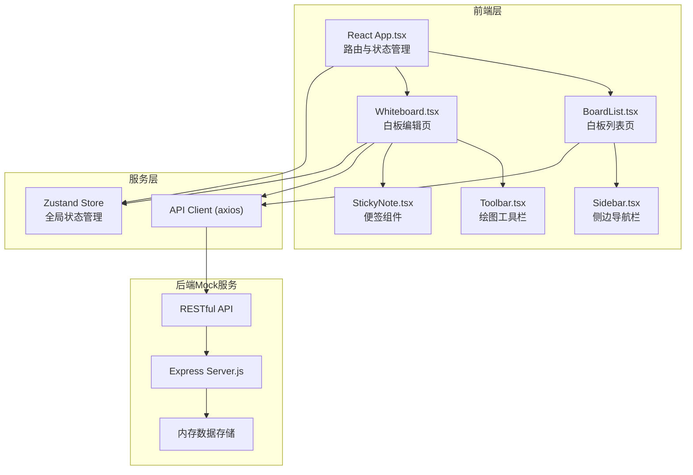
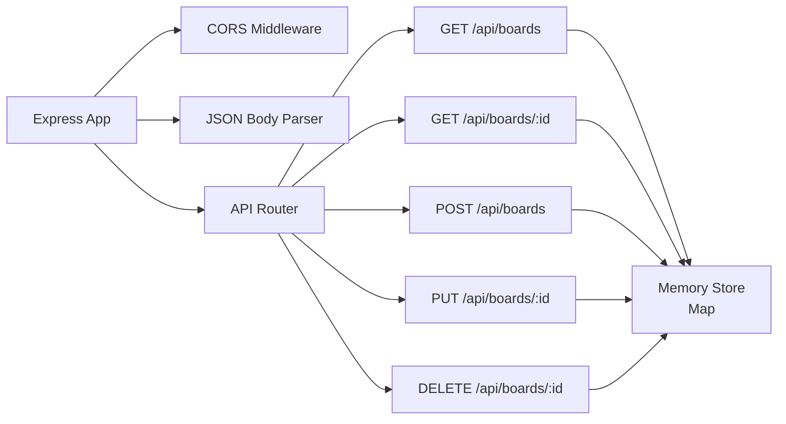
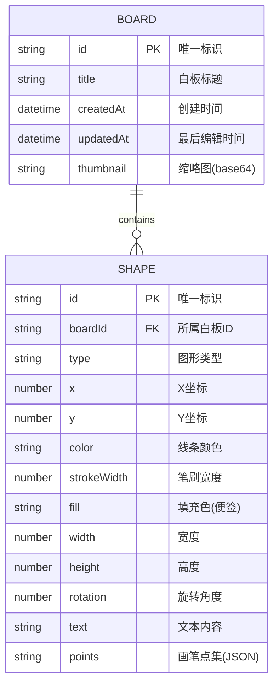

## 1. 架构设计



## 2. 技术描述

- **前端框架**：React 18 + TypeScript 5
- **构建工具**：Vite 5 + @vitejs/plugin-react
- **图形渲染**：react-konva + konva
- **状态管理**：Zustand
- **HTTP客户端**：axios
- **路由**：React Router DOM
- **图标**：lucide-react
- **后端**：Express 4
- **数据存储**：内存存储（Mock）
- **唯一ID**：uuid
- **初始化工具**：vite-init react-express-ts 模板

## 3. 路由定义

| 路由 | 用途 |
|------|------|
| / | 白板列表页，展示所有白板卡片 |
| /board/:id | 白板编辑页，ID为白板唯一标识 |

## 4. API 定义

### 类型定义

```typescript
// 图形元素类型
type ShapeType = 'pen' | 'rect' | 'ellipse' | 'line' | 'text' | 'sticky';

interface BaseShape {
  id: string;
  type: ShapeType;
  x: number;
  y: number;
  color: string;
  strokeWidth: number;
}

interface PenShape extends BaseShape {
  type: 'pen';
  points: number[];
}

interface RectShape extends BaseShape {
  type: 'rect';
  width: number;
  height: number;
}

interface EllipseShape extends BaseShape {
  type: 'ellipse';
  radiusX: number;
  radiusY: number;
}

interface LineShape extends BaseShape {
  type: 'line';
  points: [number, number, number, number];
}

interface TextShape extends BaseShape {
  type: 'text';
  text: string;
  fontSize: number;
}

interface StickyShape extends BaseShape {
  type: 'sticky';
  width: number;
  height: number;
  rotation: number;
  text: string;
  fill: string;
}

type Shape = PenShape | RectShape | EllipseShape | LineShape | TextShape | StickyShape;

// 白板数据类型
interface Board {
  id: string;
  title: string;
  createdAt: string;
  updatedAt: string;
  shapes: Shape[];
  thumbnail?: string;
}
```

### API 接口

| 方法 | 路径 | 描述 | 请求体 | 响应 |
|------|------|------|--------|------|
| GET | /api/boards | 获取所有白板列表 | - | `Board[]` |
| GET | /api/boards/:id | 获取单个白板详情 | - | `Board` |
| POST | /api/boards | 创建新白板 | `{ title: string }` | `Board` |
| PUT | /api/boards/:id | 更新白板（保存图形） | `{ shapes: Shape[], title?: string }` | `Board` |
| DELETE | /api/boards/:id | 删除白板 | - | `{ success: boolean }` |

## 5. 服务器架构图



## 6. 数据模型

### 6.1 数据模型定义



### 6.2 初始数据

服务器启动时会创建示例白板数据，便于首次展示：

```javascript
const initialBoards = [
  {
    id: 'board-1',
    title: '产品规划头脑风暴',
    createdAt: new Date().toISOString(),
    updatedAt: new Date().toISOString(),
    shapes: [
      {
        id: 'sticky-1',
        type: 'sticky',
        x: 100,
        y: 100,
        width: 150,
        height: 150,
        rotation: 0,
        text: '核心功能讨论',
        fill: '#FFD700',
        color: '#000000',
        strokeWidth: 2
      }
    ]
  }
];
```

## 7. 文件结构与调用关系

```
project-root/
├── package.json          # 项目依赖与脚本
├── vite.config.js        # Vite配置（含代理）
├── tsconfig.json         # TypeScript配置
├── index.html            # 应用入口
├── src/
│   ├── App.tsx           # 主组件：路由管理，协调BoardList和Whiteboard
│   ├── main.tsx          # 应用入口文件
│   ├── index.css         # 全局样式
│   ├── pages/
│   │   ├── BoardList.tsx # 白板列表页：调用API → 渲染卡片 → 用户操作
│   │   └── Whiteboard.tsx# 白板编辑页：接收Board数据 → 渲染图层 → 同步后端
│   ├── components/
│   │   ├── Toolbar.tsx   # 工具栏：切换工具、选择颜色、下载PNG
│   │   ├── Sidebar.tsx   # 侧边导航栏：Logo、新建、用户头像
│   │   └── StickyNote.tsx# 便签组件：拖拽、缩放、旋转、编辑
│   ├── store/
│   │   └── useBoardStore.ts  # Zustand全局状态管理
│   ├── hooks/
│   │   ├── useUndoRedo.ts    # 撤销重做Hook（最多50步）
│   │   └── useCanvas.ts      # 画布操作Hook
│   ├── utils/
│   │   ├── api.ts            # API请求封装
│   │   ├── shapes.ts         # 图形工具函数
│   │   └── thumbnail.ts      # 缩略图生成工具
│   └── types/
│       └── index.ts          # TypeScript类型定义
├── server/
│   └── index.js          # Express Mock服务器：RESTful API + 内存存储
└── .trae/
    └── documents/
        ├── prd.md
        └── technical-architecture.md
```

### 数据流向说明

1. **白板列表数据流**：
   `BoardList.tsx` → `api.getBoards()` → `GET /api/boards` → `server/index.js` → 内存存储 → 返回 `Board[]` → 渲染卡片网格

2. **白板编辑数据流**：
   `Whiteboard.tsx` → `api.getBoard(id)` → `GET /api/boards/:id` → 返回 `Board` → 渲染 Konva Layer → 用户操作 → 更新本地 state → `api.updateBoard(id, data)` → `PUT /api/boards/:id` → 持久化存储

3. **撤销重做数据流**：
   用户操作 → `useUndoRedo` Hook 记录历史栈 → Ctrl+Z/Y → 回退/恢复 state → 重新渲染画布 → 0.2秒淡入淡出动画

4. **缩略图生成**：
   `Whiteboard.tsx` → Konva Stage → `stage.toDataURL()` → `thumbnail.ts` 压缩 → 保存到 Board → 列表页展示

## 8. 性能优化策略

1. **画布性能**：
   - 使用 Konva 的 `batchDraw()` 替代 `draw()` 减少重绘
   - 图形元素使用 `listening: false` 优化非交互元素
   - 100+元素时启用离屏渲染缓存

2. **渲染优化**：
   - React.memo 包装子组件避免不必要重渲染
   - 使用 useCallback/useMemo 缓存函数和计算值
   - Konva 形状单独更新而非全量重绘

3. **状态管理**：
   - Zustand 状态分片订阅
   - 历史栈限制50步防止内存溢出
   - 节流防抖处理高频操作
