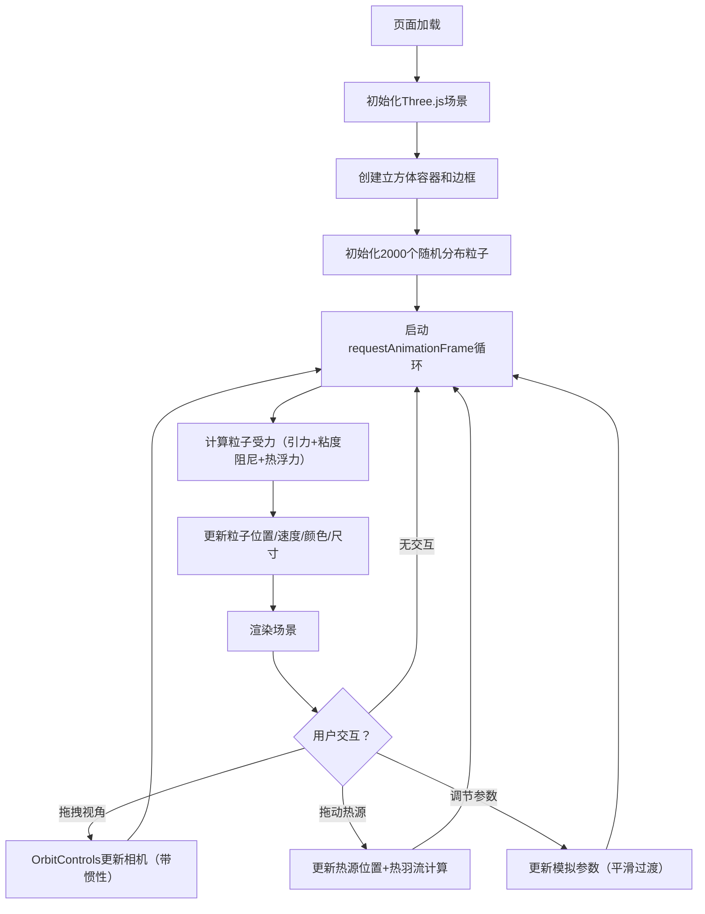

## 1. 产品概述

本产品是一个基于Three.js的浏览器端3D流体动力学粒子系统可视化应用，旨在解决物理教学和数字艺术创作中流体运动过程难以直观观察和操控的问题。通过实时渲染2000-4000个彩色粒子模拟简化的Navier-Stokes流体效果，结合可交互的热源系统，让用户直观理解热对流、涡旋结构等流体力学现象。

- 目标用户：物理教师、学生、数字艺术家、科学可视化爱好者
- 核心价值：将抽象的流体力学概念转化为可交互、可操控的沉浸式3D视觉体验

## 2. 核心功能

### 2.1 用户角色
无需登录，所有用户均可直接使用全部功能。

### 2.2 功能模块
1. **3D流体粒子系统**：立方体容器内的粒子物理模拟与渲染
2. **可交互热源系统**：底部可拖动热源产生热羽流对流
3. **实时参数控制面板**：粒子数、粘度、温度、引力强度等参数实时调节
4. **视角交互系统**：鼠标拖拽旋转视角，带惯性阻尼效果

### 2.3 功能详情

| 模块名称 | 子功能 | 功能描述 |
|-----------|--------|----------|
| 3D流体粒子系统 | 容器渲染 | 10x10x10单位立方体，半透明白色边框（透明度0.2），深空蓝背景#0a0a2e |
| 3D流体粒子系统 | 粒子渲染 | 默认2000个粒子，半径0.08，暖色#FF6347到冷色#4682B4中心-边缘渐变，带3px半透明外发光 |
| 3D流体粒子系统 | 流体运动 | 简化Navier-Stokes模拟，粒子间弱引力相互作用，形成旋转涡旋结构 |
| 热源系统 | 热源渲染 | 圆形热源半径1单位，中心#FFFF00向外渐变#FFA500，2秒周期脉冲波纹环 |
| 热源系统 | 热源拖动 | 鼠标拖拽在容器底部XY平面移动 |
| 热源系统 | 热羽流效应 | 热源上方粒子受热上升（最大0.5单位/秒，距离反比），顶部冷却下沉形成对流循环 |
| 热源系统 | 视觉反馈 | 热源周围粒子变红（#FF4500-#FFD700），尺寸膨胀15% |
| 参数控制面板 | 粒子总数 | 滑块1000-4000，实时数值显示，平滑变化无需重置 |
| 参数控制面板 | 流体粘度 | 滑块0.01-0.5，实时调节阻尼效果 |
| 参数控制面板 | 热源温度 | 滑块1.0-5.0，影响热羽流强度 |
| 参数控制面板 | 引力强度 | 滑块0.0-0.1，调节粒子间吸引力 |
| 视角交互 | 轨道控制 | OrbitControls鼠标拖拽旋转，初始相机位置(5,5,5) |
| 视角交互 | 惯性阻尼 | 阻尼系数0.85，松手后视角平滑减速 |
| 性能优化 | 帧率控制 | requestAnimationFrame驱动，30FPS+（4000粒子≥25FPS） |
| 性能优化 | 页面可见性 | 标签页不可见时暂停渲染节省资源 |
| 响应式适配 | 画布适配 | 1920x1080和1440x900分辨率自动适配 |

## 3. 核心流程

## 4. 用户界面设计

### 4.1 设计风格
- **整体风格**：深空科技感（Sci-Fi），以深邃宇宙蓝为基调，配合发光粒子和毛玻璃UI
- **主色调**：深空蓝背景 #0a0a2e
- **强调色**：暖色粒子 #FF6347 / 冷色粒子 #4682B4 / 热源黄橙渐变 #FFFF00 → #FFA500
- **UI面板**：毛玻璃半透明风格，背景 rgba(255,255,255,0.1)，边框 1px solid rgba(255,255,255,0.2)，圆角 12px
- **粒子效果**：3px外发光光晕，半透明叠加
- **热源动效**：2秒周期脉冲波纹环动画

### 4.2 页面设计概览

| 区域 | 模块名称 | UI元素与设计 |
|------|----------|-------------|
| 全屏背景 | 3D画布 | #0a0a2e 深空蓝，Three.js WebGL渲染 |
| 画面中心 | 立方体容器 | 微弱白色线框（透明度0.2），10x10x10单位 |
| 画面中心 | 粒子系统 | 彩色发光粒子，中心暖色边缘冷色渐变 |
| 容器底部 | 热源 | 圆形黄橙渐变，脉冲波纹，可拖拽 |
| 右侧固定 | 控制面板 | 毛玻璃半透明面板，4组滑块+数值显示，垂直排列 |

### 4.3 响应式设计
- Desktop-first设计，优先适配 1920x1080 和 1440x900
- 画布尺寸：监听window.resize事件，自动调整canvas宽高和相机aspect
- 控制面板：固定宽度300px，右侧边距24px，垂直居中

### 4.4 3D场景指导
- **环境氛围**：深空宇宙感，纯深色背景无HDRI，粒子自发光作为主要视觉元素
- **光照设置**：环境光（强度0.4，白色）+ 点光源（位置(5,10,5)，强度0.8）辅助粒子立体感
- **相机设置**：PerspectiveCamera，fov=60，初始位置(5,5,5)，看向原点
- **视角交互**：OrbitControls，enableDamping=true，dampingFactor=0.85，禁止平移
- **粒子系统**：使用 THREE.Points + BufferGeometry + ShaderMaterial 实现高性能渲染
- **性能预算**：4000粒子维持≥25FPS，使用BufferGeometry避免每帧GC
