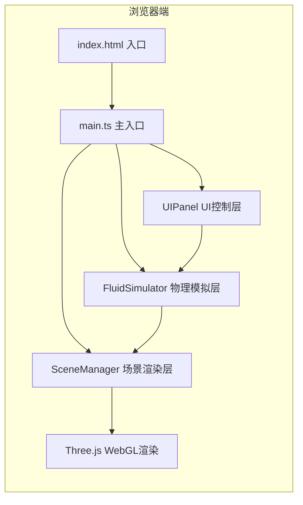

## 1. 架构设计



**分层说明**：
- **UI控制层（UIPanel）**：纯DOM操作，生成右侧控制面板HTML，绑定滑块事件
- **物理模拟层（FluidSimulator）**：独立于Three.js的纯物理计算模块，管理粒子状态
- **场景渲染层（SceneManager）**：封装Three.js场景、相机、光源、粒子系统、交互控制
- **主入口（main.ts）**：整合三层，通过Clock控制时间步长，驱动requestAnimationFrame循环

## 2. 技术描述

- **前端框架**：原生 TypeScript（无React/Vue），Three.js 直接操作 DOM 和 WebGL
- **构建工具**：Vite 5.x（ESM + HMR）
- **3D引擎**：Three.js 最新版本
- **类型定义**：@types/three
- **样式方案**：内联CSS + 直接DOM操作（无Tailwind等CSS框架，减少依赖）
- **包管理器**：npm
- **后端**：无，纯前端单页应用

## 3. 项目文件结构

| 路径 | 职责 |
|------|------|
| `/package.json` | 依赖声明与npm脚本（dev/build/preview） |
| `/index.html` | HTML入口，全屏容器，深空蓝背景，引入main.ts |
| `/vite.config.js` | Vite基础配置（server.port=5173） |
| `/tsconfig.json` | TypeScript严格模式配置（strict=true, module=ESNext, target=ES2020） |
| `/src/main.ts` | 应用入口：初始化三大模块，启动动画循环 |
| `/src/FluidSimulator.ts` | 物理模拟：粒子位置/速度/颜色更新，热浮力、引力、粘度阻尼计算 |
| `/src/SceneManager.ts` | Three.js场景：相机/光源/容器/粒子Points/热源/OrbitControls/渲染循环 |
| `/src/UIPanel.ts` | 右侧控制面板DOM生成与事件绑定：4个参数滑块 |

## 4. 核心类与接口定义

### 4.1 FluidSimulator

```typescript
interface Particle {
  x: number; y: number; z: number;       // 位置
  vx: number; vy: number; vz: number;    // 速度
  baseColor: THREE.Color;                 // 基准颜色（中心-边缘映射）
  size: number;                           // 当前渲染尺寸
  heatFactor: number;                     // 受热程度 0-1
}

interface SimParams {
  particleCount: number;    // 1000-4000
  viscosity: number;        // 0.01-0.5
  heatTemperature: number;  // 1.0-5.0
  gravityStrength: number;  // 0.0-0.1
}

class FluidSimulator {
  particles: Particle[];
  params: SimParams;
  constructor(initialCount: number);
  update(deltaTime: number, heatPos: THREE.Vector3, params?: Partial<SimParams>): void;
  updateParams(params: Partial<SimParams>): void;
  resizeParticleCount(target: number): void;
}
```

### 4.2 SceneManager

```typescript
class SceneManager {
  scene: THREE.Scene;
  camera: THREE.PerspectiveCamera;
  renderer: THREE.WebGLRenderer;
  controls: THREE.OrbitControls;
  particles: THREE.Points;
  heatSource: THREE.Mesh;
  heatRings: THREE.Mesh[];
  isVisible: boolean;
  
  constructor(container: HTMLElement);
  updateParticleGeometry(particles: Particle[]): void;
  updateHeatSource(pos: THREE.Vector3, time: number): void;
  render(): void;
  dispose(): void;
}
```

### 4.3 UIPanel

```typescript
interface PanelCallbacks {
  onParamsChange: (params: Partial<SimParams>) => void;
}

class UIPanel {
  constructor(container: HTMLElement, callbacks: PanelCallbacks);
  setParticleCount(value: number): void;
  setViscosity(value: number): void;
  setHeatTemperature(value: number): void;
  setGravityStrength(value: number): void;
}
```

## 5. 物理算法说明

### 5.1 粒子运动方程
每个粒子每帧更新：
```
受力 F = F_gravity（粒子间弱引力） + F_buoyancy（热浮力） + F_drag（粘度阻尼）
速度 v' = v + F * dt * 阻尼系数(1 - viscosity)
位置 p' = p + v' * dt
边界：碰撞立方体壁面反弹（速度反向 * 0.5）
```

### 5.2 粒子间引力（空间网格优化）
为避免O(n²)复杂度，使用5x5x5空间网格，仅对同网格及相邻网格内粒子施加弱吸引力：
```
F_gravity = Σ (G * direction / max(distance², 0.1))  其中 G = gravityStrength
```

### 5.3 热浮力计算
```
distance = 粒子到热源的水平距离（忽略Y轴差）
heatFactor = heatTemperature * exp(-distance² / 2)  // 高斯衰减
F_buoyancy.y = heatFactor * 0.5  // 向上最大0.5单位/秒
冷却：粒子Y > 8 时施加重力向下加速
```

### 5.4 涡旋效果（简化Navier-Stokes）
对邻近粒子速度做加权平均，模拟粘性流体动量传递：
```
v_smooth = Σ (v_neighbor * weight) / Σ weight,  weight = exp(-distance²)
v_final = lerp(v_original, v_smooth, 0.1 * (1 - viscosity))
```

## 6. 性能优化策略

1. **BufferGeometry + Float32Array**：粒子位置/颜色数据存入TypedArray，每帧仅setter更新，避免GC
2. **ShaderMaterial**：在GPU侧实现粒子颜色插值与尺寸膨胀，减少CPU计算
3. **空间网格哈希**：粒子邻居查询从O(n²)降至O(n)
4. **Visibility API**：document.hidden时暂停requestAnimationFrame
5. **DeltaTime平滑**：使用THREE.Clamp deltaTime上限0.05s，避免切回标签页时大跳步
6. **粒子数平滑过渡**：resizeParticleCount时按帧渐进增减，避免卡顿
