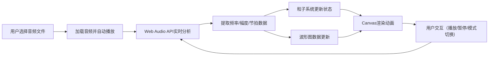

## 1. 产品概述

交互式音乐节奏可视化应用，允许用户上传本地音频文件，实时生成与音乐节拍同步的粒子动画和波形图。通过Web Audio API和Canvas技术，为用户提供沉浸式的音乐视觉体验。

## 2. 核心功能

### 2.1 用户角色
| 角色 | 注册方式 | 核心权限 |
|------|----------|----------|
| 普通用户 | 无需注册 | 上传音频、播放控制、模式切换 |

### 2.2 功能模块
1. **主页面**：文件上传、播放控制、全屏Canvas容器、实时音频信息
2. **音频分析模块**：解析音频文件，提取频率、幅度、节拍数据
3. **粒子系统模块**：管理200-500个动态粒子，受音乐影响产生动画效果
4. **可视化渲染模块**：Canvas绘制波形图和粒子动画

### 2.3 页面详情
| 页面名称 | 模块名称 | 功能描述 |
|----------|----------|----------|
| 主页面 | 文件上传 | 中央按钮支持MP3/WAV文件选择，加载后自动播放 |
| 主页面 | 播放控制 | SVG图标切换播放/暂停状态 |
| 主页面 | 粒子动画 | 两种显示模式：星云模式和暴风雪模式 |
| 主页面 | 波形图 | 底部64条频域柱形图，弧形排列 |
| 主页面 | 实时信息 | 播放时间、总时长、幅度进度条 |
| 主页面 | 模式切换 | 右下角圆形按钮切换粒子显示模式 |

## 3. 核心流程

用户点击"选择音频文件"按钮 → 选择本地MP3/WAV文件 → 系统加载并自动播放 → Web Audio API实时分析音频数据 → 粒子系统根据音频数据更新粒子状态 → Canvas渲染波形图和粒子动画 → 用户可切换播放/暂停或粒子显示模式

## 4. 用户界面设计

### 4.1 设计风格
- **主色调**：深空蓝黑色背景（#0a0a2e中心，#000011边缘）
- **强调色**：青色（#00FFFF）和品红（#FF00FF）霓虹配色
- **按钮样式**：半透明渐变色圆角矩形，悬停亮度提升20%，轻微上浮效果
- **字体**：系统无衬线字体，文本颜色白色偏蓝（#e0e8ff）
- **圆角**：所有UI元素统一8px圆角
- **粒子颜色**：冷色（#00FFFF）到暖色（#FF00FF）根据频率区间渐变

### 4.2 页面设计概述
| 页面名称 | 模块名称 | UI元素 |
|----------|----------|--------|
| 主页面 | 中央上传按钮 | 半透明渐变色，圆角矩形，悬停动画 |
| 主页面 | Canvas容器 | 全屏自适应，深空蓝黑径向渐变背景 |
| 主页面 | 播放控制图标 | SVG三角形/双竖线，悬停效果 |
| 主页面 | 波形图 | 底部1/4区域，64条弧形柱形图 |
| 主页面 | 粒子动画 | 星云/暴风雪两种模式，500ms平滑切换 |
| 主页面 | 实时信息面板 | 左下角，时间显示+幅度进度条 |
| 主页面 | 模式切换按钮 | 右下角圆形，星星/漩涡图标 |

### 4.3 响应式设计
- **桌面端**（≥768px）：完整布局，画布自适应窗口
- **移动端**（<768px）：画布高度减半，UI按钮缩小20%，模式切换按钮移至左上角
- **最小尺寸**：画布最小400x400px

### 4.4 动效设计
- 按钮悬停：transform: translateY(-2px)，阴影扩散
- 粒子爆发：节拍对齐的脉冲扩散效果
- 模式切换：500ms平滑颜色过渡
- 进度条：幅度实时平滑变化

### 4.5 性能指标
- 渲染帧率：≥30FPS，目标60FPS
- 计算耗时：每帧音频分析+粒子更新≤5ms
- 动态调整：帧率<25FPS时粒子数降至150
