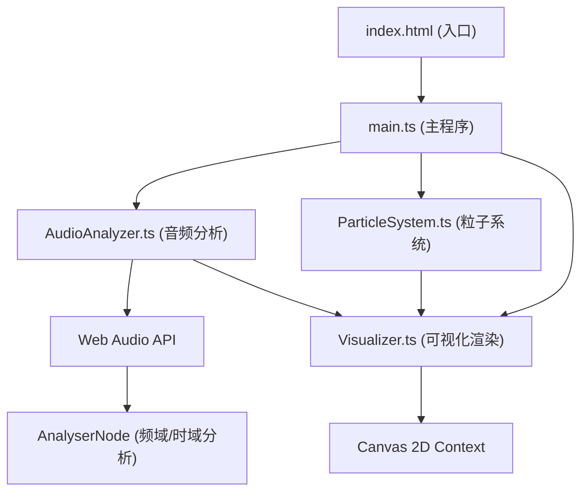

## 1. 架构设计



## 2. 技术描述

- **前端框架**：纯TypeScript + Vite 5.x（无React/Vue，直接操作DOM和Canvas）
- **初始化工具**：vite-init vanilla-ts 模板
- **音频技术**：Web Audio API (AudioContext, AnalyserNode, AudioBufferSourceNode)
- **渲染技术**：HTML5 Canvas 2D API
- **构建工具**：Vite 5.x
- **语言**：TypeScript 5.x (严格模式，ESModule)

## 3. 文件结构

| 文件路径 | 职责描述 |
|----------|----------|
| `package.json` | 项目依赖：vite, typescript；启动脚本：npm run dev |
| `vite.config.js` | Vite基础配置，支持TypeScript和ESModule |
| `tsconfig.json` | TypeScript严格模式配置，ESModule输出 |
| `index.html` | 入口HTML，包含文件上传按钮、播放控制UI、全屏canvas容器 |
| `src/main.ts` | 主程序入口，协调各模块、事件绑定、动画循环 |
| `src/AudioAnalyzer.ts` | 音频解析，提取频率、幅度、节拍数据 |
| `src/ParticleSystem.ts` | 粒子群管理，动态数量、大小、颜色、运动 |
| `src/Visualizer.ts` | Canvas渲染，波形图和粒子动画绘制 |
| `src/style.css` | 全局样式，UI组件样式 |

## 4. 核心类与接口定义

### 4.1 AudioAnalyzer 类
```typescript
interface AudioData {
  frequencyData: Uint8Array;      // 频域数据 (0-255)
  timeDomainData: Uint8Array;     // 时域数据 (0-255)
  averageAmplitude: number;       // 平均幅度 (0-1)
  bassAmplitude: number;          // 低频幅度 (0-1)
  midAmplitude: number;           // 中频幅度 (0-1)
  trebleAmplitude: number;        // 高频幅度 (0-1)
  beatDetected: boolean;          // 节拍检测
  currentTime: number;            // 当前播放时间 (秒)
  duration: number;               // 总时长 (秒)
  isPlaying: boolean;             // 是否正在播放
}

class AudioAnalyzer {
  constructor();
  async loadFile(file: File): Promise<void>;
  play(): void;
  pause(): void;
  togglePlay(): void;
  getAudioData(): AudioData;
  destroy(): void;
}
```

### 4.2 ParticleSystem 类
```typescript
type VisualMode = 'nebula' | 'blizzard';

interface Particle {
  x: number;
  y: number;
  vx: number;
  vy: number;
  size: number;
  baseSize: number;
  color: string;
  alpha: number;
  life: number;
  frequencyBand: number;
  angle: number;
  distance: number;
}

class ParticleSystem {
  constructor(canvasWidth: number, canvasHeight: number);
  setMode(mode: VisualMode): void;
  update(audioData: AudioData, deltaTime: number): void;
  resize(width: number, height: number): void;
  adjustParticleCount(targetCount: number): void;
  getParticles(): Particle[];
  getMode(): VisualMode;
}
```

### 4.3 Visualizer 类
```typescript
class Visualizer {
  constructor(canvas: HTMLCanvasElement);
  render(audioData: AudioData, particles: Particle[], mode: VisualMode): void;
  resize(): void;
  clear(): void;
}
```

## 5. 性能优化策略

### 5.1 帧率监控
- 使用 `performance.now()` 计算每帧耗时
- 维护最近10帧的移动平均帧率
- 帧率 < 25FPS 时自动减少粒子数量至150
- 帧率恢复 > 40FPS 时逐步增加粒子数量

### 5.2 计算优化
- 音频分析每帧仅调用一次 `getByteFrequencyData`
- 粒子更新使用批量循环，避免频繁函数调用
- 使用 `requestAnimationFrame` 同步显示刷新率
- 波形图数据预计算，避免重复计算

### 5.3 渲染优化
- Canvas 背景使用径向渐变一次性绘制
- 粒子使用 `arc` 批量绘制，复用 Path2D
- 波形图使用 `fillRect` 批量绘制
- 避免不必要的状态切换（save/restore）

## 6. 关键算法

### 6.1 节拍检测算法
```
1. 维护低频段历史能量数组（长度64）
2. 计算当前低频能量
3. 计算历史能量平均值和方差
4. 当前能量 > 平均值 * 1.5 且 > 阈值 → 检测到节拍
5. 冷却时间100ms，避免重复检测
```

### 6.2 粒子颜色渐变
```
频率区间映射到色相：
- 低频(0-33%) → 青色 #00FFFF (HSL: 180, 100%, 50%)
- 中频(33-66%) → 中间色 (HSL: 240, 100%, 50%)
- 高频(66-100%) → 品红 #FF00FF (HSL: 300, 100%, 50%)
```

### 6.3 波形图弧形排列
```
每条柱形的位置：
- 中心点在画布底部中心
- 起始角度：-60°
- 结束角度：60°
- 半径：画布宽度 * 0.4
- 每条柱形沿圆弧等距排列
```

## 7. 浏览器兼容性

- **目标浏览器**：Chrome 90+, Firefox 88+, Safari 14+
- **Web Audio API**：使用 `AudioContext` 而非 `webkitAudioContext`
- **Canvas**：使用标准 2D Context API
- **ESModule**：通过 Vite 构建确保兼容性

## 8. 响应式断点

| 断点 | 画布尺寸 | UI缩放 | 模式按钮位置 |
|------|----------|--------|--------------|
| ≥768px | 自适应窗口，最小400x400 | 100% | 右下角 |
| <768px | 自适应宽度，高度减半，最小400x200 | 80% | 左上角 |
