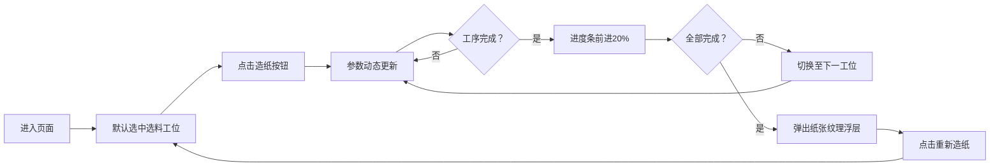

## 1. 产品概述

古法造纸工序交互式可视化工具，通过浏览器端动态模拟传统造纸工艺的完整流程，解决传统文化工艺流程难以通过静态图文直观呈现和理解的问题。
- 面向文化教育、传统工艺爱好者和博物馆展示场景，提供沉浸式交互体验
- 将非物质文化遗产的古法造纸技术以数字化、互动化的形式展现，提升传播效果

## 2. 核心功能

### 2.1 用户角色
| 角色 | 注册方式 | 核心权限 |
|------|----------|----------|
| 普通用户 | 无需注册 | 浏览造纸流程、控制造纸过程、查看参数变化 |

### 2.2 功能模块
1. **造纸流水线工位区**：六个工序工位水平排列，点击切换查看详情
2. **3D示意图展示区**：右侧主视图展示当前工位的CSS 3D线框立方体动画
3. **参数控制区**：造纸/停止/重置按钮，控制流程启停
4. **全局进度条**：顶部显示整体进度和当前步骤
5. **完成浮层**：工序完成后展示随机生成的纸张纹理

### 2.3 页面详情
| 页面名称 | 模块名称 | 功能描述 |
|---------|----------|----------|
| 主页面 | 工位卡片 | 六个工序卡片水平排列，半透明白色虚线箭头连接，流动动画 |
| 主页面 | 3D示意图 | CSS 3D变换模拟旋转立方体，展示各工位关键道具 |
| 主页面 | 参数显示 | 每个工位下方显示耗时和湿度，动态更新 |
| 主页面 | 控制按钮 | 造纸/停止/重置三个按钮，控制流程状态 |
| 主页面 | 进度条 | 顶部全局进度条，颜色渐变，显示步骤序号 |
| 主页面 | 完成浮层 | 半透明浮层展示Canvas绘制的纸张纹理，重新造纸按钮 |

## 3. 核心流程

用户进入页面后，默认选中第一个工位（选料），点击"造纸"按钮启动流程，各工位参数开始动态变化，每完成一个工序进度条前进20%，六个工序全部完成后弹出纸张纹理浮层。

## 4. 用户界面设计

### 4.1 设计风格
- **主色调**：米白(#FAF0E6)、檀木色(#8B5E3C)、墨绿(#2E4A22)
- **按钮样式**：古铜色矩形圆角按钮，点击时有3px内阴影压印效果
- **字体**：衬线字体'Noto Serif SC'，标题22px，正文14px，行高1.6
- **布局风格**：古风卷轴风格，卡片采用毛边纸纹理背景，圆角12px
- **装饰元素**：半透明白色虚线箭头连接工位，呼吸发光边框效果

### 4.2 页面设计概述
| 页面名称 | 模块名称 | UI元素 |
|---------|----------|--------|
| 主页面 | 工位卡片 | 毛边纸纹理背景、圆角12px、檀木色边框、激活时#D4C4A8呼吸发光 |
| 主页面 | 3D示意图 | CSS 3D变换立方体、线框样式、3秒旋转周期、关键道具标识 |
| 主页面 | 参数区 | 耗时（小时）、湿度（%）、动态数字变化 |
| 主页面 | 控制按钮 | 古铜色(#8B5E3C)、圆角、压印内阴影 |
| 主页面 | 进度条 | 深褐(#5D4037)→暖橙(#E65100)→浅黄(#D4C4A8)渐变 |
| 主页面 | 完成浮层 | 半透明背景、Canvas纸张纹理、随机纤维图案 |

### 4.3 响应式
- **桌面优先**：默认水平排列工位卡片，箭头水平流动
- **移动适配**：宽度360px以下自动堆叠为单栏布局，工位垂直排列，箭头旋转90度
- **触摸优化**：按钮最小点击区域44x44px

### 4.4 3D场景指导
- **实现方式**：纯CSS 3D变换（transform-style: preserve-3d, perspective），不依赖Three.js
- **立方体构造**：6个面组成线框立方体，每个面设置半透明边框
- **旋转动画**：沿Y轴持续旋转，周期3秒
- **道具标识**：每个工位立方体上标注关键道具名称（蒸煮锅、打浆槽等）
- **性能优化**：使用transform和opacity属性动画，保证45FPS以上帧率

## 5. 动画规范

| 动画名称 | 实现方式 | 周期/速度 |
|---------|----------|-----------|
| 箭头流动 | CSS animation + stroke-dashoffset | 0.5周期/秒 |
| 卡片呼吸发光 | CSS animation + box-shadow | 1.5秒周期 |
| 立方体旋转 | CSS transform rotateY | 3秒周期 |
| 进度条渐变 | requestAnimationFrame补间 | 均匀平滑过渡 |
| 耗时递增 | setInterval | 每0.3秒+0.1小时 |
| 湿度递减 | setInterval | 每0.5秒-0.5% |
| 过渡动画 | CSS transition | 最长600ms |
