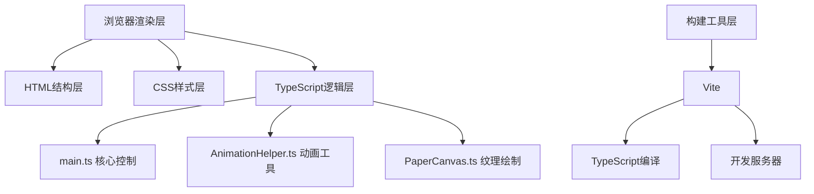

## 1. 架构设计



## 2. 技术描述
- **前端技术栈**：原生HTML/CSS + TypeScript（无框架）
- **构建工具**：Vite@5
- **开发语言**：TypeScript@5（严格模式，target ES2020）
- **CSS技术**：CSS 3D变换、CSS动画、CSS渐变、CSS Patterns
- **图形绘制**：Canvas 2D API
- **动画实现**：requestAnimationFrame + CSS Animation

## 3. 文件结构
| 文件路径 | 作用 |
|---------|------|
| package.json | 项目依赖配置，npm脚本 |
| vite.config.js | Vite构建配置 |
| tsconfig.json | TypeScript编译配置（严格模式） |
| index.html | 入口HTML文件，包含完整布局结构 |
| src/main.ts | 核心逻辑：状态管理、参数更新、事件监听 |
| src/AnimationHelper.ts | 通用动画工具：补间函数、持续动画 |
| src/PaperCanvas.ts | Canvas纸张纹理绘制 |

## 4. 数据模型

### 4.1 工位状态定义
```typescript
interface Station {
  id: number;
  name: string;
  tool: string;
  duration: number;
  humidity: number;
  isCompleted: boolean;
}

interface AppState {
  currentStationIndex: number;
  isRunning: boolean;
  progress: number;
  stations: Station[];
  totalDuration: number;
  totalHumidity: number;
}
```

### 4.2 初始数据
| 工位序号 | 工位名称 | 关键道具 | 初始耗时 | 初始湿度 |
|---------|----------|----------|----------|----------|
| 1 | 选料 | 竹料筐 | 0 | 90% |
| 2 | 蒸煮 | 蒸煮锅 | 0 | 90% |
| 3 | 打浆 | 打浆槽 | 0 | 90% |
| 4 | 抄纸 | 抄纸帘 | 0 | 90% |
| 5 | 压榨 | 压榨机 | 0 | 90% |
| 6 | 晾晒 | 晾晒架 | 0 | 90% |

## 5. 核心API定义

### 5.1 AnimationHelper API
```typescript
/**
 * 创建基于requestAnimationFrame的补间动画
 * @param from 起始值
 * @param to 目标值
 * @param duration 动画时长(ms)
 * @param onUpdate 更新回调
 * @param easing 缓动函数
 * @returns 清理函数
 */
type TweenFunction = (
  from: number,
  to: number,
  duration: number,
  onUpdate: (value: number) => void,
  easing?: (t: number) => number
) => () => void;

/**
 * 创建持续循环动画
 * @param onFrame 每帧回调，参数为0-1的进度值
 * @param period 周期时长(ms)
 * @returns 清理函数
 */
type LoopAnimation = (
  onFrame: (progress: number) => void,
  period: number
) => () => void;

/**
 * 颜色插值函数
 * @param color1 起始颜色
 * @param color2 目标颜色
 * @param t 插值比例0-1
 * @returns 插值后的颜色字符串
 */
type ColorLerp = (color1: string, color2: string, t: number) => string;
```

### 5.2 PaperCanvas API
```typescript
/**
 * 绘制随机纸张纤维纹理
 * @param width 画布宽度
 * @param height 画布高度
 * @param baseColor 基础颜色
 * @param fiberColor 纤维颜色
 * @returns HTMLCanvasElement
 */
function createPaperTexture(
  width: number,
  height: number,
  baseColor?: string,
  fiberColor?: string
): HTMLCanvasElement;
```

### 5.3 main.ts 核心状态
```typescript
class PapermakingSimulator {
  constructor();
  init(): void;
  startProcess(): void;
  stopProcess(): void;
  resetProcess(): void;
  selectStation(index: number): void;
  showCompletionModal(): void;
  hideCompletionModal(): void;
  updateProgress(value: number): void;
}
```

## 6. 参数更新规则

| 参数 | 更新规则 | 特殊处理 |
|-----|----------|----------|
| 耗时 | 每0.3秒增加0.1小时 | 停止后暂停，重置归零 |
| 湿度 | 每0.5秒下降0.5% | 抄纸工序暂时回升，最低不低于5% |
| 进度条 | 每个工序完成前进20% | 颜色从#5D4037→#E65100→#D4C4A8渐变 |

## 7. 性能要求
- **帧率**：45FPS以上
- **过渡时长**：最长600ms
- **内存占用**：无明显内存泄漏，动画清理函数正确调用
- **响应时间**：按钮点击响应<100ms

## 8. 关键实现点

1. **CSS 3D立方体**：使用`transform-style: preserve-3d`和6个面元素构建立方体，通过`rotateY`实现旋转
2. **毛边纸纹理**：使用CSS repeating-linear-gradient模拟纸张纹理
3. **箭头流动动画**：SVG路径配合`stroke-dasharray`和`stroke-dashoffset`实现虚线流动
4. **呼吸发光效果**：CSS animation关键帧动画，改变box-shadow透明度
5. **进度条颜色渐变**：通过AnimationHelper的颜色插值函数实时计算渐变颜色
6. **纸张纹理Canvas**：随机径向渐变+随机半透明短线模拟纤维效果
