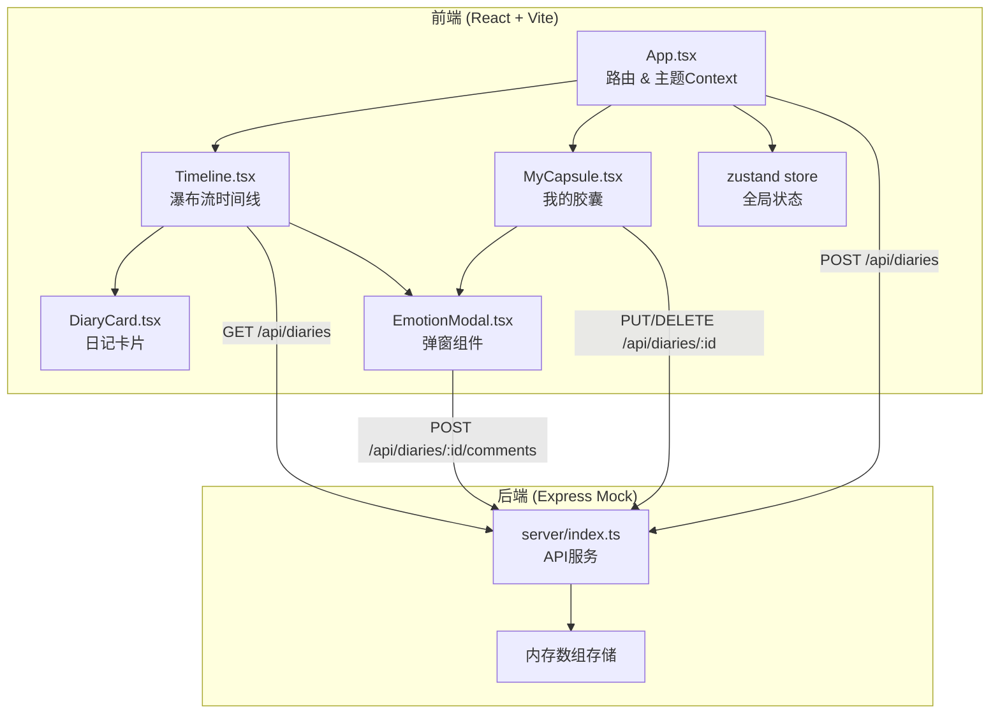
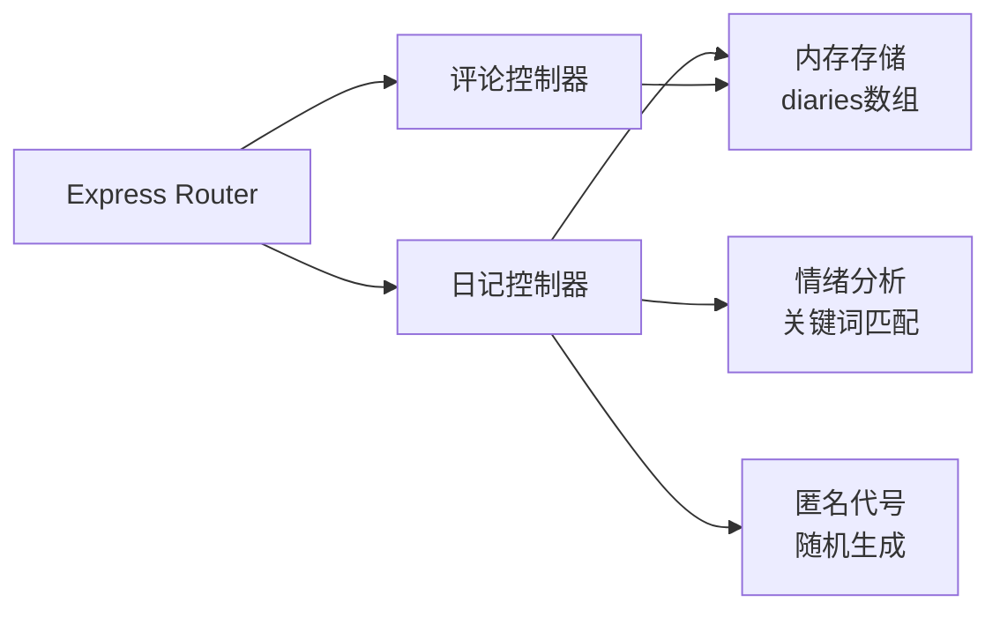
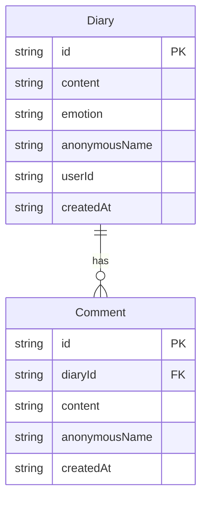

## 1. 架构设计



## 2. 技术说明

- 前端：React@18 + TypeScript + Vite + TailwindCSS
- 初始化工具：vite-init（react-express-ts 模板）
- 后端：Express@4 + TypeScript（Mock服务，内存数组存储）
- 数据库：无，使用内存数组模拟
- 状态管理：zustand
- 路由：react-router-dom

## 3. 路由定义

| 路由 | 用途 |
|------|------|
| / | 时间线首页，展示瀑布流匿名日记 |
| /my-capsule | 我的胶囊页面，展示用户自己的日记时间轴 |

## 4. API 定义

### 4.1 数据类型

```typescript
type EmotionType = "happy" | "melancholy" | "angry" | "calm" | "anxious"

interface Diary {
  id: string
  content: string
  emotion: EmotionType
  anonymousName: string
  userId: string
  createdAt: string
  comments: Comment[]
}

interface Comment {
  id: string
  content: string
  anonymousName: string
  createdAt: string
}

interface CreateDiaryRequest {
  content: string
  userId: string
}

interface CreateCommentRequest {
  content: string
  anonymousName: string
}
```

### 4.2 接口定义

| 方法 | 路径 | 请求体 | 响应 | 说明 |
|------|------|--------|------|------|
| GET | /api/diaries?page=1&limit=50 | - | `{ diaries: Diary[], total: number, page: number }` | 分页获取日记列表 |
| GET | /api/diaries/:id | - | `Diary` | 获取单条日记详情 |
| POST | /api/diaries | `CreateDiaryRequest` | `Diary` | 创建新日记（自动分析情绪） |
| PUT | /api/diaries/:id | `{ content: string }` | `Diary` | 更新日记内容 |
| DELETE | /api/diaries/:id | - | `{ success: boolean }` | 删除日记 |
| POST | /api/diaries/:id/comments | `CreateCommentRequest` | `Comment` | 添加评论 |

## 5. 服务端架构图



## 6. 数据模型

### 6.1 数据模型定义



### 6.2 情绪分析关键词映射

| 情绪 | 英文标签 | 色值 | 关键词 |
|------|----------|------|--------|
| 开心 | happy | #FFD700 | 开心、快乐、幸福、美好、棒、赞、喜欢、阳光、哈哈、嘻嘻、愉快、满足 |
| 忧郁 | melancholy | #6A5ACD | 忧郁、难过、伤心、失落、孤独、寂寞、想哭、低落、惆怅、叹气 |
| 暴躁 | angry | #FF4500 | 生气、愤怒、烦、暴躁、讨厌、受够了、火大、气死、可恶、抓狂 |
| 平静 | calm | #87CEEB | 平静、安宁、放松、惬意、舒适、淡然、从容、自在、宁静、祥和 |
| 焦虑 | anxious | #8B008B | 焦虑、紧张、担心、害怕、不安、压力、慌、纠结、忐忑、着急 |

### 6.3 匿名代号生成规则

格式：`{情绪形容词}的{动物名}`

- 情绪形容词列表：忧郁的、快乐的、暴躁的、平静的、焦虑的、温柔的、倔强的、慵懒的、沉默的、调皮的
- 动物名列表：考拉、企鹅、猫咪、鲸鱼、柴犬、仓鼠、水獭、熊猫、狐狸、兔子、猫头鹰、海豚、树懒、刺猬、小鹿
