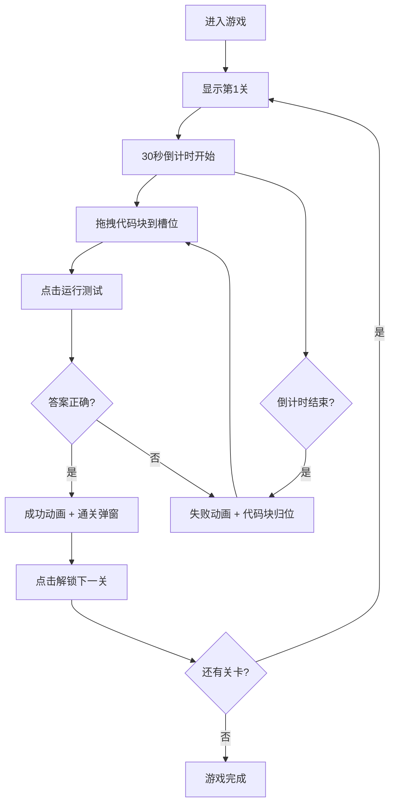

## 1. 产品概述

交互式代码块拼图教学应用，通过拖拽彩色代码块组合成正确的JavaScript函数来学习编程基础概念。面向编程初学者，通过游戏化方式降低学习门槛，提升学习趣味性。

- 核心用途：JavaScript语法教学、编程思维培养
- 目标用户：编程初学者、计算机教育从业者
- 产品价值：将抽象的代码语法转化为可视化的拼图游戏，降低学习难度

## 2. 核心功能

### 2.1 功能模块

1. **游戏主界面**：关卡信息栏、代码块池、拼图槽位区、操作按钮区
2. **拖拽交互系统**：代码块拖拽、槽位吸附、归位动画
3. **关卡系统**：5个递进难度关卡，动态槽位数量
4. **计时与评分系统**：30秒倒计时、完成度检测
5. **反馈系统**：成功/失败动画、粒子特效、弹窗提示

### 2.2 页面详情

| 页面名称 | 模块名称 | 功能描述 |
|-----------|-------------|---------------------|
| 游戏主界面 | 关卡信息栏 | 显示当前关卡编号、可用代码块数量、倒计时进度条 |
| 游戏主界面 | 代码块池 | 2列网格展示未使用的彩色代码块，支持拖拽 |
| 游戏主界面 | 拼图槽位区 | 横向排列虚线框槽位，支持代码块吸附放置 |
| 游戏主界面 | 操作按钮区 | "运行测试"按钮验证答案、"重置"按钮重新开始 |
| 成功弹窗 | 通关提示 | 毛玻璃效果弹窗，展示旋转星星图标和"解锁下一关"按钮 |

## 3. 核心流程

用户进入游戏 → 查看关卡目标和代码块 → 拖拽代码块到槽位 → 点击运行测试验证 → 正确则通关进入下一关/错误则重试 → 倒计时结束未完成则失败

## 4. 用户界面设计

### 4.1 设计风格

- **主题**：深色科技风格，赛博朋克霓虹美学
- **主色调**：霓虹蓝 `#00D4FF`
- **背景**：从顶部深蓝 `#0A0E27` 到底部灰蓝 `#1A1F3A` 的垂直渐变
- **代码块颜色**：
  - 关键字：紫色 `#9B59B6`
  - 标识符：蓝色 `#3498DB`
  - 符号：橙色 `#E67E22`
  - 字符串：绿色 `#2ECC71`
- **按钮风格**：圆角12px，靛蓝 `#4B6BFB` 背景，悬停变亮 `#6B8BFF`
- **字体**：代码块使用等宽字体，UI使用无衬线字体
- **布局**：分层布局，顶部信息栏、中间游戏区、底部操作栏
- **发光效果**：代码块阴影使用 `box-shadow: 0 0 8px currentColor` 霓虹发光

### 4.2 页面设计概览

| 页面名称 | 模块名称 | UI 元素 |
|-----------|-------------|-------------|
| 游戏主界面 | 关卡信息栏 | 关卡编号标签、渐变填充计数圆点、倒计时进度条（绿到红渐变，30秒动画） |
| 游戏主界面 | 代码块池 | 2列网格、矩形圆角卡片（高度60px）、白边、半透明阴影、等宽字体文本 |
| 游戏主界面 | 拼图槽位区 | 60x60px虚线框、灰色虚线边框、脉冲动画（1.5Hz）、呼吸灯效果（2s周期） |
| 游戏主界面 | 操作按钮区 | 水波纹点击效果、重置按钮抖动反馈 |
| 成功弹窗 | 通关界面 | 半透明毛玻璃背景 `rgba(255,255,255,0.15)`、backdrop-filter 模糊、旋转星星图标（2s周期） |

### 4.3 动画效果

| 动画名称 | 触发条件 | 效果描述 | 持续时间 |
|-----------|-------------|-------------|----------|
| 拖拽半透明 | 代码块被拖动 | opacity 0.7 | 拖拽期间 |
| 弹性吸附 | 代码块放入槽位 | 反弹效果 | 300ms |
| 平滑归位 | 代码块未放入槽位 | ease-out 飞回原位 | 200ms |
| 光晕扩散 | 所有槽位正确填满 | 边框变绿+光晕扩散 | 400ms |
| 粒子上升 | 通关成功 | 20个彩色圆点上升 | 1000ms |
| 晃动闪烁 | 答案错误/超时 | 拼图区左右晃动+槽位变红闪烁3次 | 500ms |
| 水波纹 | 按钮点击 | 波纹从点击点扩散 | 300ms |

### 4.4 响应式设计

- 桌面端优先，最小宽度1024px
- 代码块宽度自适应容器
- 槽位数量动态适配（4-12个）

## 5. 关卡配置

| 关卡编号 | 槽位数量 | 目标函数 |
|-----------|-------------|-------------|
| 第1关 | 4 | `function hello() { return 'hello'; }` |
| 第2关 | 6 | 递增复杂度函数 |
| 第3关 | 8 | 递增复杂度函数 |
| 第4关 | 10 | 递增复杂度函数 |
| 第5关 | 12 | 递增复杂度函数 |
